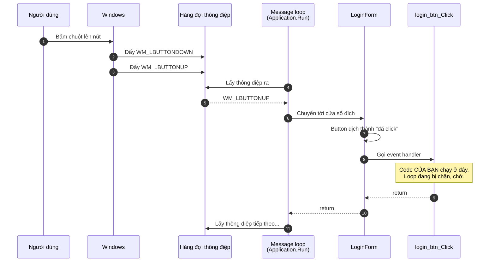
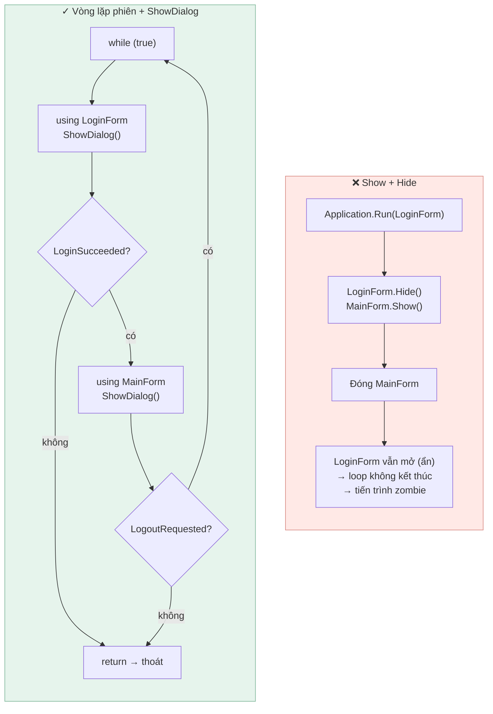

[← Mục lục](README.md) · Bài 01/12 · [Tiếp: Giải phẫu dự án →](02-giai-phau-du-an.md)

# 01 · WinForms chạy thế nào

## Vấn đề

Bạn viết `private void login_btn_Click(...)`. Bạn không gọi nó ở đâu cả. Vậy mà khi người
dùng bấm nút, nó chạy. **Ai gọi nó?**

Trả lời được câu này là hiểu được toàn bộ mô hình WinForms.

## Cơ chế: vòng lặp thông điệp

Chương trình console chạy từ trên xuống rồi kết thúc. Ứng dụng giao diện thì không —
nó phải **ngồi chờ** người dùng làm gì đó. Cái vòng chờ đó gọi là *message loop*.

Windows không gửi thẳng sự kiện cho code của bạn. Nó đẩy **thông điệp** vào một hàng đợi
riêng cho từng luồng. Ứng dụng phải tự lấy ra và xử lý.



Ba điều quan trọng rút ra từ sơ đồ:

1. **Không phải bạn gọi handler — message loop gọi.** Code của bạn là thứ *được gọi lại*
   (callback).
2. **Trong lúc handler chạy, loop đứng im.** Nó không lấy được thông điệp nào khác. Đây
   chính là lý do app bị "đơ" — xem [bài 07](07-luong-ui-va-xu-ly-loi.md).
3. **Chỉ có một luồng làm việc này.** Gọi là *UI thread*.

## Trong dự án này

Toàn bộ điểm khởi đầu nằm ở `EmployeeManagementSystem/Program.cs`:

```csharp
[STAThread]
static void Main()
{
    Application.EnableVisualStyles();
    Application.SetCompatibleTextRenderingDefault(false);

    try
    {
        AppServices.Initialize();
    }
    catch (Exception ex)
    {
        MessageBox.Show(
            "The application could not start:" + Environment.NewLine + Environment.NewLine + ex.Message,
            "Startup Error", MessageBoxButtons.OK, MessageBoxIcon.Error);
        return;
    }

    RunSessions();
}
```

Đọc từng dòng:

| Dòng | Ý nghĩa |
|------|---------|
| `[STAThread]` | Đánh dấu luồng chính là *Single-Threaded Apartment*. COM yêu cầu điều này, mà clipboard, drag-drop và `OpenFileDialog` đều dựa trên COM. **Bỏ đi là các thứ đó hỏng.** |
| `EnableVisualStyles()` | Dùng giao diện theo theme Windows thay vì kiểu Windows 95. |
| `SetCompatibleTextRenderingDefault(false)` | Vẽ chữ bằng GDI thay vì GDI+. Phải gọi **trước** khi tạo control đầu tiên. |
| `AppServices.Initialize()` | Của riêng dự án này — dựng repository. Xem [bài 06](06-kien-truc-phan-tang.md). |
| `RunSessions()` | Vòng lặp phiên: đăng nhập → màn hình chính → quay lại đăng nhập. Xem bên dưới. |

Lưu ý cách `Program.cs` bọc `Initialize()` trong `try`: nếu không kết nối được cấu hình,
app hiện một thông báo rồi thoát sạch, thay vì mở lên rồi lỗi lung tung ở từng màn hình.

### Message loop đến từ đâu?

Hầu hết tài liệu WinForms sẽ cho bạn thấy dòng này:

```csharp
Application.Run(new MainForm());
```

`Application.Run` khởi động message loop và **chặn cho tới khi đúng form được truyền vào
bị đóng**:


Ba chữ **"form ĐÓ"** là chỗ nhiều người trượt, và dự án này đã trượt — phần ngay sau đây
kể lại.

Dự án hiện **không dùng `Application.Run`**. `Form.ShowDialog()` cũng tự chạy một message
loop, nên vẫn đủ để ứng dụng sống; khác biệt là loop kết thúc khi *cửa sổ đang hiện* đóng,
chứ không phải khi một form cố định nào đó đóng.

### Một mẫu điều hướng SAI, và vì sao nó sai

Phiên bản đầu của dự án chuyển màn hình thế này:

```csharp
// PHIÊN BẢN CŨ — có hai lỗi
new LoginForm().Show();
this.Hide();          // form hiện tại chỉ bị ẩn, không bao giờ được giải phóng
```

Mẫu này xuất hiện ở bốn chỗ, và gây ra hai vấn đề đo được:

**Form tích tụ vô hạn.** Form cũ chỉ ẩn đi chứ không `Dispose`. Chuyển qua lại giữa
Login và Register 5 lần để lại **6 form còn sống**, mỗi form giữ control và handle GDI.

**Tiến trình zombie.** `Application.Run(loginForm)` chỉ kết thúc khi **đúng form đó**
đóng. Sau khi đăng nhập, form ấy đang bị *ẩn* — chưa đóng. Nhấn Alt+F4 lên `MainForm`
(vẫn hoạt động dù `FormBorderStyle.None`) sẽ đóng cửa sổ duy nhất đang hiện, nhưng
message loop vẫn chạy: **không còn cửa sổ nào, mà tiến trình vẫn sống.**



Cách hiện tại nằm ở `Program.cs`. Mỗi cửa sổ hiện **modal** và được `Dispose` trước khi
cửa sổ tiếp theo mở, nên **mỗi lúc chỉ đúng một form còn sống**:

```csharp
private static void RunSessions()
{
    while (true)
    {
        using (var login = new LoginForm())
        {
            login.ShowDialog();

            if (!login.LoginSucceeded)
            {
                return;     // the user closed or exited the login window
            }
        }

        using (var main = new MainForm())
        {
            main.ShowDialog();

            if (!main.LogoutRequested)
            {
                return;     // anything other than "log out" ends the application
            }
        }
    }
}
```

Form không tự quyết định đi đâu tiếp; nó chỉ **đặt một cờ rồi đóng lại**, và vòng lặp
quyết định. Vì cờ mặc định là `false`, đóng cửa sổ mà không đặt gì cả cũng đồng nghĩa
"kết thúc ứng dụng" — không còn đường nào dẫn tới zombie.

> `ShowDialog()` tự chạy message loop riêng, nên ở đây **không cần `Application.Run`**
> nữa. Ứng dụng kết thúc khi `Main()` return, đúng như một chương trình console.

## Hướng sự kiện nghĩa là gì

Trong console bạn quyết định thứ tự. Trong GUI **người dùng quyết định**. Code của bạn chỉ
là một tập các phản ứng rời rạc.


Hệ quả thực tế: **bạn không kiểm soát được thứ tự**. Người dùng có thể bấm "Sửa" trước khi
chọn dòng nào. Mỗi handler phải tự kiểm tra điều kiện của nó — đó là lý do
`Views/EmployeeView.cs` có hàm `ReadForm()` kiểm tra mọi ô trước khi làm gì:

```csharp
private Employee ReadForm()
{
    if (addEmployee_id.Text.Trim().Length == 0
        || addEmployee_fullName.Text.Trim().Length == 0
        /* ... */)
    {
        UiMessage.Warn("Please fill all blank fields.");
        return null;      // handler dừng tại đây
    }

    return new Employee { /* ... */ };
}
```

## Cạm bẫy

**Đừng bao giờ làm việc nặng trong handler.** Loop đang chờ bạn. Một truy vấn chậm hay một
`Thread.Sleep` sẽ làm cửa sổ trắng xoá và Windows dán nhãn "Not Responding".

**Đừng gọi `Application.DoEvents()` để chữa cháy.** Nó bơm thông điệp giữa chừng handler
của bạn, cho phép người dùng bấm lại chính cái nút đang chạy — sinh ra lỗi tái nhập
(reentrancy) cực khó tìm. Cách đúng là `async`/`await` hoặc chạy nền, xem
[bài 07](07-luong-ui-va-xu-ly-loi.md).

**Hộp thoại chặn loop chính, không chặn timer.** `MessageBox.Show` chạy message loop
riêng của nó. Trong lúc hộp thoại mở, `Timer.Tick` vẫn nổ. Nếu handler của timer động
vào cùng dữ liệu, bạn có bug.

## Tự kiểm tra

1. Vì sao `Main()` cần `[STAThread]`?
2. `Application.Run(form)` return khi nào? Vì sao dự án này không dùng nó?
3. Bạn đặt `Thread.Sleep(5000)` vào trong `login_btn_Click`. Người dùng thấy gì?
4. Mẫu `new OtherForm().Show(); this.Hide();` gây ra hai vấn đề gì?

<details>
<summary>Đáp án</summary>

1. Vì các tính năng dựa trên COM — clipboard, kéo-thả, `OpenFileDialog` — yêu cầu luồng
   ở chế độ STA. Thiếu nó, `addEmployee_importBtn_Click` (dùng `OpenFileDialog`) sẽ hỏng.
2. Khi **đúng form được truyền vào** bị đóng — không phải khi form cuối cùng đóng. Dự án
   không dùng nó vì luồng đăng nhập → chính → đăng xuất cần đổi cửa sổ nhiều lần; buộc một
   form cố định làm "form chính" chính là thứ tạo ra tiến trình zombie mô tả ở trên.
3. Cửa sổ đứng hình 5 giây: không vẽ lại, không nhận click, tiêu đề có thể thành
   "(Not Responding)". Vì loop bị chặn nên không lấy được thông điệp `WM_PAINT` nào.
4. Thứ nhất, form cũ chỉ bị ẩn chứ không `Dispose`, nên chúng tích tụ — 5 lần chuyển qua
   lại để lại 6 form. Thứ hai, `Application.Run` canh form đầu tiên; form đó bị ẩn chứ
   chưa đóng, nên đóng cửa sổ đang hiện để lại một tiến trình không còn cửa sổ nào mà vẫn
   chạy.

</details>

---

[← Mục lục](README.md) · [Tiếp: Giải phẫu dự án →](02-giai-phau-du-an.md)
