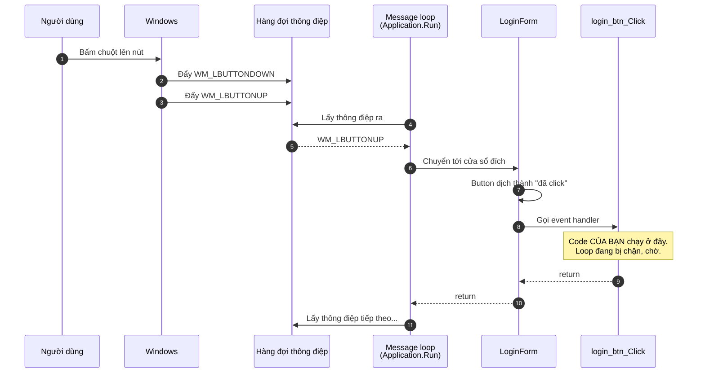
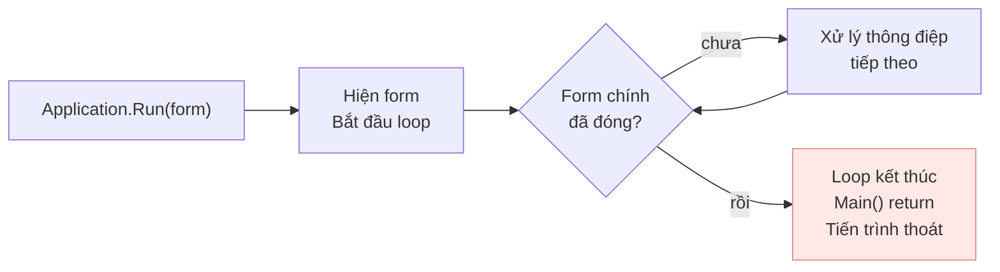
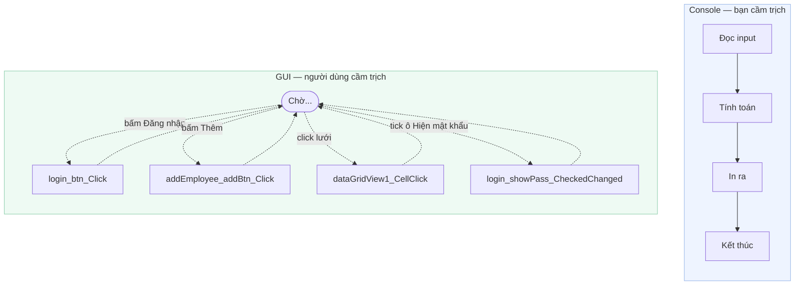

[← Mục lục](README.md) · Bài 01/09 · [Tiếp: Giải phẫu dự án →](02-giai-phau-du-an.md)

# 01 · WinForms chạy thế nào

## Vấn đề

Bạn viết `private void login_btn_Click(...)`. Bạn không gọi nó ở đâu cả. Vậy mà khi người
dùng bấm nút, nó chạy. **Ai gọi nó?**

Trả lời được câu này là hiểu được toàn bộ mô hình WinForms.

## Cơ chế: vòng lặp thông điệp

Chương trình console chạy từ trên xuống rồi kết thúc. Ứng dụng giao diện thì không —
nó phải **ngồi chờ** người dùng làm gì đó. Cái vòng chờ đó gọi là *message loop*.

Windows không gửi thẳng sự kiện cho code của bạn. Nó đẩy **thông điệp** vào một hàng đợi
riêng cho từng luồng. Ứng dụng phải tự lấy ra và xử lý.



Ba điều quan trọng rút ra từ sơ đồ:

1. **Không phải bạn gọi handler — message loop gọi.** Code của bạn là thứ *được gọi lại*
   (callback).
2. **Trong lúc handler chạy, loop đứng im.** Nó không lấy được thông điệp nào khác. Đây
   chính là lý do app bị "đơ" — xem [bài 07](07-luong-ui-va-xu-ly-loi.md).
3. **Chỉ có một luồng làm việc này.** Gọi là *UI thread*.

## Trong dự án này

Toàn bộ điểm khởi đầu nằm ở `EmployeeManagementSystem/Program.cs`:

```csharp
[STAThread]
static void Main()
{
    Application.EnableVisualStyles();
    Application.SetCompatibleTextRenderingDefault(false);

    try
    {
        AppServices.Initialize();
    }
    catch (Exception ex)
    {
        MessageBox.Show(
            "The application could not start:" + Environment.NewLine + Environment.NewLine + ex.Message,
            "Startup Error", MessageBoxButtons.OK, MessageBoxIcon.Error);
        return;
    }

    Application.Run(new LoginForm());
}
```

Đọc từng dòng:

| Dòng | Ý nghĩa |
|------|---------|
| `[STAThread]` | Đánh dấu luồng chính là *Single-Threaded Apartment*. COM yêu cầu điều này, mà clipboard, drag-drop và `OpenFileDialog` đều dựa trên COM. **Bỏ đi là các thứ đó hỏng.** |
| `EnableVisualStyles()` | Dùng giao diện theo theme Windows thay vì kiểu Windows 95. |
| `SetCompatibleTextRenderingDefault(false)` | Vẽ chữ bằng GDI thay vì GDI+. Phải gọi **trước** khi tạo control đầu tiên. |
| `AppServices.Initialize()` | Của riêng dự án này — dựng repository. Xem [bài 06](06-kien-truc-phan-tang.md). |
| `Application.Run(new LoginForm())` | **Đây là message loop.** Dòng này chặn cho tới khi form đóng. |

Lưu ý cách `Program.cs` bọc `Initialize()` trong `try`: nếu không kết nối được cấu hình,
app hiện một thông báo rồi thoát sạch, thay vì mở lên rồi lỗi lung tung ở từng màn hình.

### `Application.Run` kết thúc khi nào?



Điều này giải thích một chi tiết trong dự án: khi đăng xuất, `MainForm` **ẩn** chính nó
chứ không đóng:

```csharp
// Forms/MainForm.cs
new LoginForm().Show();
this.Hide();      // Hide, không phải Close
```

Nếu gọi `Close()` trên form chính, message loop kết thúc và **cả ứng dụng thoát** — kể cả
khi `LoginForm` mới vừa được hiện ra.

> **Ghi chú thẳng thắn:** cách này chạy được nhưng không đẹp. Mỗi lần đăng xuất lại tạo
> thêm một `LoginForm` mới, còn form cũ chỉ bị ẩn và vẫn nằm trong bộ nhớ. Cách chuẩn hơn
> là dùng `LoginForm` như dialog (`ShowDialog`) và cho `Application.Run` chạy trên
> `MainForm`. Đây là [bài tập 3](09-bai-tap.md).

## Hướng sự kiện nghĩa là gì

Trong console bạn quyết định thứ tự. Trong GUI **người dùng quyết định**. Code của bạn chỉ
là một tập các phản ứng rời rạc.



Hệ quả thực tế: **bạn không kiểm soát được thứ tự**. Người dùng có thể bấm "Sửa" trước khi
chọn dòng nào. Mỗi handler phải tự kiểm tra điều kiện của nó — đó là lý do
`Views/EmployeeView.cs` có hàm `ReadForm()` kiểm tra mọi ô trước khi làm gì:

```csharp
private Employee ReadForm()
{
    if (addEmployee_id.Text.Trim().Length == 0
        || addEmployee_fullName.Text.Trim().Length == 0
        /* ... */)
    {
        UiMessage.Warn("Please fill all blank fields.");
        return null;      // handler dừng tại đây
    }

    return new Employee { /* ... */ };
}
```

## Cạm bẫy

**Đừng bao giờ làm việc nặng trong handler.** Loop đang chờ bạn. Một truy vấn chậm hay một
`Thread.Sleep` sẽ làm cửa sổ trắng xoá và Windows dán nhãn "Not Responding".

**Đừng gọi `Application.DoEvents()` để chữa cháy.** Nó bơm thông điệp giữa chừng handler
của bạn, cho phép người dùng bấm lại chính cái nút đang chạy — sinh ra lỗi tái nhập
(reentrancy) cực khó tìm. Cách đúng là `async`/`await` hoặc chạy nền, xem
[bài 07](07-luong-ui-va-xu-ly-loi.md).

**Hộp thoại chặn loop chính, không chặn timer.** `MessageBox.Show` chạy message loop
riêng của nó. Trong lúc hộp thoại mở, `Timer.Tick` vẫn nổ. Nếu handler của timer động
vào cùng dữ liệu, bạn có bug.

## Tự kiểm tra

1. Vì sao `Main()` cần `[STAThread]`?
2. `Application.Run(new LoginForm())` return khi nào?
3. Bạn đặt `Thread.Sleep(5000)` vào trong `login_btn_Click`. Người dùng thấy gì?
4. Vì sao `MainForm` gọi `Hide()` chứ không phải `Close()` lúc đăng xuất?

<details>
<summary>Đáp án</summary>

1. Vì các tính năng dựa trên COM — clipboard, kéo-thả, `OpenFileDialog` — yêu cầu luồng
   ở chế độ STA. Thiếu nó, `addEmployee_importBtn_Click` (dùng `OpenFileDialog`) sẽ hỏng.
2. Khi form được truyền vào bị đóng. Lúc đó loop dừng, `Main()` return, tiến trình thoát.
3. Cửa sổ đứng hình 5 giây: không vẽ lại, không nhận click, tiêu đề có thể thành
   "(Not Responding)". Vì loop bị chặn nên không lấy được thông điệp `WM_PAINT` nào.
4. Vì `MainForm` là form được truyền cho `Application.Run`. Đóng nó sẽ kết thúc message
   loop và thoát cả ứng dụng, khiến `LoginForm` vừa hiện ra cũng biến mất.

</details>

---

[← Mục lục](README.md) · [Tiếp: Giải phẫu dự án →](02-giai-phau-du-an.md)
