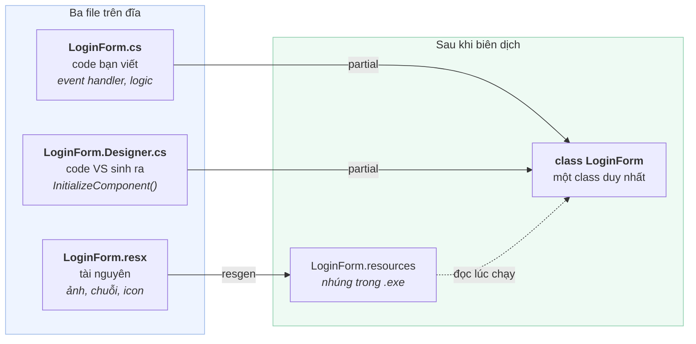
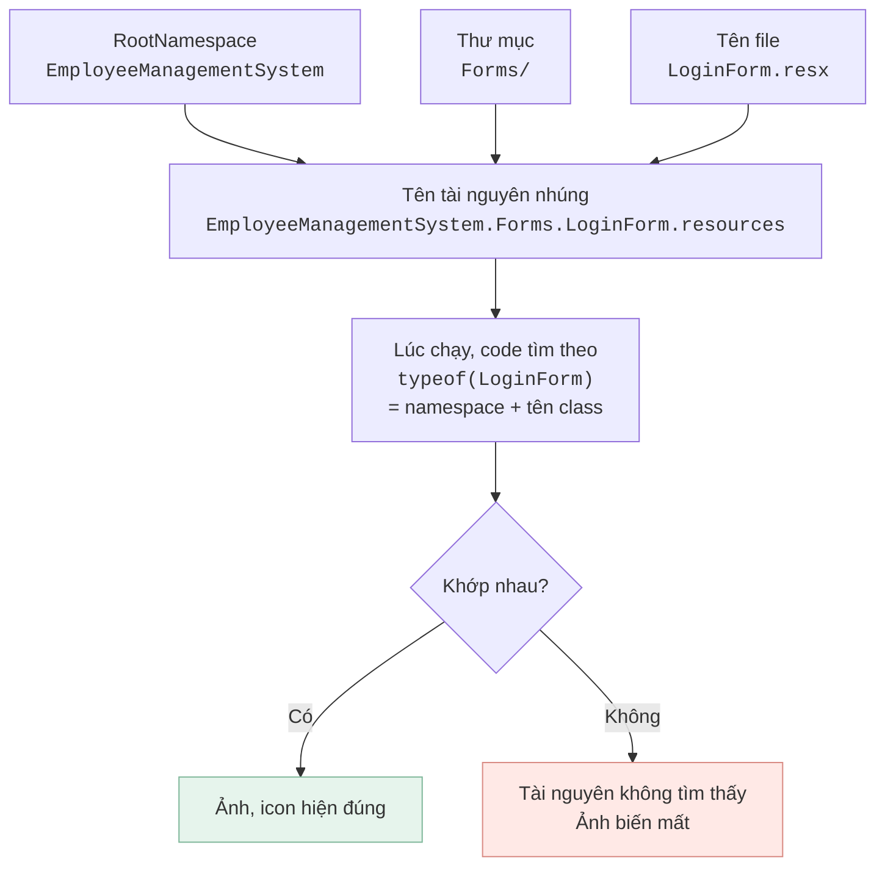
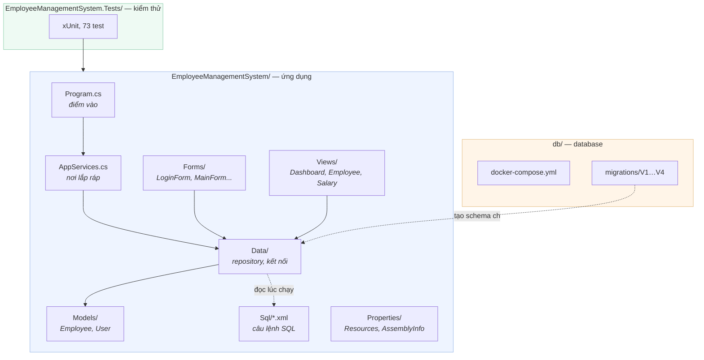
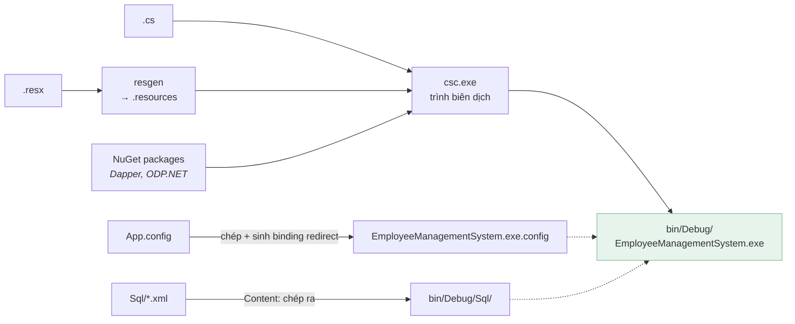

[← Bài 01](01-winforms-hoat-dong-the-nao.md) · Bài 02/12 · [Tiếp: Vòng đời Form →](03-vong-doi-form-usercontrol.md)

# 02 · Giải phẫu dự án

## Vấn đề

Bạn kéo một nút vào form. Visual Studio sinh ra file nào? Vì sao có `.Designer.cs`? File
`.resx` chứa gì? Và vì sao đôi khi sửa tay vào chúng lại làm hỏng cả form?

## Ba file cho một form

Mỗi form trong WinForms là **một class trải trên nhiều file**, nhờ từ khoá `partial`.



Cả `LoginForm.cs` và `LoginForm.Designer.cs` đều khai báo `partial class LoginForm`.
Trình biên dịch ghép chúng lại thành một class. Chia đôi để **Visual Studio có thể ghi đè
file Designer bất cứ lúc nào mà không đụng vào code của bạn**.

### Ai viết file nào

| File | Ai sửa | Sửa tay được không |
|------|--------|--------------------|
| `LoginForm.cs` | Bạn | Đương nhiên |
| `LoginForm.Designer.cs` | Visual Studio | Được, nhưng cẩn thận — xem bên dưới |
| `LoginForm.resx` | Visual Studio | Gần như không bao giờ nên |

## Bên trong `.Designer.cs`

Mở `EmployeeManagementSystem/Forms/LoginForm.Designer.cs`. Bạn sẽ thấy ba phần:

```csharp
// Rút gọn cho dễ đọc — file thật dài hơn nhiều
partial class LoginForm
{
    // 1. Nơi chứa component (dùng cho Dispose)
    private System.ComponentModel.IContainer components = null;

    protected override void Dispose(bool disposing) { /* ... */ }

    // 2. Hàm dựng giao diện — VS sinh lại mỗi khi bạn kéo thả
    private void InitializeComponent()
    {
        this.login_btn = new System.Windows.Forms.Button();
        this.login_btn.Location = new System.Drawing.Point(50, 300);
        this.login_btn.Text = "Login";
        this.login_btn.Click += new System.EventHandler(this.login_btn_Click);
        this.Controls.Add(this.login_btn);
        // ...
    }

    // 3. Khai báo field cho từng control
    private System.Windows.Forms.Button login_btn;
}
```

**`InitializeComponent()` chính là "giao diện" của bạn.** Không có file layout dạng XML
như WPF hay HTML — bố cục là code C# thuần, chạy tuần tự lúc form được tạo.

Dòng đáng chú ý nhất:

```csharp
this.login_btn.Click += new System.EventHandler(this.login_btn_Click);
```

Đây là chỗ nối nút với handler. **Đây là câu trả lời cho câu hỏi ở bài 01: ai gọi handler.**
Không có dòng này, bạn bấm nút sẽ không có gì xảy ra.

> **Cạm bẫy hay gặp:** bạn xoá hàm `login_btn_Click` trong `LoginForm.cs` nhưng quên xoá
> dòng `+=` trong Designer → lỗi biên dịch "does not contain a definition". Ngược lại,
> đổi tên control trong Designer mà quên đổi trong code cũng hỏng tương tự.

## File `.resx`

`.resx` là XML chứa tài nguyên nhúng: ảnh, icon, chuỗi đã dịch. Lúc build, MSBuild biến
nó thành `.resources` rồi nhúng thẳng vào file `.exe`.

**Tên tài nguyên được ghép từ namespace gốc + đường dẫn thư mục + tên file.** Đây là chi
tiết đã cắn dự án này khi tái cấu trúc:



Nghĩa là: **nếu bạn chuyển form vào thư mục con, phải đổi namespace theo cho khớp**, nếu
không tên tài nguyên sẽ lệch với tên class. Trong dự án này, khi ba form được chuyển vào
`Forms/`, namespace cũng đổi thành `EmployeeManagementSystem.Forms`, nên đường dẫn vẫn
khớp.

> Dự án này may mắn ở chỗ các file `.resx` chỉ chứa mẫu mặc định của Visual Studio, chưa
> có tài nguyên thật, nên di chuyển không làm hỏng gì. Ảnh trong app đến từ
> `Properties/Resources.resx` — một file riêng, không di chuyển.

## File `.csproj`

`.csproj` là kịch bản build. Dự án này dùng **định dạng cũ (legacy)**, nghĩa là
**mọi file phải được liệt kê tường minh**:

```xml
<ItemGroup>
  <Compile Include="Forms\LoginForm.cs">
    <SubType>Form</SubType>
  </Compile>
  <Compile Include="Forms\LoginForm.Designer.cs">
    <DependentUpon>LoginForm.cs</DependentUpon>
  </Compile>
  <EmbeddedResource Include="Forms\LoginForm.resx">
    <DependentUpon>LoginForm.cs</DependentUpon>
  </EmbeddedResource>
</ItemGroup>
```

| Thẻ | Tác dụng |
|-----|----------|
| `<Compile>` | File này được biên dịch. **Thiếu là class không tồn tại.** |
| `<SubType>Form</SubType>` | Bảo VS mở bằng designer thay vì trình soạn text |
| `<DependentUpon>` | Cho file nằm thụt vào dưới file cha trong Solution Explorer |
| `<EmbeddedResource>` | Nhúng file vào assembly |
| `<Content>` + `CopyToOutputDirectory` | Chép file ra cạnh `.exe` (dự án này dùng cho `Sql/*.xml`) |

> **Khác biệt quan trọng với dự án .NET đời mới:** định dạng SDK-style (`<Project Sdk="...">`)
> tự động gộp mọi file `.cs` trong thư mục, không cần liệt kê. Project test của dự án này
> (`EmployeeManagementSystem.Tests`) dùng định dạng mới — mở ra so sánh sẽ thấy nó ngắn hơn
> hẳn.

## Toàn cảnh dự án



Chi tiết vì sao chia tầng như vậy: [bài 06](06-kien-truc-phan-tang.md).

## Từ mã nguồn đến file chạy



Chi tiết cần nhớ: `App.config` **không** được nhúng vào `.exe`. Nó được chép ra thành
`EmployeeManagementSystem.exe.config` nằm cạnh file chạy. Nghĩa là **sửa chuỗi kết nối
sau khi build được, không cần biên dịch lại** — cứ mở file `.config` trong `bin\Debug` ra
sửa.

Tương tự với `Sql/*.xml`: chúng được chép ra `bin\Debug\Sql\` nên sửa một câu SQL cũng
không cần build lại. Xem [bài 05](05-ket-noi-database.md).

## Cạm bẫy

**Thêm file mới bằng tay mà quên khai báo trong `.csproj`.** File nằm trên đĩa, VS có thể
hiện nó, nhưng trình biên dịch không thấy → "type or namespace not found". Với định dạng
legacy, mỗi file `.cs` phải có một dòng `<Compile Include="...">`.

**Sửa `.Designer.cs` bằng tay rồi mở designer.** Nếu VS không hiểu được code bạn viết, nó
có thể ghi đè hoặc báo lỗi thiết kế. Đổi tên class, đổi namespace thì an toàn; viết logic
vào đó thì không.

**Đặt code khởi tạo vào `InitializeComponent()`.** Lần sau bạn kéo thả một control, VS sinh
lại hàm này và code của bạn bốc hơi. Code khởi tạo đặt trong constructor hoặc `OnLoad` —
xem [bài 03](03-vong-doi-form-usercontrol.md).

## Tự kiểm tra

1. Vì sao form được chia thành hai file `.cs`?
2. Xoá dòng `this.login_btn.Click += ...` trong Designer thì chuyện gì xảy ra? Có lỗi biên
   dịch không?
3. Bạn chuyển `MainForm.cs` từ thư mục gốc vào `Forms/` nhưng giữ nguyên namespace. Điều gì
   có thể hỏng?
4. Sửa chuỗi kết nối trong `bin\Debug\EmployeeManagementSystem.exe.config` có cần build lại
   không?

<details>
<summary>Đáp án</summary>

1. Để Visual Studio ghi đè phần giao diện (`.Designer.cs`) mỗi khi bạn kéo thả, mà không
   đụng tới code bạn viết. Từ khoá `partial` ghép chúng thành một class lúc biên dịch.
2. **Không có lỗi biên dịch.** Code vẫn build bình thường, nhưng bấm nút thì không có gì
   xảy ra — vì không còn ai nối sự kiện với handler nữa. Đây là loại lỗi khó tìm.
3. Tên tài nguyên nhúng thành `EmployeeManagementSystem.Forms.MainForm.resources` (theo
   thư mục) trong khi code tìm theo `typeof(MainForm)` = `EmployeeManagementSystem.MainForm`.
   Lệch nhau → tài nguyên trong `.resx` không nạp được, ảnh/icon biến mất.
4. Không. `App.config` được chép ra chứ không nhúng vào `.exe`, nên sửa file `.config` cạnh
   file chạy là đủ.

</details>

---

[← Bài 01](01-winforms-hoat-dong-the-nao.md) · [Tiếp: Vòng đời Form →](03-vong-doi-form-usercontrol.md)
