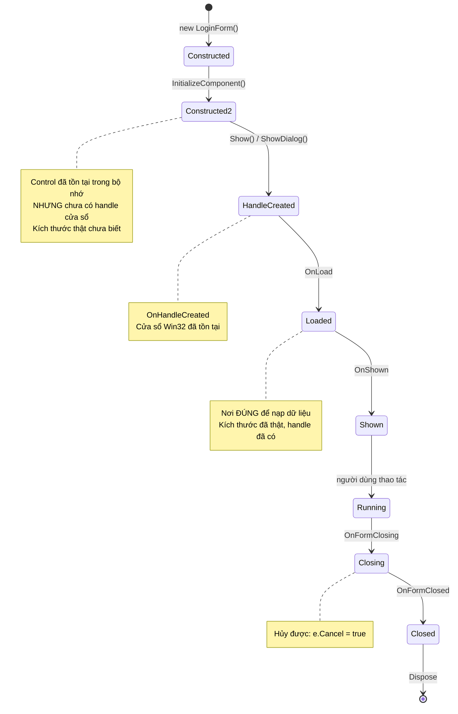
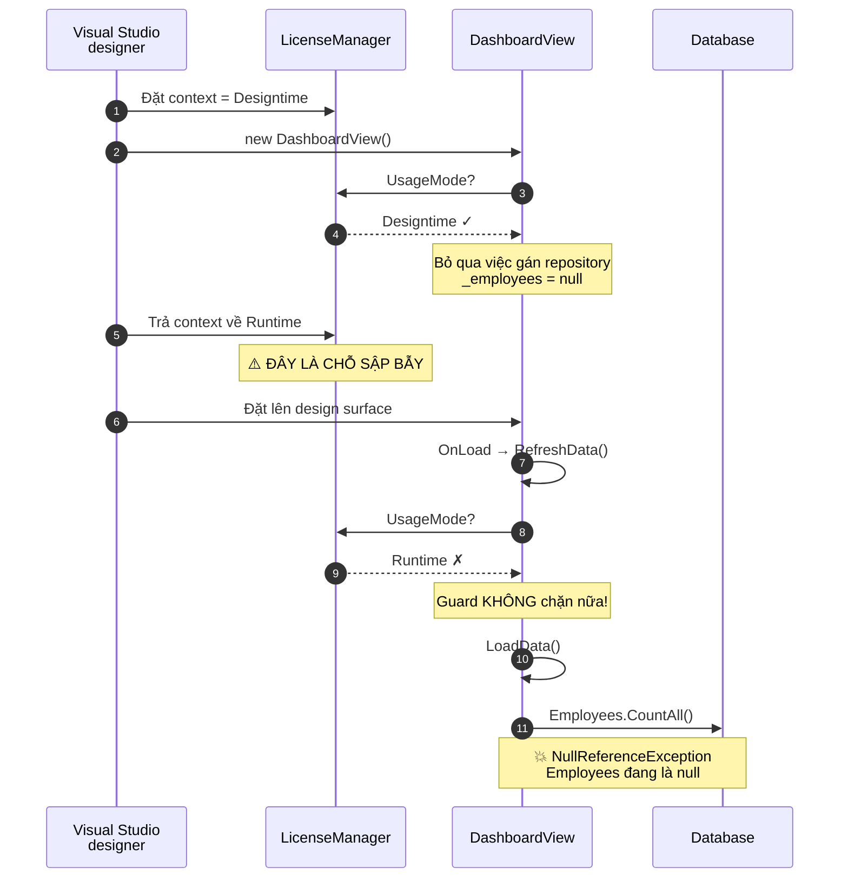
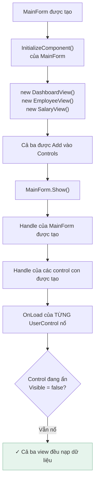
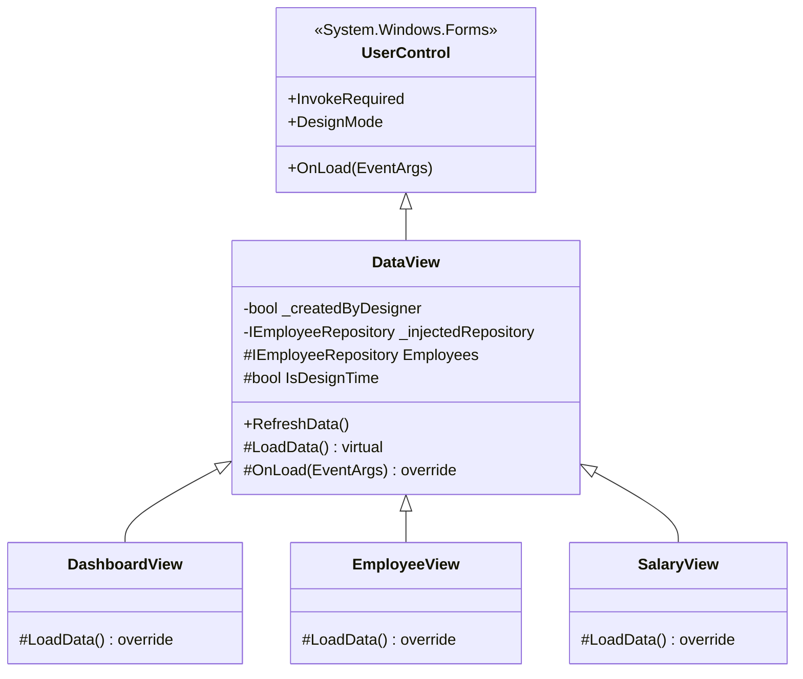

[← Bài 02](02-giai-phau-du-an.md) · Bài 03/09 · [Tiếp: DataGridView →](04-datagridview-databinding.md)

# 03 · Vòng đời Form và UserControl

## Vấn đề

Bạn cần nạp dữ liệu khi màn hình mở ra. Đặt code ở đâu — constructor hay `OnLoad`?

Nhiều tài liệu trả lời "chỗ nào cũng được". **Sai.** Dự án này đã dính một lỗi thật vì
chọn sai, và bài này mổ xẻ đúng con bug đó.

## Vòng đời một Form



### Constructor và `OnLoad` khác nhau ở đâu

| | Constructor | `OnLoad` |
|---|---|---|
| Control đã tạo chưa | Sau `InitializeComponent()` thì rồi | Rồi |
| Handle cửa sổ | **Chưa có** | Đã có |
| Kích thước thật | **Chưa biết** (còn là giá trị thiết kế) | Đã biết |
| Chạy khi mở trong designer | **Có** | Có (khi control nằm trên design surface) |
| `Invoke` gọi được chưa | **Chưa** — chưa có handle | Rồi |
| Chạy mấy lần | Một lần | Một lần mỗi lần handle được tạo |

**Nguyên tắc: constructor chỉ để lắp ráp. Mọi thứ chạm ra ngoài — database, file, mạng —
đặt ở `OnLoad`.**

Lý do quan trọng nhất nằm ở dòng in đậm: **constructor cũng chạy bên trong Visual Studio
designer.** Khi bạn mở một form để sửa giao diện, VS thực sự khởi tạo các control con
ngay trong tiến trình `devenv.exe`.

## Câu chuyện có thật của dự án này

Ba màn hình `DashboardView`, `EmployeeView`, `SalaryView` đều cần nạp dữ liệu. Phiên bản
đầu đặt việc đó trong constructor:

```csharp
// PHIÊN BẢN CŨ — có lỗi
public Dashboard()
{
    InitializeComponent();
    displayTotalEmployees();     // ← mở kết nối database
    displayActiveEmployees();
    displayInactiveEmployees();
}
```

Hậu quả: **mỗi lần lập trình viên mở form trong designer, Visual Studio cố mở một kết nối
Oracle.** Không có database thì designer báo lỗi.

### Lần sửa thứ nhất — và vì sao nó vẫn sai

Cách sửa hiển nhiên là hỏi "có phải đang ở designer không?":

```csharp
// LẦN SỬA THỨ NHẤT — vẫn còn lỗi
protected DataView() : this(DesignTime ? null : AppServices.Employees) { }

protected static bool DesignTime
{
    get { return LicenseManager.UsageMode == LicenseUsageMode.Designtime; }
}

public void RefreshData()
{
    if (DesignTime) return;      // ← kiểm tra lần hai
    LoadData();
}
```

Trông có vẻ ổn. Nhưng mở `MainForm` trong designer thì hiện ra:

```
Object reference not set to an instance of an object.
```

Vì sao? Vì **`LicenseManager.UsageMode` chỉ báo `Designtime` trong lúc constructor đang
chạy.** Khi designer đặt control lên design surface và `OnLoad` nổ, nó đã quay về
`Runtime`.



Constructor bỏ qua việc lắp repository, rồi `OnLoad` lại kết luận "không phải design time"
và truy cập đúng cái `null` mà constructor vừa để lại.

### Lần sửa thứ hai — cách đúng

Nằm ở `Views/DataView.cs`:

```csharp
public class DataView : UserControl
{
    private readonly bool _createdByDesigner;
    private readonly IEmployeeRepository _injectedRepository;

    protected DataView(IEmployeeRepository employees)
    {
        // LicenseManager chỉ chính xác TRONG LÚC dựng component,
        // nên phải chốt câu trả lời tại đây và nhớ lấy.
        _createdByDesigner = LicenseManager.UsageMode == LicenseUsageMode.Designtime;
        _injectedRepository = employees;
    }

    // Lấy lười: dựng view không bao giờ cần AppServices đã khởi tạo.
    protected IEmployeeRepository Employees
    {
        get { return _injectedRepository ?? AppServices.Employees; }
    }

    protected bool IsDesignTime
    {
        get { return _createdByDesigner || DesignMode; }
    }

    public void RefreshData()
    {
        if (IsDesignTime || !HasRepository) return;
        // ...
        LoadData();
    }

    protected override void OnLoad(EventArgs e)
    {
        base.OnLoad(e);
        RefreshData();
    }
}
```

Ba thay đổi, mỗi thay đổi đóng một lỗ:

1. **Chốt kết quả một lần trong constructor** (`_createdByDesigner`) — không hỏi lại
   `LicenseManager` về sau nữa.
2. **OR với `DesignMode`** — vì `DesignMode` trả `false` cho control lồng bên trong
   control khác, nên **dùng riêng mỗi cái đều không đủ**.
3. **Lấy repository lười qua property** — constructor không còn cần `AppServices` đã sẵn
   sàng, nên mở form trong designer không thể ném lỗi.

### Bảng so sánh hai cách phát hiện design-time

| | `LicenseManager.UsageMode` | `this.DesignMode` |
|---|---|---|
| Dùng được trong constructor | **Có** | Không (luôn `false`) |
| Dùng được sau constructor | **Không** (đã về Runtime) | Có |
| Đúng với control lồng nhau | Có | **Không** |

→ Không cái nào đủ một mình. Dự án dùng cả hai.

## Vòng đời UserControl

`UserControl` giống Form nhưng thiếu vài sự kiện và **phụ thuộc vào cha**:



**Điểm bất ngờ: `OnLoad` của UserControl vẫn nổ ngay cả khi `Visible = false`**, miễn là
control có cha và cha được hiện. Trong dự án này, mở `MainForm` sẽ chạy **ba** truy vấn
database cùng lúc, dù người dùng chỉ nhìn thấy một màn hình.

> Đây là một điểm chưa tối ưu còn tồn tại. Nạp lười (chỉ nạp khi view được hiện lần đầu)
> là [bài tập 5](09-bai-tap.md).

## Mẫu lớp cơ sở

`DataView` là một lớp cơ sở gom phần chung. Ba view kế thừa nó:



Lớp con chỉ cần override đúng một hàm:

```csharp
// Views/DashboardView.cs — toàn bộ phần logic
public partial class DashboardView : DataView
{
    public DashboardView()
    {
        InitializeComponent();
    }

    protected override void LoadData()
    {
        dashboard_TE.Text = Employees.CountAll().ToString();
        dashboard_AE.Text = Employees.CountByStatus(EmployeeStatus.Active).ToString();
        dashboard_IE.Text = Employees.CountByStatus(EmployeeStatus.Inactive).ToString();
    }
}
```

Guard design-time, chuyển luồng, và bắt lỗi đều nằm ở lớp cha. Lớp con không cần biết.

> **Lưu ý khi dùng lớp cơ sở với designer:** lớp cơ sở phải **biên dịch được và không
> abstract** thì designer mới vẽ được lớp con. Nếu `DataView` là `abstract`, VS sẽ báo
> "The designer could not be shown".

## Cạm bẫy

**Đặt truy vấn database trong constructor.** Designer sẽ chạy nó. Đây chính là lỗi gốc
của dự án này.

**Dùng kích thước control trong constructor.** `this.Width` lúc đó là giá trị thiết kế,
chưa tính scaling theo DPI hay layout của cha. Đọc trong `OnLoad` hoặc muộn hơn.

**Gọi `Invoke` trong constructor.** Chưa có handle → `InvalidOperationException`. Xem
[bài 07](07-luong-ui-va-xu-ly-loi.md).

**Quên gọi `base.OnLoad(e)`.** Sự kiện `Load` sẽ không nổ cho người đăng ký từ bên ngoài.
Luôn gọi `base` trước khi làm việc của mình.

**Tưởng `OnLoad` chỉ chạy một lần.** Nó chạy mỗi khi handle được tạo lại. Đóng rồi hiện
lại một form sẽ kích hoạt nó lần nữa.

## Tự kiểm tra

1. Vì sao đặt lệnh gọi database trong constructor của UserControl lại nguy hiểm?
2. Vì sao `LicenseManager.UsageMode` một mình không đủ để phát hiện design-time?
3. Vì sao `DesignMode` một mình cũng không đủ?
4. `MainForm` chứa ba UserControl, hai trong số đó `Visible = false`. Mở `MainForm` thì
   mấy cái `OnLoad` chạy?
5. Bạn muốn đọc chiều rộng thật của control để chia cột. Đặt code ở đâu?

<details>
<summary>Đáp án</summary>

1. Vì Visual Studio designer cũng gọi constructor đó khi bạn mở form chứa nó. Máy lập
   trình viên sẽ cần database chỉ để sửa giao diện.
2. Vì nó chỉ báo `Designtime` **trong lúc component đang được dựng**. Đến `OnLoad` thì đã
   trở về `Runtime`, nên kiểm tra ở hai thời điểm cho hai kết quả khác nhau — đúng cơ chế
   gây ra `NullReferenceException` của dự án này.
3. Vì `DesignMode` trả `false` cho control **lồng bên trong** một control khác đang được
   thiết kế. Ba view nằm trong `MainForm` chính là trường hợp đó.
4. **Cả ba.** `Visible = false` không ngăn `OnLoad`; chỉ cần control có cha và cha được
   hiện là handle được tạo và `Load` nổ.
5. Trong `OnLoad` hoặc muộn hơn. Trong constructor, `Width` vẫn là giá trị lúc thiết kế.

</details>

---

[← Bài 02](02-giai-phau-du-an.md) · [Tiếp: DataGridView →](04-datagridview-databinding.md)
