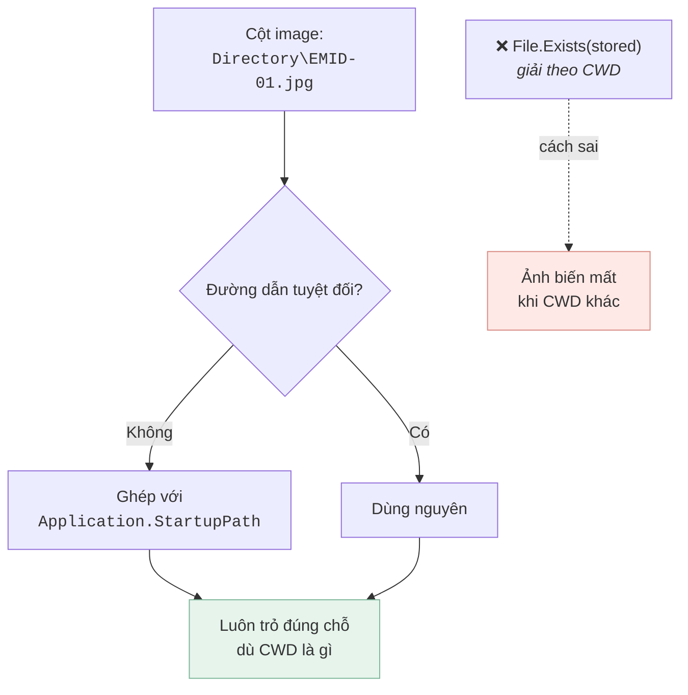
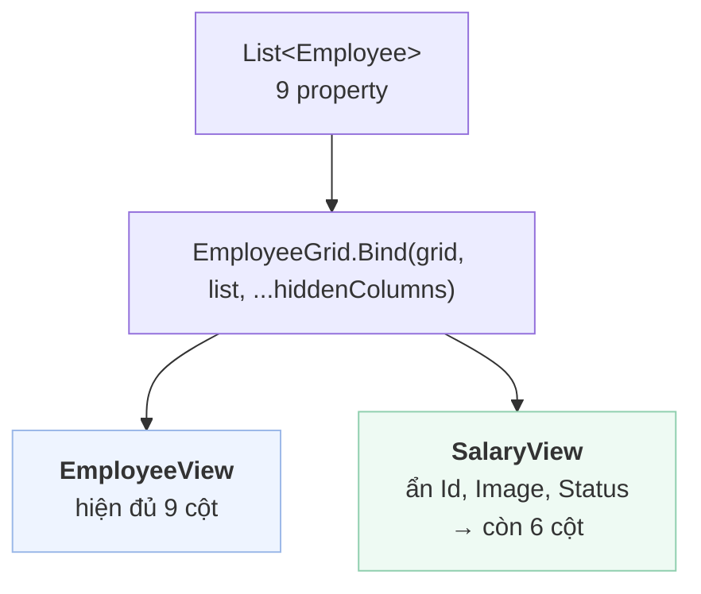
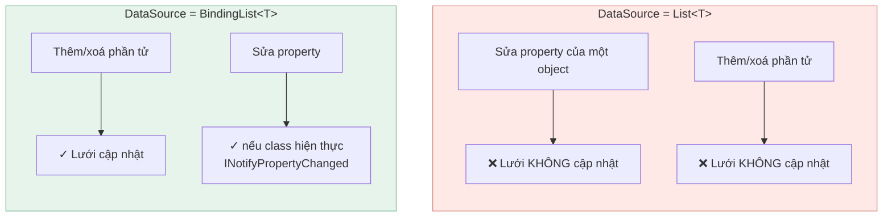

[← Bài 03](03-vong-doi-form-usercontrol.md) · Bài 04/12 · [Tiếp: Kết nối database →](05-ket-noi-database.md)

# 04 · DataGridView và data binding

## Vấn đề

Bạn có `List<Employee>`. Bạn muốn nó hiện thành bảng, và khi người dùng click một dòng thì
lấy lại được đúng object đó. Làm sao?

## Cơ chế: gán DataSource

Cách thủ công là lặp và thêm từng dòng. **Đừng làm vậy.** WinForms có data binding —
đây là toàn bộ phần cốt lõi của `EmployeeGrid.Bind`:

```csharp
grid.AutoGenerateColumns = true;
grid.DataSource = new List<Employee>(employees);
```

Hai dòng. Lưới tự đọc các **public property** của `Employee` bằng reflection và sinh một
cột cho mỗi property, **theo đúng thứ tự khai báo trong class**.

```mermaid
flowchart LR
    subgraph M["Models/Employee.cs"]
        direction TB
        P1["int Id"]
        P2["string EmployeeId"]
        P3["string FullName"]
        P4["string Gender"]
        P5["string ContactNumber"]
        P6["string Position"]
        P7["string Image"]
        P8["int Salary"]
        P9["string Status"]
    end

    R["Reflection<br/><i>đọc property</i>"]

    subgraph G["DataGridView"]
        direction TB
        C1["Cột 0: Id"]
        C2["Cột 1: EmployeeId"]
        C3["Cột 2: FullName"]
        C4["..."]
        C9["Cột 8: Status"]
    end

    M --> R --> G

    style M fill:#eef4ff,stroke:#9bb8e8
    style G fill:#eefaf3,stroke:#8fcfae
```



**Tên cột chính là tên property.** Đây là chìa khoá cho phần sau.

## Cạm bẫy lớn nhất: chỉ số cột

Phiên bản đầu của dự án đọc dữ liệu từ lưới thế này:

```csharp
// PHIÊN BẢN CŨ — dễ vỡ
private void dataGridView1_CellClick(object sender, DataGridViewCellEventArgs e)
{
    DataGridViewRow row = dataGridView1.Rows[e.RowIndex];
    addEmployee_id.Text        = row.Cells[1].Value.ToString();
    addEmployee_fullName.Text  = row.Cells[2].Value.ToString();
    addEmployee_gender.Text    = row.Cells[3].Value.ToString();
    addEmployee_position.Text  = row.Cells[5].Value.ToString();
    addEmployee_status.Text    = row.Cells[8].Value.ToString();
}
```

Vấn đề: **`Cells[5]` chỉ đúng chừng nào không ai đụng vào thứ tự property trong
`Employee`.** Thêm một property vào giữa class, hoặc đổi chỗ hai property, thì mọi chỉ số
sau đó lệch — và **trình biên dịch không hề báo gì**. Bạn chỉ phát hiện khi thấy cột
"Chức vụ" hiện ra số điện thoại.

### Cách sửa: lấy thẳng object đã bind

Mỗi dòng của lưới giữ tham chiếu tới object gốc trong `DataBoundItem`:

```csharp
// Views/EmployeeGrid.cs
public static Employee RowAt(DataGridView grid, int rowIndex)
{
    if (rowIndex < 0 || rowIndex >= grid.Rows.Count)
    {
        return null;          // dòng header có RowIndex = -1
    }

    return grid.Rows[rowIndex].DataBoundItem as Employee;
}
```

Nhờ vậy handler trở thành:

```csharp
// Views/EmployeeView.cs
private void dataGridView1_CellClick(object sender, DataGridViewCellEventArgs e)
{
    Employee employee = EmployeeGrid.RowAt(dataGridView1, e.RowIndex);
    if (employee == null)
    {
        return;
    }

    addEmployee_id.Text          = employee.EmployeeId;
    addEmployee_fullName.Text    = employee.FullName;
    addEmployee_gender.Text      = employee.Gender;
    addEmployee_phoneNumber.Text = employee.ContactNumber;
    addEmployee_position.Text    = employee.Position;
    addEmployee_status.Text      = employee.Status;

    ShowPicture(employee.Image);
}
```

So sánh:

| | `row.Cells[5]` | `DataBoundItem` |
|---|---|---|
| Đổi thứ tự property | **Hỏng ngầm** | Vẫn đúng |
| Đổi tên property | Vẫn "chạy" (sai) | **Lỗi biên dịch** |
| Kiểu dữ liệu | `object`, phải `ToString()` | Đã đúng kiểu |
| Giá trị null | `NullReferenceException` | `null` bình thường |

Nguyên tắc chung: **để trình biên dịch bắt lỗi thay bạn.** Chỉ số là chuỗi ma thuật ở dạng
số.

> `e.RowIndex == -1` nghĩa là người dùng click vào **header**. Luôn phải kiểm tra — đây là
> nguồn `IndexOutOfRangeException` kinh điển.

## Ảnh: hai cái bẫy của `PictureBox`

Dòng `ShowPicture(employee.Image)` ở trên trông vô hại, nhưng chứa hai bẫy mà dự án này
đã dính cả hai.

### Bẫy 1 — `PictureBox` không tự giải phóng ảnh cũ

Gán `pictureBox.Image = anhMoi` **không** giải phóng ảnh đang giữ. `Image` là đối tượng
bọc bộ nhớ GDI+ không được quản lý bởi garbage collector theo cách thông thường. Mỗi lần
người dùng bấm một dòng, một bitmap bị bỏ rơi.

```csharp
// Views/EmployeeView.cs
private void SetPicture(Image image)
{
    Image previous = addEmployee_picture.Image;
    addEmployee_picture.Image = image;

    if (previous != null && !ReferenceEquals(previous, image))
    {
        previous.Dispose();
    }
}
```

Kiểm tra `ReferenceEquals` là cần thiết: gán lại chính ảnh đang hiển thị rồi `Dispose` nó
sẽ để lại một `PictureBox` trỏ vào đối tượng đã huỷ, và lần vẽ tiếp theo ném
`ArgumentException`.

### Bẫy 2 — đường dẫn tương đối không tính từ nơi bạn nghĩ

Cột `image` lưu chuỗi như `Directory\EMID-01.jpg`. Nhưng `File.Exists("Directory\...")`
giải theo **thư mục làm việc hiện tại**, không phải nơi đặt file `.exe`. Chạy app từ một
shortcut có "Start in" khác là mọi ảnh biến mất.



```csharp
private static string ResolvePicturePath(string stored)
{
    if (string.IsNullOrWhiteSpace(stored))
    {
        return null;
    }

    return Path.IsPathRooted(stored)
        ? stored
        : Path.Combine(Application.StartupPath, stored);
}
```

Nhận cả hai dạng vì dữ liệu cũ có thể đã lưu đường dẫn tuyệt đối. Khi **ghi**, ứng dụng
luôn lưu dạng tương đối, để cả thư mục di chuyển được mà không hỏng.

> **Bài học rộng hơn:** đường dẫn tương đối trong dữ liệu là một quả bom hẹn giờ, vì
> "tương đối với cái gì" không nằm trong chính chuỗi đó. Hoặc lưu tuyệt đối, hoặc quy định
> rõ gốc và luôn giải theo gốc đó — đừng phó mặc cho `Environment.CurrentDirectory`.

## Ẩn cột và đổi tiêu đề

`SalaryView` và `EmployeeView` dùng chung model `Employee` nhưng hiện khác nhau:



```csharp
// Views/EmployeeGrid.cs
public static void Bind(DataGridView grid, IReadOnlyList<Employee> employees,
                        params string[] hiddenColumns)
{
    grid.AutoGenerateColumns = true;
    grid.DataSource = new List<Employee>(employees);

    foreach (DataGridViewColumn column in grid.Columns)
    {
        string header;
        if (Headers.TryGetValue(column.Name, out header))
        {
            column.HeaderText = header;      // "EmployeeId" → "Employee ID"
        }

        column.Visible = Array.IndexOf(hiddenColumns, column.Name) < 0;
    }
}
```

Gọi:

```csharp
// EmployeeView — tất cả các cột
EmployeeGrid.Bind(dataGridView1, Employees.GetAll());

// SalaryView — chỉ những gì liên quan tới lương
EmployeeGrid.Bind(dataGridView1, Employees.GetByStatus(EmployeeStatus.Active),
                  "Id", "Image", "Status");
```

Ẩn cột bằng **tên** (`column.Name`), không phải chỉ số — cùng lý do như trên.

## Vì sao `new List<Employee>(employees)`

Để ý `Bind` sao chép danh sách. Không phải thừa:

- `IReadOnlyList<T>` **không** hiện thực `IList`, mà `DataGridView` cần `IList` để bind.
- Sao chép cũng tránh việc lưới giữ tham chiếu tới danh sách mà repository có thể tái dùng.

## Giới hạn: `List<T>` không tự cập nhật

Đây là điều nhiều người mới hiểu nhầm:



Dự án này dùng `List<T>` và **nạp lại toàn bộ sau mỗi lần ghi**:

```csharp
// Views/EmployeeView.cs, sau khi thêm thành công
Employees.Add(employee);

LoadData();                      // truy vấn lại và bind lại từ đầu
UiMessage.Info("Added successfully!");
clearFields();
```

Đơn giản và luôn đồng bộ với database. Đổi lại là một truy vấn thừa. Với bảng vài trăm
dòng thì không sao; với bảng lớn thì nên cân nhắc `BindingList<T>` +
`INotifyPropertyChanged`, hoặc phân trang.

## Cạm bẫy

**Quên kiểm tra `e.RowIndex == -1`.** Click vào header sẽ ném ngoại lệ.

**Đọc `row.Cells[i]` thay vì `DataBoundItem`.** Ràng buộc ngầm với thứ tự property.

**Bind lại lưới trong lúc lặp trên `Rows`.** Bộ sưu tập thay đổi giữa chừng → ngoại lệ.

**Gán `DataSource` rồi truy cập `Columns[...]` ngay khi lưới chưa có handle.** Cột chỉ
được sinh khi lưới thực sự bind; trong test không hiện form, `Columns` có thể còn rỗng.

**Property `private` không hiện thành cột.** Binding chỉ đọc public property có getter.

## Tự kiểm tra

1. Bạn thêm `public string Email { get; set; }` vào giữa class `Employee`. Code dùng
   `row.Cells[5]` sẽ ra sao?
2. `e.RowIndex` bằng `-1` nghĩa là gì?
3. Vì sao ẩn cột theo tên tốt hơn theo chỉ số?
4. Bạn sửa `employee.FullName = "X"` trên object đã bind. Lưới có đổi không? Vì sao?

<details>
<summary>Đáp án</summary>

1. Mọi cột từ vị trí 5 trở đi dịch một ô. `Cells[5]` giờ trả về `Email` thay vì `Position`.
   **Không có lỗi biên dịch, không có ngoại lệ** — chỉ là dữ liệu sai hiển thị lên form.
   Đây đúng là loại lỗi mà `DataBoundItem` triệt tiêu.
2. Người dùng click vào dòng tiêu đề, không phải dòng dữ liệu. Truy cập `Rows[-1]` sẽ ném
   ngoại lệ nên luôn phải kiểm tra trước.
3. Vì tên gắn với tên property — đổi tên property thì lỗi biên dịch, còn đổi thứ tự thì
   không ảnh hưởng. Chỉ số thì im lặng trỏ sai chỗ.
4. **Không.** `List<T>` không có cơ chế thông báo thay đổi. Cần `BindingList<T>` cộng với
   `INotifyPropertyChanged` trên `Employee`, hoặc gọi lại `LoadData()` như dự án đang làm.

</details>

---

[← Bài 03](03-vong-doi-form-usercontrol.md) · [Tiếp: Kết nối database →](05-ket-noi-database.md)
