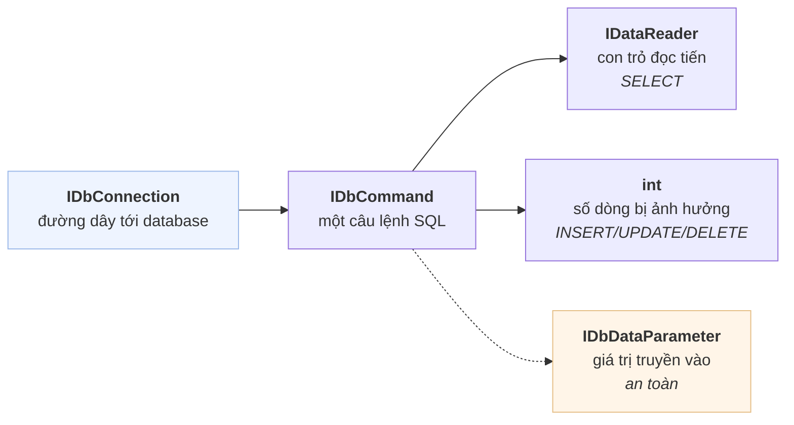
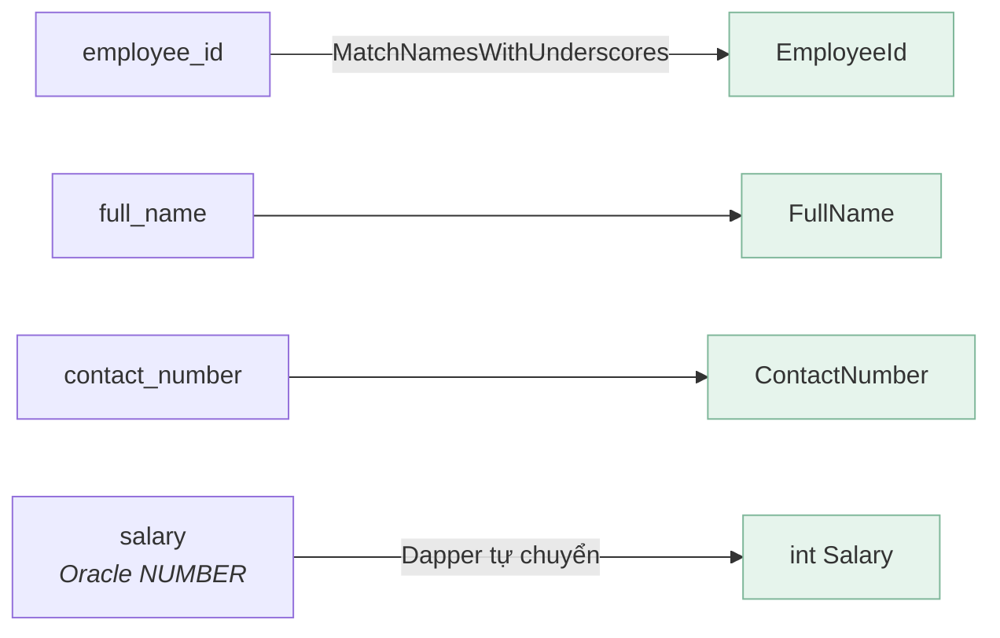
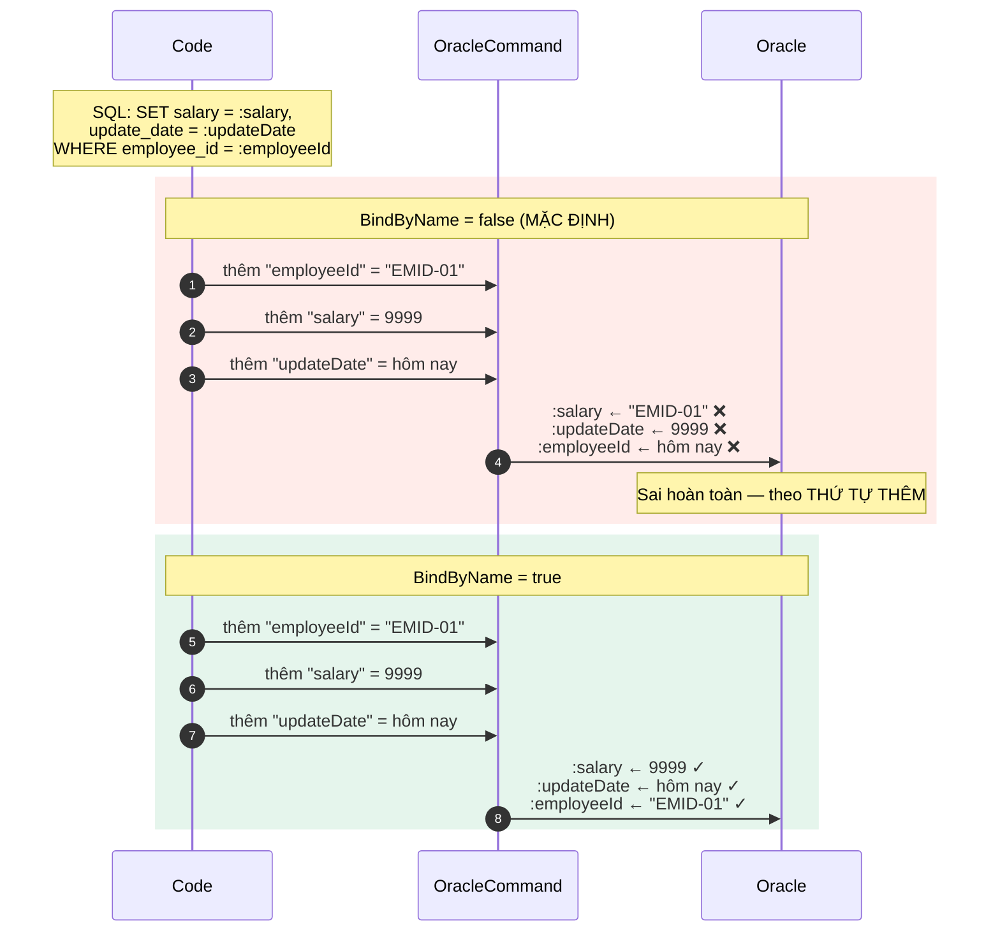
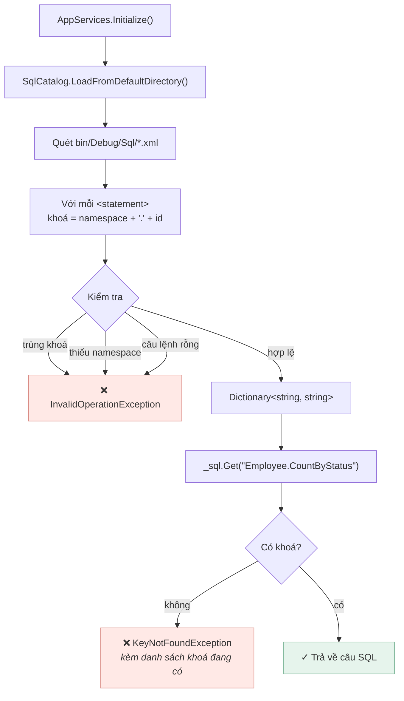
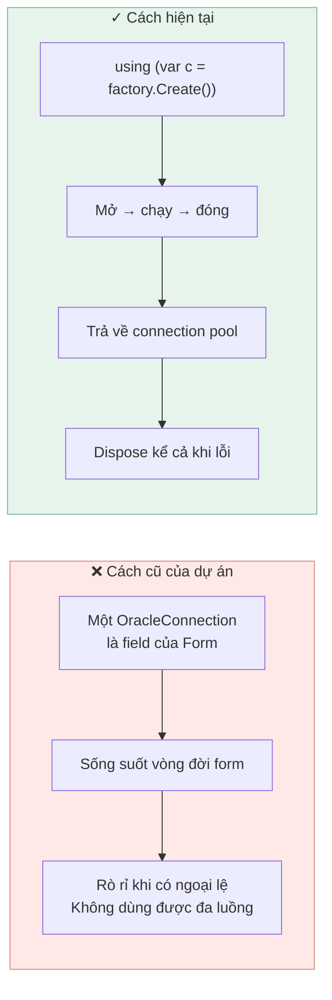

[← Bài 04](04-datagridview-databinding.md) · Bài 05/09 · [Tiếp: Kiến trúc phân tầng →](06-kien-truc-phan-tang.md)

# 05 · Kết nối database

## Vấn đề

Form cần dữ liệu. Dữ liệu nằm trong Oracle. Nối hai đầu lại thế nào, và những chỗ nào dễ
làm sai?

## ADO.NET: bốn khái niệm

Mọi thư viện truy cập dữ liệu trong .NET đều dựng trên bốn interface này:



Với Oracle, bản hiện thực là `OracleConnection`, `OracleCommand`... đến từ gói NuGet
**`Oracle.ManagedDataAccess`** — driver thuần managed, **không cần cài Oracle Client**.

## Viết tay ADO.NET trông thế nào

Đây là phiên bản đầu của dự án (đã bỏ, nhưng cần thấy để hiểu vì sao có Dapper):

```csharp
// PHIÊN BẢN CŨ — 25 dòng cho một câu SELECT
List<Employee> list = new List<Employee>();

using (OracleConnection connect = new OracleConnection(connectionString))
{
    connect.Open();
    using (OracleCommand cmd = new OracleCommand("SELECT * FROM employees ...", connect))
    using (OracleDataReader reader = cmd.ExecuteReader())
    {
        while (reader.Read())
        {
            Employee e = new Employee();
            e.Id            = Convert.ToInt32(reader["id"]);
            e.EmployeeId    = reader["employee_id"].ToString();
            e.FullName      = reader["full_name"].ToString();
            e.Gender        = reader["gender"].ToString();
            e.ContactNumber = reader["contact_number"].ToString();
            e.Position      = reader["position"].ToString();
            e.Image         = reader["image"].ToString();
            e.Salary        = Convert.ToInt32(reader["salary"]);
            e.Status        = reader["status"].ToString();
            list.Add(e);
        }
    }
}
```

Đúng nhưng dài dòng, và mỗi lần thêm một cột là sửa ở hai chỗ.

## Dapper: cùng việc đó, ba dòng

**Dapper** là *micro-ORM*: nó chỉ làm đúng một việc — ánh xạ dòng dữ liệu thành object.
Bạn vẫn viết SQL.

```csharp
// Data/EmployeeRepository.cs — phiên bản hiện tại
public IReadOnlyList<Employee> GetAll()
{
    using (IDbConnection connection = _connections.Create())
    {
        return connection.Query<Employee>(_sql.Get("Employee.SelectAll")).ToList();
    }
}
```

Dapper khớp **tên cột với tên property**, không phân biệt hoa thường. Nhưng cột Oracle là
`snake_case` còn property C# là `PascalCase`, nên cần bật một công tắc:

```csharp
// AppServices.cs
DefaultTypeMap.MatchNamesWithUnderscores = true;
```



Dòng cuối quan trọng: **Oracle `NUMBER` luôn trả về `decimal`, không bao giờ là `int`.**
Code viết tay phải dùng `Convert.ToInt32(...)`; ép kiểu thẳng `(int)reader["salary"]` sẽ
ném `InvalidCastException` lúc chạy. Dapper tự lo phần này.

## Cạm bẫy chí mạng: bind theo vị trí

Đây là phần dễ mất nhiều giờ debug nhất khi dùng Oracle.

**ODP.NET mặc định gán tham số theo VỊ TRÍ, không theo TÊN.**



Nguy hiểm ở chỗ: nếu các tham số **tình cờ** cùng kiểu và cùng thứ tự thì code vẫn chạy
đúng — cho tới ngày ai đó đổi chỗ hai dòng.

Dapper không có chỗ nào để bật cờ này, nên dự án tạo riêng một lớp tham số:

```csharp
// Data/OracleParams.cs
public sealed class OracleParams : SqlMapper.IDynamicParameters
{
    void SqlMapper.IDynamicParameters.AddParameters(IDbCommand command, SqlMapper.Identity identity)
    {
        var oracleCommand = command as OracleCommand;
        if (oracleCommand != null)
        {
            oracleCommand.BindByName = true;      // ← lý do lớp này tồn tại
        }

        foreach (KeyValuePair<string, object> value in _values)
        {
            IDbDataParameter parameter = command.CreateParameter();
            parameter.ParameterName = value.Key;
            parameter.Value = value.Value;
            command.Parameters.Add(parameter);
        }
    }
}
```

Dùng:

```csharp
connection.Execute(
    _sql.Get("Employee.UpdateSalary"),
    OracleParams.New()
        .Set("salary", salary)
        .Set("updateDate", DateTime.Today)
        .Set("employeeId", employeeId));
```

Có một test riêng canh đúng cái bẫy này —
`UpdateSalary_binds_parameters_by_name_not_position` trong `EmployeeRepositoryTests.cs`.

### Bảng khác biệt SQL Server ↔ Oracle

Dự án này vốn viết cho SQL Server rồi chuyển sang Oracle. Những chỗ phải sửa:

| | SQL Server | Oracle |
|---|---|---|
| Tham số | `@name` | `:name` |
| Cách bind | Theo tên | **Theo vị trí** (trừ khi `BindByName = true`) |
| Kiểu số nguyên | `int` trả về `int` | `NUMBER` trả về `decimal` |
| Chuỗi rỗng | Khác `NULL` | **Bằng `NULL`** |
| Giới hạn số dòng | `SELECT TOP 10` | `FETCH FIRST 10 ROWS ONLY` |
| Bảng giả | không cần | `SELECT 1 FROM dual` |

## SQL không nằm trong C#

Toàn bộ SQL của dự án nằm trong `EmployeeManagementSystem/Sql/*.xml`:

```xml
<statements namespace="Employee">
  <statement id="CountByStatus">
    SELECT COUNT(id)
    FROM   employees
    WHERE  delete_date IS NULL
    AND    status = :status
  </statement>
</statements>
```

Lớp `SqlCatalog` nạp cả thư mục một lần lúc khởi động:



Lợi ích thực tế: file XML được **chép ra cạnh `.exe`**, nên sửa một câu SQL trong
`bin\Debug\Sql\` là có hiệu lực ngay lần chạy sau — **không cần build lại**.

Vì sao không dùng iBATIS/MyBatis? Xem [README gốc](../README.md#why-not-ibatis) — tóm tắt:
bản .NET của iBATIS đã ngừng bảo trì từ 2010.

## Vòng đời kết nối

Quy tắc: **mở muộn, đóng sớm, luôn dùng `using`.**



Nghe có vẻ tốn kém nhưng không: ADO.NET có **connection pool**. `Close()` không thực sự
ngắt kết nối TCP mà trả nó về pool để tái dùng. Mở/đóng liên tục là cách dùng đúng.

## Dịch lỗi Oracle cho người dùng đọc được

Database từ chối dữ liệu sai bằng mã lỗi kiểu `ORA-00001`. Không ai muốn thấy tên index
trong hộp thoại, nên `Data/OracleErrors.cs` dịch lại:

| Mã Oracle | Nghĩa | Thành |
|-----------|-------|-------|
| `ORA-00001` | Vi phạm ràng buộc duy nhất | `DuplicateKeyException` |
| `ORA-02290` | Vi phạm CHECK constraint | `DataRuleViolationException` |
| `ORA-12899` | Giá trị dài quá cột | `DataRuleViolationException` |

```csharp
catch (OracleException ex)
{
    throw Translate(ex, "Employee ID '" + employee.EmployeeId + "'");
}
```

Lỗi nào không nhận ra thì **giữ nguyên** để không che mất sự cố thật.

## Cạm bẫy

**Nối chuỗi để dựng SQL.** `"... WHERE name = '" + input + "'"` là lỗ hổng SQL injection.
Luôn dùng tham số. Toàn bộ dự án này không có chỗ nào nối chuỗi vào SQL.

**Quên `BindByName` với Oracle.** Xem phần trên.

**Ép kiểu `(int)` trên `NUMBER`.** Dùng `Convert.ToInt32` hoặc để Dapper lo.

**Giữ connection làm field.** Rò rỉ tài nguyên, không dùng được đa luồng.

**Quên `using` trên `IDataReader`.** Reader giữ connection bận cho tới khi đóng.

**Tưởng chuỗi rỗng khác NULL trên Oracle.** `'' IS NULL` trả về đúng — khác hẳn SQL Server.

## Tự kiểm tra

1. Vì sao `OracleParams` phải tồn tại, thay vì truyền anonymous object cho Dapper?
2. `(int)reader["salary"]` sai ở đâu khi dùng Oracle?
3. Sửa một câu SQL trong `bin\Debug\Sql\EmployeeStatements.xml` có cần build lại không?
4. Vì sao mở và đóng connection cho từng thao tác lại không chậm?
5. `_sql.Get("Employee.KhongTonTai")` sẽ ra sao?

<details>
<summary>Đáp án</summary>

1. Vì ODP.NET gán tham số theo vị trí trừ khi bật `OracleCommand.BindByName = true`, mà
   Dapper không cung cấp chỗ nào để bật cờ đó. `OracleParams` hiện thực
   `IDynamicParameters` để chen vào đúng lúc Dapper dựng command.
2. Oracle `NUMBER` trả về `decimal`. Ép thẳng sang `int` ném `InvalidCastException` lúc
   chạy — trình biên dịch không cảnh báo vì `reader["salary"]` có kiểu tĩnh là `object`.
3. Không. File XML được khai báo `Content` + `CopyToOutputDirectory` nên nằm cạnh `.exe`
   và được `SqlCatalog` đọc lúc khởi động.
4. Vì có connection pool. `Close()` trả kết nối về pool chứ không đóng socket, lần mở sau
   lấy lại từ pool.
5. Ném `KeyNotFoundException` với thông báo liệt kê **tất cả các khoá đang có** — để bạn
   thấy ngay mình gõ sai chỗ nào. Có test cho hành vi này.

</details>

---

[← Bài 04](04-datagridview-databinding.md) · [Tiếp: Kiến trúc phân tầng →](06-kien-truc-phan-tang.md)
