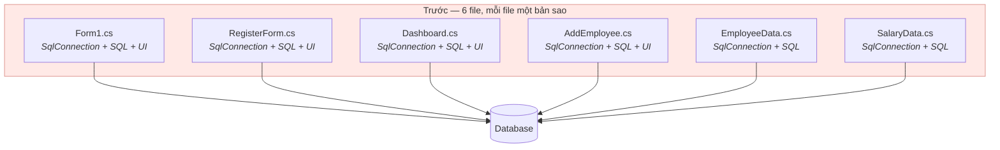
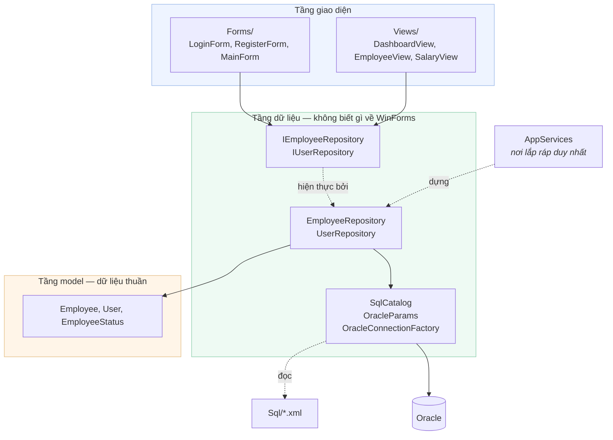
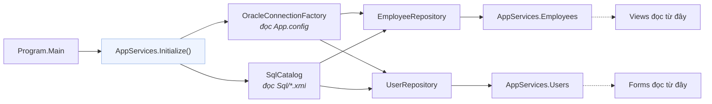
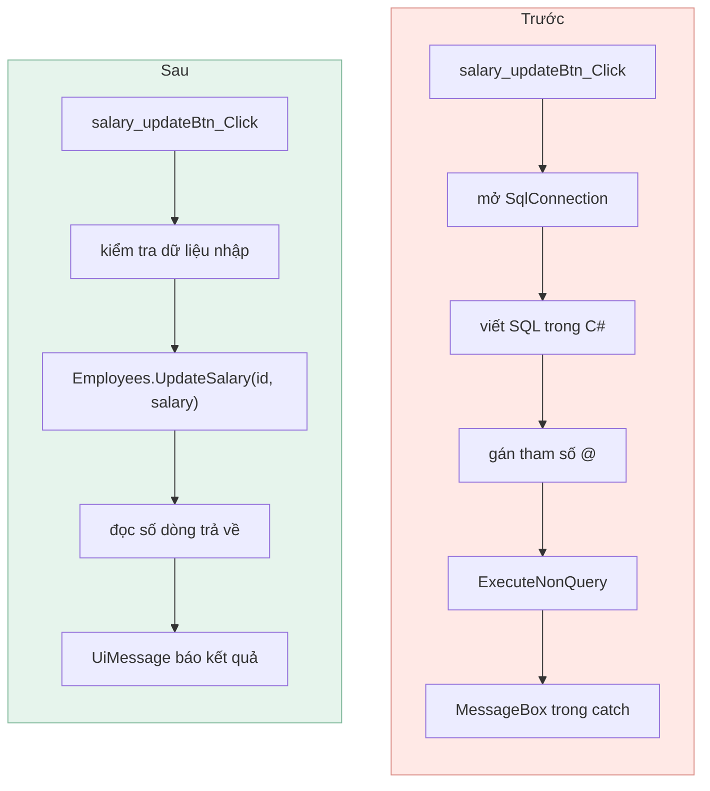

[← Bài 05](05-ket-noi-database.md) · Bài 06/12 · [Tiếp: Luồng UI và xử lý lỗi →](07-luong-ui-va-xu-ly-loi.md)

# 06 · Kiến trúc phân tầng

## Vấn đề

Viết thẳng SQL vào trong `button_Click` thì **chạy được**. Vậy tại sao phải tách tầng?

Bài này trả lời bằng cách so sánh chính dự án này trước và sau khi tái cấu trúc.

## Trước: mọi thứ trong form

Phiên bản ban đầu để mỗi form tự lo tất cả:



Chuỗi kết nối được **dán lại y hệt trong sáu file**:

```csharp
SqlConnection connect = new SqlConnection(
    @"Data Source=(LocalDB)\MSSQLLocalDB;AttachDbFilename=C:\Users\milen\OneDrive\Documents\employee.mdf;...");
```

Bốn hậu quả rất cụ thể:

1. **Đổi database phải sửa 6 chỗ.** Sót một chỗ là lỗi lúc chạy.
2. **Đường dẫn trỏ vào máy người khác** — dự án không chạy được trên máy bạn.
3. **Không test được.** Muốn test logic phải mở một cái form lên.
4. **Tầng dữ liệu tự bật `MessageBox`** — nghĩa là nó phụ thuộc WinForms, không tái dùng
   được cho web hay console.

## Sau: phụ thuộc một chiều



**Mũi tên chỉ đi một chiều: UI → Data → Models.** Không có mũi tên ngược.

Kiểm chứng được bằng một lệnh — không file nào trong `Data/` nhắc tới WinForms:

```bash
grep -rn "System.Windows.Forms" EmployeeManagementSystem/Data/
# (không có kết quả)
```

Đó chính là điều khiến 20 test repository chạy được mà không cần mở một cái form nào.

## Repository là gì

Một interface mô tả **những gì làm được với dữ liệu**, không nói làm bằng cách nào:

```csharp
// Data/IEmployeeRepository.cs
public interface IEmployeeRepository
{
    IReadOnlyList<Employee> GetAll();
    IReadOnlyList<Employee> GetByStatus(string status);
    int CountAll();
    int CountByStatus(string status);
    bool ExistsByEmployeeId(string employeeId);
    void Add(Employee employee);
    int Update(Employee employee);
    int UpdateSalary(string employeeId, int salary);
    int SoftDelete(string employeeId);
}
```

Tầng UI chỉ nhìn thấy interface này. Nó không biết có Oracle, có Dapper, có XML.

Để ý các hàm ghi trả về `int` — **số dòng bị ảnh hưởng**. Nhờ vậy UI phân biệt được
"đã sửa" với "không tìm thấy ai để sửa":

```csharp
// Views/EmployeeView.cs
if (Employees.Update(employee) == 0)
{
    UiMessage.Warn("No employee found with ID " + employee.EmployeeId + ".");
    return;
}
```

## `AppServices`: nơi lắp ráp

Ai tạo ra `EmployeeRepository`? Nếu mỗi form tự `new` thì lại quay về vấn đề cũ. Dự án gom
việc đó vào một chỗ:

```csharp
// AppServices.cs
public static void Initialize()
{
    DefaultTypeMap.MatchNamesWithUnderscores = true;

    var connections = new OracleConnectionFactory();
    SqlCatalog sql = SqlCatalog.LoadFromDefaultDirectory();

    Initialize(new EmployeeRepository(connections, sql), new UserRepository(connections, sql));
}

// Nạp bản hiện thực bất kỳ — dùng cho test
public static void Initialize(IEmployeeRepository employees, IUserRepository users) { ... }
```



### Thành thật: đây là service locator, không phải DI thật

Cách chuẩn hơn là **constructor injection** — truyền phụ thuộc vào hàm dựng. Nhưng
WinForms designer đòi **mọi Form và UserControl phải có constructor không tham số**, nếu
không designer không vẽ được.

Dự án chọn giải pháp dung hoà:

```csharp
// Views/DataView.cs
protected DataView() : this(null) { }                    // designer dùng cái này

protected DataView(IEmployeeRepository employees) { ... } // test dùng cái này

protected IEmployeeRepository Employees
{
    get { return _injectedRepository ?? AppServices.Employees; }
}
```

| | Service locator (đang dùng) | Constructor injection |
|---|---|---|
| Designer hoạt động | ✓ | ✗ với ctor không tham số |
| Thay được bằng fake khi test | ✓ (qua ctor thứ hai) | ✓ |
| Nhìn code biết ngay phụ thuộc gì | ✗ phải đọc thân hàm | ✓ nằm ở chữ ký |
| Cần thư viện DI | Không | Thường là có |

Đây là **đánh đổi có ý thức**, không phải cẩu thả — và nó bị ép bởi designer, không phải
bởi phiên bản .NET. Dù chạy trên .NET 8/9 thì `UserControl` vẫn cần constructor không
tham số để designer vẽ được.

Nếu muốn DI thật mà vẫn giữ .NET Framework, `Microsoft.Extensions.DependencyInjection`
chạy được trên 4.8. Mẫu thường dùng là để `Program.Main` dựng container rồi cho form
lấy phụ thuộc từ đó — vẫn là một dạng service locator ở biên giao diện, chỉ khác chỗ ai
quản lý vòng đời đối tượng.

## Cấu trúc thư mục và ý nghĩa

| Thư mục | Chứa gì | Được phép biết về |
|---------|---------|-------------------|
| `Models/` | Dữ liệu thuần, không hành vi | Không gì cả |
| `Data/` | Repository, kết nối, SQL | `Models` |
| `Sql/` | Câu lệnh SQL dạng XML | — |
| `Forms/` | Cửa sổ cấp cao nhất | `Data`, `Models`, `Views` |
| `Views/` | Ba panel bên trong `MainForm` | `Data`, `Models` |

Quy tắc kiểm tra nhanh: **nếu một file trong `Data/` cần `using System.Windows.Forms`,
bạn đã đặt sai chỗ.**

## Trước/sau: một thao tác cụ thể

Cùng chức năng "cập nhật lương":



Bên phải, handler **không biết** SQL trông thế nào, database là gì, hay tham số bind ra
sao. Nó chỉ biết "cập nhật lương, cho tôi số dòng đã đổi".

## Khi nào tách project riêng

Dự án này phân tầng bằng **thư mục trong một project**. Đủ dùng ở quy mô này, nhưng ranh
giới chỉ do quy ước giữ — không có gì ngăn một `Views/` file `using` thẳng `OracleConnection`.

Tách thành nhiều project sẽ để **trình biên dịch ép** ranh giới đó:

```
EMS.Core/       Models          (không tham chiếu gì)
EMS.Data/       Repositories    (tham chiếu Core)
EMS.WinForms/   UI              (tham chiếu Core + Data)
```

Lúc đó `EMS.Data` **không thể** dùng WinForms vì nó không tham chiếu tới. Đáng làm khi
codebase lớn hơn hoặc có nhiều người cùng làm.

## Cạm bẫy

**Model chứa logic database.** `Employee` phải là dữ liệu thuần. Nếu nó có method `Save()`
thì tầng model đã phụ thuộc tầng data — mũi tên đi ngược.

**Repository trả về `DataTable`.** Rò rỉ chi tiết ADO.NET lên tầng UI. Trả về object của
bạn.

**Tầng data hiện `MessageBox`.** Ném ngoại lệ, để UI quyết định hiển thị thế nào. Xem
[bài 07](07-luong-ui-va-xu-ly-loi.md).

**Interface chỉ có đúng một bản hiện thực nên bỏ luôn interface.** Bản thứ hai chính là
bản giả trong test.

## Tự kiểm tra

1. Chuỗi kết nối trước đây nằm ở 6 file. Giờ nằm ở đâu?
2. Vì sao `Data/` không được phép `using System.Windows.Forms`?
3. Vì sao các hàm ghi của repository trả về `int` thay vì `void`?
4. Vì sao dự án dùng service locator thay vì constructor injection?
5. Bạn cần thêm chức năng "xuất danh sách nhân viên ra CSV". Đặt ở tầng nào?

<details>
<summary>Đáp án</summary>

1. Một chỗ duy nhất: `App.config`, đọc bởi `OracleConnectionFactory`.
2. Vì nó sẽ trói tầng dữ liệu vào giao diện — không test được nếu không mở form, và không
   tái dùng được cho console hay web. Đây cũng là cách kiểm tra nhanh xem có đặt sai chỗ
   không.
3. Để UI phân biệt "đã cập nhật" với "không có dòng nào khớp". `void` thì mọi lần gọi đều
   trông như thành công, kể cả khi mã nhân viên không tồn tại.
4. Vì WinForms designer đòi Form/UserControl có constructor không tham số. Dự án giữ cả
   hai: ctor rỗng cho designer, ctor có tham số cho test.
5. Đọc dữ liệu là việc của repository (đã có `GetAll()`). Định dạng CSV và chọn nơi lưu là
   việc của tầng UI hoặc một lớp service riêng — **không** phải của repository, vì
   repository không nên biết gì về định dạng file.

</details>

---

[← Bài 05](05-ket-noi-database.md) · [Tiếp: Luồng UI và xử lý lỗi →](07-luong-ui-va-xu-ly-loi.md)
