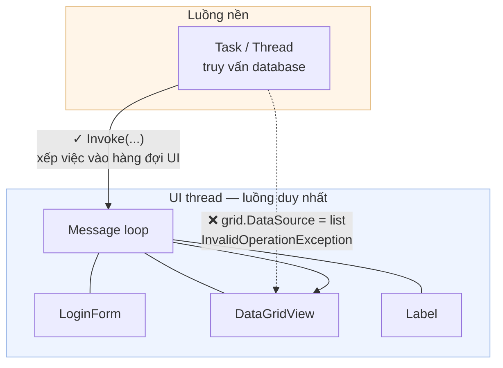
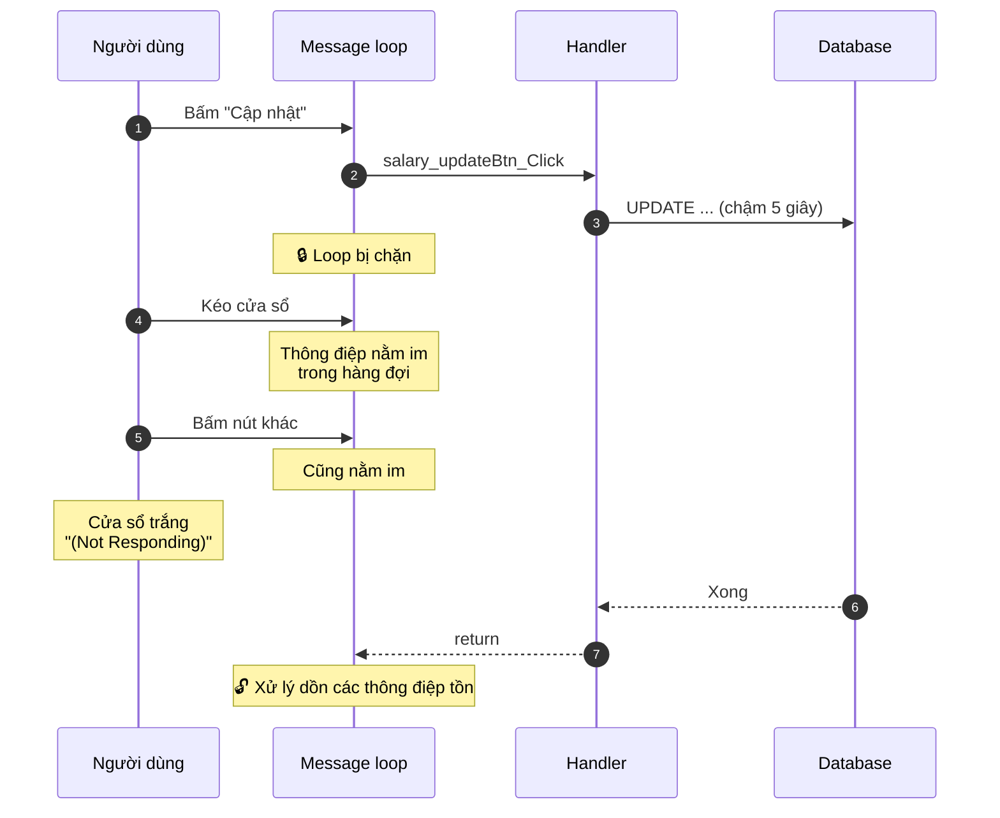
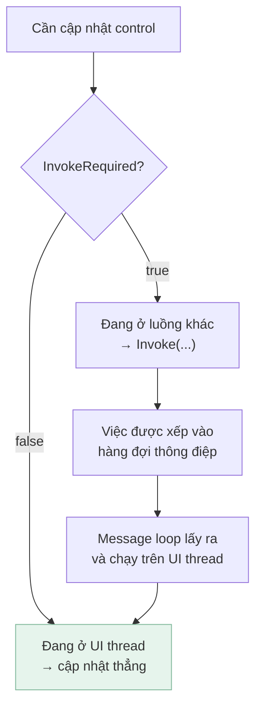
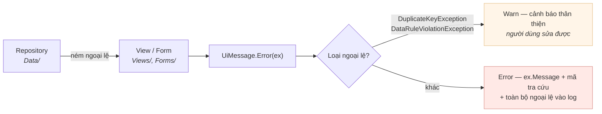
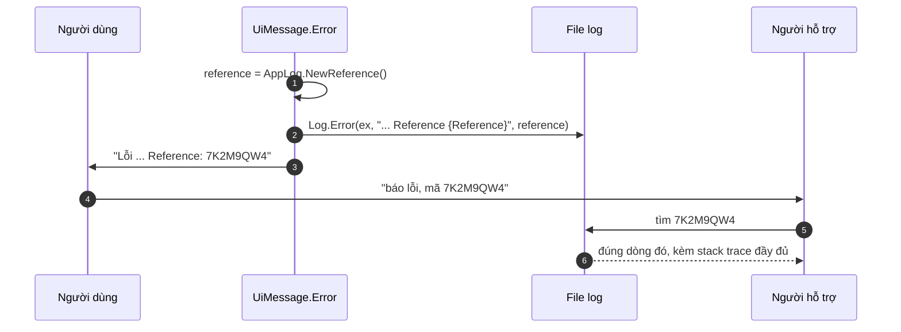

[← Bài 06](06-kien-truc-phan-tang.md) · Bài 07/12 · [Tiếp: Kiểm thử WinForms →](08-kiem-thu-winforms.md)

# 07 · Luồng UI và xử lý lỗi

## Vấn đề

Hai câu hỏi hay gặp nhất khi app đã chạy được:

1. Vì sao cửa sổ trắng xoá và Windows ghi "Not Responding"?
2. Vì sao thỉnh thoảng có lỗi `Cross-thread operation not valid`?

Cả hai đều bắt nguồn từ một quy tắc duy nhất.

## Quy tắc luồng UI

> **Chỉ luồng đã tạo ra control mới được đụng vào control đó.**

Đây không phải khuyến nghị mà là luật của Win32. Mỗi control gắn với hàng đợi thông điệp
của luồng tạo ra nó (xem [bài 01](01-winforms-hoat-dong-the-nao.md)).



## Vì sao app đơ

Message loop chạy trên UI thread. Nếu handler của bạn chiếm UI thread lâu, loop không lấy
được thông điệp nào — kể cả `WM_PAINT`. Cửa sổ không vẽ lại được.



**Dự án này hiện đang đồng bộ hoàn toàn** — mọi truy vấn chạy thẳng trên UI thread. Riêng
việc đăng nhập đã mất khoảng 400ms vì PBKDF2, và cửa sổ đơ chừng ấy. Đây là hạng mục F11
trong [kế hoạch cải tiến](../README.md), và là [bài tập 6](12-bai-tap.md).

### Cách sửa đúng: `async`/`await`

```csharp
// Đây là hướng đi, chưa có trong dự án
private async void salary_updateBtn_Click(object sender, EventArgs e)
{
    salary_updateBtn.Enabled = false;          // chặn bấm hai lần
    Cursor = Cursors.WaitCursor;
    try
    {
        int rows = await Task.Run(() => Employees.UpdateSalary(id, salary));
        // sau await, ta lại đang ở UI thread — chạm control thoải mái
        if (rows == 0) { UiMessage.Warn("..."); return; }
        LoadData();
    }
    finally
    {
        Cursor = Cursors.Default;
        salary_updateBtn.Enabled = true;
    }
}
```

Điểm mấu chốt: **sau `await`, code quay lại UI thread**, nhờ `SynchronizationContext` của
WinForms. Không cần `Invoke`.

> `async void` bình thường là mùi code xấu, **trừ event handler** — đó là ngoại lệ chính
> đáng duy nhất, vì chữ ký handler bắt buộc trả `void`.

### Đừng dùng `Application.DoEvents()`

Nó bơm thông điệp giữa chừng handler đang chạy, cho phép người dùng bấm lại chính nút đó
→ handler chạy chồng lên nhau (reentrancy). Lỗi kiểu này cực khó tái hiện.

## `InvokeRequired` và `Invoke`

Khi code đang ở luồng nền và cần chạm control, phải "gửi" việc đó sang UI thread:



Dự án dùng mẫu này ở `Views/DataView.cs`:

```csharp
public void RefreshData()
{
    if (IsDesignTime || !HasRepository)
    {
        return;
    }

    if (InvokeRequired)
    {
        Invoke((MethodInvoker)RefreshData);   // gọi lại chính nó, lần này trên UI thread
        return;
    }

    try
    {
        LoadData();
    }
    catch (Exception ex)
    {
        UiMessage.Error(ex);
    }
}
```

Mẫu "gọi lại chính mình" này rất phổ biến: kiểm tra `InvokeRequired`, nếu cần thì
`Invoke` chính hàm đó rồi `return`.

| | `Invoke` | `BeginInvoke` |
|---|---|---|
| Chờ chạy xong | Có (đồng bộ) | Không (đặt hàng rồi trả về ngay) |
| Rủi ro deadlock | **Có** nếu UI thread đang chờ luồng gọi | Thấp hơn |
| Dùng khi | Cần kết quả ngay | Chỉ cần "báo cho UI biết" |

> **Lưu ý:** `InvokeRequired` trả `false` khi control **chưa có handle** — vì lúc đó chưa
> có luồng nào sở hữu nó. Gọi `Invoke` trong constructor sẽ ném `InvalidOperationException`.
> Đây là một lý do nữa để nạp dữ liệu trong `OnLoad`, không phải constructor
> ([bài 03](03-vong-doi-form-usercontrol.md)).

## Chiến lược xử lý lỗi

Phiên bản đầu của dự án bắt ngoại lệ **ngay trong tầng dữ liệu** và tự bật `MessageBox`:

```csharp
// PHIÊN BẢN CŨ — trong EmployeeData.cs
catch (Exception ex)
{
    MessageBox.Show($"Error:{ex}", "Error Message", MessageBoxButtons.OK, MessageBoxIcon.Error);
}
```

Ba vấn đề:

1. Tầng dữ liệu phụ thuộc WinForms → không test được, không tái dùng được.
2. `{ex}` in **toàn bộ stack trace** cho người dùng cuối — vừa khó hiểu vừa lộ thông tin
   nội bộ.
3. Sau khi hiện hộp thoại, hàm **vẫn trả về danh sách rỗng** như thể không có lỗi. Bên gọi
   không phân biệt được "không có dữ liệu" với "truy vấn hỏng".

### Cách hiện tại



```csharp
// Forms/UiMessage.cs
public static void Error(Exception ex)
{
    // Người dùng vi phạm quy tắc thì không phải là sự cố hệ thống.
    if (ex is DuplicateKeyException || ex is DataRuleViolationException)
    {
        Log.Information("Rejected by a data rule: {Message}", ex.Message);
        Warn(ex.Message);
        return;
    }

    string reference = AppLog.NewReference();
    Log.Error(ex, "Error shown to the user. Reference {Reference}", reference);

    MessageBox.Show(
        ex.Message + Environment.NewLine + Environment.NewLine + "Reference: " + reference,
        "Error Message", MessageBoxButtons.OK, MessageBoxIcon.Error);
}
```

Ba nguyên tắc rút ra:

| Nguyên tắc | Vì sao |
|------------|--------|
| Tầng dữ liệu **ném**, tầng UI **hiện** | Giữ `Data/` độc lập với WinForms |
| Hiện `ex.Message`, không hiện `ex.ToString()` | Người dùng không cần stack trace |
| Phân biệt "người dùng sai" và "hệ thống lỗi" | Trùng mã nhân viên là chuyện thường, không phải crash |

## Log — thứ biến "chạy được" thành "vận hành được"

Trước đây toàn bộ ứng dụng có **đúng một** dòng `Debug.WriteLine`, và nó **biến mất hoàn
toàn trong bản Release**. Người dùng báo lỗi thì không có gì để tra.

Giờ dự án dùng **Serilog** ghi ra file xoay vòng theo ngày.

### Ghi ở đâu, và vì sao không phải cạnh file .exe

```csharp
// Diagnostics/AppLog.cs
public static string LogDirectory
{
    get
    {
        return Path.Combine(
            Environment.GetFolderPath(Environment.SpecialFolder.LocalApplicationData),
            "EmployeeManagementSystem",
            "logs");
    }
}
```

Cạnh `.exe` là sai: khi cài vào `Program Files`, người dùng thường **không có quyền ghi**
ở đó. Log mà ứng dụng không ghi được còn tệ hơn không có log — vì thất bại đó xảy ra
trong im lặng.

### Mã tra cứu — nối người dùng với dòng log

Đây là chi tiết nhỏ nhưng đổi hẳn cách hỗ trợ người dùng:



Người dùng nhận **một câu** dễ hiểu cộng một mã; log nhận **toàn bộ** ngoại lệ dưới cùng
mã đó. "Nó bị lỗi" trở thành "nó bị lỗi, mã 7K2M9QW4".

Mã dùng bảng chữ cái bỏ `I`, `L`, `O`, `U` — vì người dùng sẽ **đọc nó qua điện thoại**.

### Điều quan trọng nhất: cái gì KHÔNG được ghi

Log rò rỉ mật khẩu biến công cụ vận hành thành lỗ hổng bảo mật. Ba quy tắc trong dự án:

| Không bao giờ ghi | Vì sao |
|-------------------|--------|
| Mật khẩu người dùng nhập | Hiển nhiên — kể cả khi họ gõ sai |
| Chuỗi kết nối | Nó chứa mật khẩu database |
| Hash và salt | Ghi ra là tặng kẻ tấn công dữ liệu để bẻ khoá offline |

Có **4 test tự động** canh đúng điều này, chạy không cần database. Và một bài kiểm tra
chạy thật toàn bộ luồng đăng nhập rồi quét file log — kết quả thật:

```
=== KIEM TRA BAO MAT ===
  Ems_Pass2026            khong xuat hien
  Password=               khong xuat hien
  wrong-password-12345    khong xuat hien
  PBKDF2                  khong xuat hien
```

### Log thật trông thế nào

```
2026-09-07 14:23:15.748 [INF] Signed in as admin.
2026-09-07 14:23:15.993 [WRN] Failed sign-in for admin.
2026-09-07 14:23:16.235 [WRN] Failed sign-in for khong-ton-tai.
2026-09-07 14:23:16.287 [INF] Added employee LOG-be9cd6 (Active).
2026-09-07 14:23:16.292 [INF] Set salary of LOG-be9cd6 to 4242, 1 row(s).
```

Để ý hai dòng `Failed sign-in`: cách nhau **245ms** và **242ms**. Đó chính là
`PasswordHasher.BurnTime()` ([bài tập 9](12-bai-tap.md)) đang làm việc — user có
thật và user không tồn tại tốn thời gian như nhau, nên thời gian phản hồi không tiết lộ
username nào đã đăng ký. **Chính log lại là bằng chứng cho biện pháp bảo mật đó.**

Cũng để ý cả hai dòng ghi **cùng một câu**. Nếu một dòng ghi "unknown username" còn dòng
kia ghi "wrong password", thì log lại tự tay làm lộ đúng thứ mà `BurnTime` đang che.

### Bắt ngoại lệ không ai bắt

Hai loại ngoại lệ vốn biến mất không dấu vết, nay đều được ghi:

```csharp
// Program.cs
Application.ThreadException += ...            // ném trong event handler
AppDomain.CurrentDomain.UnhandledException += ...   // ném ở luồng không ai canh
```

Thiếu chúng thì một cú sập chỉ hiện hộp thoại mặc định của Windows rồi **không để lại gì**.

## Cạm bẫy

**Nuốt ngoại lệ.** `catch (Exception) { }` biến lỗi thành hành vi kỳ lạ không giải thích
được. Nếu bắt thì phải làm gì đó — báo, log, hoặc ném lại.

**`catch (Exception ex) { throw ex; }`** — xoá sạch stack trace gốc. Dùng `throw;` không
có biến.

**Bắt `Exception` khi chỉ định xử lý một loại.** Bắt `OracleException` nếu chỉ quan tâm
lỗi database.

**Hiện `MessageBox` từ luồng nền.** Hộp thoại sẽ hiện nhưng có thể không đúng thứ tự
z-order và không chặn đúng cửa sổ. Đưa về UI thread trước.

**Bấm nút hai lần khi thao tác đang chạy.** Vô hiệu hoá nút ngay khi bắt đầu, bật lại
trong `finally`.

## Tự kiểm tra

1. Vì sao cửa sổ trắng xoá khi handler chạy lâu?
2. `InvokeRequired` trả về gì khi control chưa có handle? Hệ quả là gì?
3. Vì sao `Data/` không được tự hiện `MessageBox`?
4. Khác nhau giữa `throw;` và `throw ex;`?
5. Vì sao `UiMessage.Error` phân biệt `DuplicateKeyException` với các ngoại lệ khác?

<details>
<summary>Đáp án</summary>

1. Vì handler chạy trên UI thread, chiếm mất message loop. Loop không lấy được `WM_PAINT`
   nên cửa sổ không được vẽ lại.
2. Trả `false`, vì chưa luồng nào sở hữu control. Hệ quả: gọi `Invoke` lúc đó ném
   `InvalidOperationException` — một lý do nữa để nạp dữ liệu ở `OnLoad`.
3. Vì như vậy tầng dữ liệu phụ thuộc WinForms: không test được nếu không có UI, không tái
   dùng được cho console/web, và bên gọi không phân biệt được lỗi với "không có dữ liệu".
4. `throw;` giữ nguyên stack trace gốc. `throw ex;` đặt lại điểm ném về dòng hiện tại,
   xoá mất nơi lỗi thật sự xảy ra.
5. Vì hai loại đó là **lỗi do người dùng nhập** — trùng mã, sai trạng thái. Người dùng sửa
   được, nên hiện dạng cảnh báo. Các ngoại lệ khác là sự cố hệ thống, cần ghi trace.

</details>

---

[← Bài 06](06-kien-truc-phan-tang.md) · [Tiếp: Kiểm thử WinForms →](08-kiem-thu-winforms.md)
