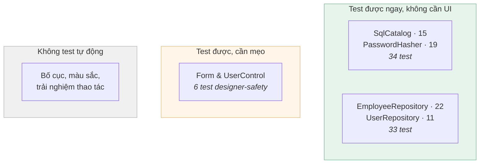
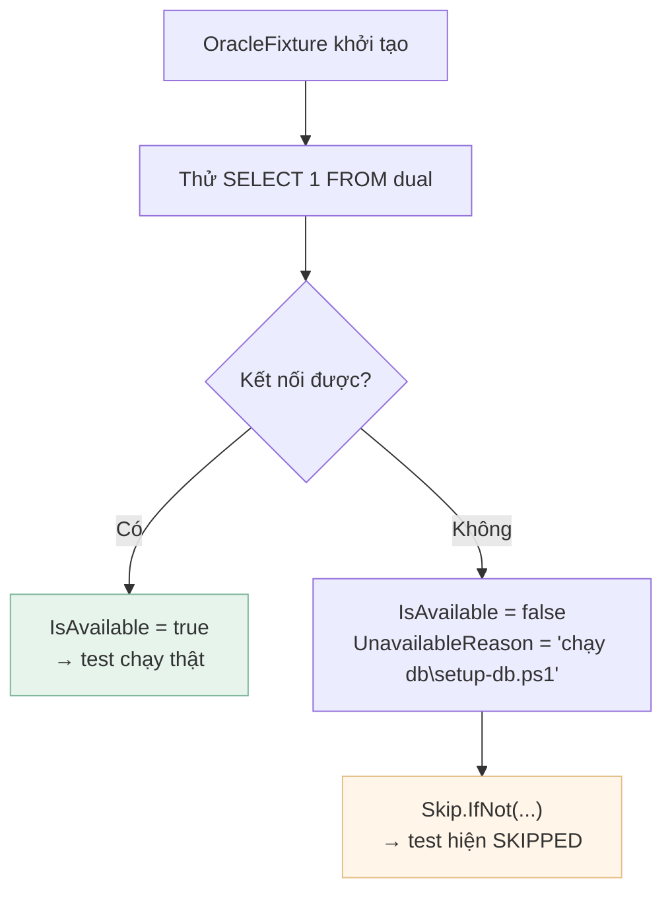
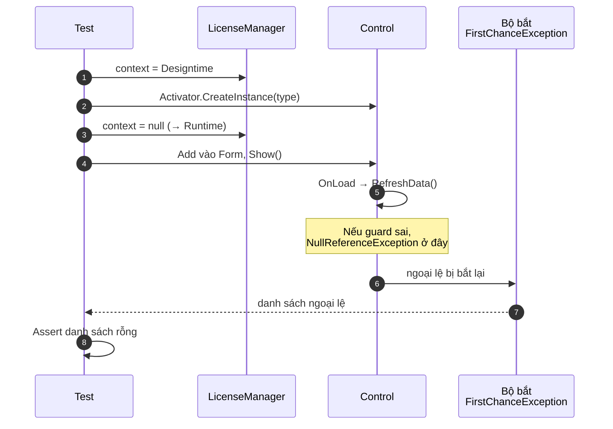
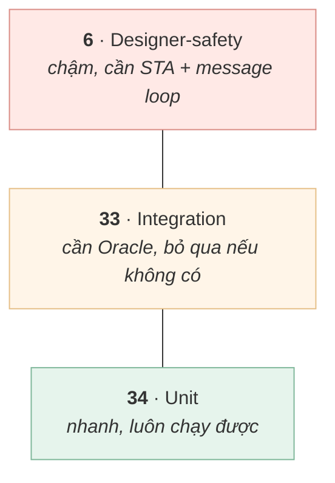

[← Bài 07](07-luong-ui-va-xu-ly-loi.md) · Bài 08/12 · [Tiếp: Bố cục và DPI →](09-bo-cuc-va-dpi.md)

# 08 · Kiểm thử WinForms

## Vấn đề

"Ứng dụng desktop thì test kiểu gì? Phải có người ngồi bấm chứ?"

Không hẳn. Phần lớn thứ đáng test **không nằm ở giao diện** — và phần nằm ở giao diện thì
vẫn test được nhiều hơn bạn tưởng.

## Vì sao kiến trúc quyết định khả năng test

Nhớ lại [bài 06](06-kien-truc-phan-tang.md): `Data/` không tham chiếu WinForms. Chính điều
đó cho phép test tầng dữ liệu mà không mở form nào.



Dự án có **73 test** trong `EmployeeManagementSystem.Tests/`.

## Chạy test

```powershell
msbuild EmployeeManagementSystem.sln -p:Configuration=Debug
vstest.console.exe EmployeeManagementSystem.Tests\bin\Debug\net472\EmployeeManagementSystem.Tests.dll
```

> **`dotnet test` không dùng được ở đây.** Project ứng dụng dùng định dạng `.csproj` cũ
> (xem [bài 02](02-giai-phau-du-an.md)), mà `dotnet` CLI chỉ build được project SDK-style.
> Phải build bằng MSBuild rồi chạy bằng `vstest.console.exe` — hoặc dùng Test Explorer
> trong Visual Studio.

## Loại 1 — Unit test thuần

Không cần database, không cần UI. Nhanh, luôn chạy được.

```csharp
// SqlCatalogTests.cs
[Fact]
public void Unknown_key_reports_the_keys_it_does_know()
{
    WriteFile("a.xml", "<statements namespace='Employee'><statement id='SelectAll'>SELECT 1 FROM dual</statement></statements>");

    SqlCatalog catalog = SqlCatalog.LoadFrom(_dir);
    var ex = Assert.Throws<KeyNotFoundException>(() => catalog.Get("Employee.Missing"));

    Assert.Contains("Employee.Missing", ex.Message);
    Assert.Contains("Employee.SelectAll", ex.Message);
}
```

Một test đáng chú ý — nó bắt lỗi mà **trình biên dịch không thể bắt**:

```csharp
[Fact]
public void Shipped_catalog_defines_every_statement_the_repositories_use()
{
    string[] required =
    {
        "Employee.SelectAll", "Employee.SelectByStatus", /* ... */ "User.Insert",
    };

    SqlCatalog catalog = SqlCatalog.LoadFromDefaultDirectory();

    foreach (string key in required)
    {
        Assert.False(string.IsNullOrWhiteSpace(catalog.Get(key)), key + " is empty");
    }
}
```

`_sql.Get("Employee.SelectAll")` là một **chuỗi**. Gõ sai thì code vẫn biên dịch, và lỗi
chỉ lộ ra khi người dùng bấm đúng nút đó. Test này biến lỗi lúc chạy thành lỗi lúc build.

## Loại 2 — Integration test

Chạm database thật. Mỗi test tự tạo dữ liệu riêng và dọn sau khi xong:

```csharp
public EmployeeRepositoryTests(OracleFixture oracle)
{
    _oracle = oracle;
    _employees = oracle.CreateEmployeeRepository();
    _prefix = "T" + Guid.NewGuid().ToString("N").Substring(0, 10);   // mã riêng cho test này
}

public void Dispose()
{
    _oracle.DeleteEmployees(_prefix);        // dọn sạch
}
```

**Không test nào dựa vào dữ liệu seed.** Nếu test khẳng định "có đúng 3 nhân viên" thì nó
sẽ vỡ ngay khi ai đó thêm một dòng. Test tự tạo dữ liệu của mình và kiểm tra thay đổi
tương đối:

```csharp
[SkippableFact]
public void Counts_agree_with_the_rows_returned()
{
    _oracle.SkipIfUnavailable();

    int before = _employees.CountAll();

    _employees.Add(NewEmployee("ACT", EmployeeStatus.Active));
    _employees.Add(NewEmployee("INA", EmployeeStatus.Inactive));

    Assert.Equal(before + 2, _employees.CountAll());
}
```

### Khi không có database

`SkipIfUnavailable()` khiến test **bỏ qua** chứ không **fail**, kèm thông báo hướng dẫn:



Kết quả: `40 passed, 33 skipped, 0 failed` khi không có Docker. Bạn vẫn biết chính xác cái
gì đã chạy và cái gì chưa.

### Test canh đúng một cạm bẫy

Nhớ vụ bind theo vị trí ở [bài 05](05-ket-noi-database.md)? Có một test riêng cho nó:

```csharp
[SkippableFact]
public void UpdateSalary_binds_parameters_by_name_not_position()
{
    Employee a = NewEmployee("A");
    Employee b = NewEmployee("B");
    a.Salary = 100;
    b.Salary = 200;
    _employees.Add(a);
    _employees.Add(b);

    Assert.Equal(1, _employees.UpdateSalary(a.EmployeeId, 9999));

    Assert.Equal(9999, Reload(a.EmployeeId).Salary);
    Assert.Equal(200,  Reload(b.EmployeeId).Salary);   // KHÔNG bị đụng tới
}
```

Nếu ai đó lỡ xoá `BindByName = true`, tham số sẽ gán lệch và test này đỏ ngay.

## Loại 3 — Test cho Form và UserControl

Đây là phần thú vị nhất, và là bài học lớn nhất về kiểm thử trong dự án này.

### Bài học: test sai chỗ thì vô dụng

Trước khi lỗi designer ở [bài 03](03-vong-doi-form-usercontrol.md) xảy ra, đã có test cho
các view. Chúng **pass hết**. Nhưng chúng làm thế này:

```csharp
var dashboard = new DashboardView();   // chỉ TẠO
dashboard.RefreshData();               // rồi gọi tay
// kiểm tra kết quả...
```

Test chỉ **tạo** control, **không bao giờ hiện** nó. Mà `OnLoad` chỉ nổ khi control được
đặt lên một surface và hiện ra. **Đúng đường dẫn có lỗi lại là đường không được test.**

### Test đúng: mô phỏng designer

```csharp
// DesignerSafetyTests.cs
private static void HostLikeTheDesigner(Type type)
{
    Assert.False(AppServices.IsInitialized,
        "AppServices must stay uninitialised for this test to be meaningful.");

    Control control;
    try
    {
        // 1. designer dựng component dưới context design-time
        LicenseManager.CurrentContext = new DesigntimeLicenseContext();
        control = (Control)Activator.CreateInstance(type);
    }
    finally
    {
        // 2. rồi trả về context runtime — chính bước làm lộ bug
        LicenseManager.CurrentContext = null;
    }

    // 3. đặt lên surface để handle được tạo và OnLoad nổ
    using (var host = new Form())
    {
        host.Controls.Add(control);
        host.Show();
        Application.DoEvents();
    }
}
```



Hai chi tiết khiến test này thực sự hiệu quả:

**1. Bắt cả ngoại lệ đã bị nuốt.** Ứng dụng bắt lỗi rồi hiện `MessageBox`, nên một
`try/catch` thường sẽ không thấy gì. Test dùng `FirstChanceException` — sự kiện nổ **trước**
mọi khối `catch`:

```csharp
AppDomain.CurrentDomain.FirstChanceException += handler;
```

**2. Lọc theo luồng.** `FirstChanceException` là sự kiện toàn tiến trình, mà xUnit chạy các
class test song song. Lần chạy đầu tiên test này **fail oan** vì bắt phải ngoại lệ do một
test khác cố tình ném:

```csharp
EventHandler<FirstChanceExceptionEventArgs> handler = (s, e) =>
{
    // Chỉ quan tâm ngoại lệ trên đúng luồng STA của test này.
    if (Thread.CurrentThread.ManagedThreadId != Volatile.Read(ref staThreadId)) return;
    if (e.Exception.GetType().Name == "ONSException") return;   // nhiễu nội bộ của ODP.NET
    lock (thrown) { thrown.Add(e.Exception); }
};
```

> Bài học: **test cũng có bug.** Một test đỏ không đương nhiên nghĩa là sản phẩm sai.

### WinForms cần luồng STA

xUnit chạy test trên luồng MTA. WinForms đòi STA, nên test phải tự tạo luồng:

```csharp
var thread = new Thread(() => { /* ... */ });
thread.SetApartmentState(ApartmentState.STA);
thread.Start();
Assert.True(thread.Join(TimeSpan.FromSeconds(60)),
    "Timed out - a modal dialog is probably blocking, which is itself the bug.");
```

Chú ý cái timeout: **nếu một `MessageBox` bật lên, luồng sẽ treo mãi**. Timeout biến "treo"
thành "fail có thông báo rõ".

## Test làm tài liệu: `KNOWN_GAP_`

Dự án **từng** có hai test khẳng định hành vi **sai** một cách cố ý. Cả hai giờ đã biến
mất, và đó chính là điều đáng học.

Một trong hai trông như sau:

```csharp
/// <summary>
/// Documents finding F1: passwords are stored and compared in clear text.
/// When hashing lands this test must be replaced.
/// </summary>
[SkippableFact]
public void KNOWN_GAP_password_is_stored_in_clear_text()
{
    _users.Register(username, "PlainTextPassword");
    User found = _users.FindByCredentials(username, "PlainTextPassword");

    Assert.Equal("PlainTextPassword", found.Password);   // khẳng định điều SAI
}
```

Nghe ngược đời, nhưng có mục đích: **khi ai đó sửa lỗi, test này đỏ** và buộc họ đọc phần
mô tả rồi viết lại. Đây là tài liệu tự báo động khi hết hạn — khác hẳn comment, thứ có thể
sai âm thầm nhiều năm.

Cả hai đều đã hoàn thành nhiệm vụ:

| Test cũ | Bị thay khi | Test mới |
|---------|-------------|----------|
| `KNOWN_GAP_duplicate_employee_id_is_still_accepted` | V2 thêm unique index | `Duplicate_active_employee_id_is_rejected_by_the_database` |
| `KNOWN_GAP_password_is_stored_in_clear_text` | V4 băm mật khẩu | `The_password_is_not_stored_anywhere_in_the_row` |

Test thay thế cho mật khẩu đọc thẳng dòng dữ liệu thô, không qua repository — vì câu hỏi
cần trả lời là "**trong database** có gì", chứ không phải "API trả về gì":

```csharp
dynamic row = ReadStoredRow(username);          // SELECT thang tu bang

Assert.Equal("PBKDF2-SHA256", (string)row.PASSWORD_ALGORITHM);
Assert.True(Convert.ToInt32(row.PASSWORD_ITERATIONS) >= 100000);

string hash = (string)row.PASSWORD_HASH;
string salt = (string)row.PASSWORD_SALT;

Assert.NotEqual(password, hash);
Assert.DoesNotContain(password, hash);
Assert.DoesNotContain(password, salt);
```

## Kim tự tháp test của dự án



## Cạm bẫy

**Test chỉ tạo form mà không hiện.** `OnLoad` không chạy → bỏ sót đúng phần hay hỏng nhất.

**Test phụ thuộc dữ liệu seed.** Vỡ ngay khi ai đó thêm một dòng. Tự tạo dữ liệu riêng.

**Quên dọn dữ liệu test.** Lần chạy sau thấy rác của lần trước. Dùng `IDisposable`.

**`MessageBox` trong code đang test.** Test treo vô hạn. Luôn đặt timeout.

**Quên STA.** WinForms ném ngoại lệ khó hiểu trên luồng MTA.

## Tự kiểm tra

1. Vì sao test cũ không bắt được lỗi designer?
2. `FirstChanceException` khác `try/catch` ở điểm nào, và vì sao test cần nó?
3. Vì sao test designer-safety phải lọc theo thread id?
4. Vì sao integration test skip thay vì fail khi không có database?
5. Một test tên `KNOWN_GAP_...` có ích gì?

<details>
<summary>Đáp án</summary>

1. Vì chúng chỉ `new` control rồi gọi `RefreshData()` bằng tay, không bao giờ **hiện**
   control. `OnLoad` — nơi có lỗi — không hề chạy.
2. `FirstChanceException` nổ **trước** khi bất kỳ `catch` nào xử lý. Ứng dụng bắt ngoại lệ
   rồi hiện `MessageBox`, nên nếu chỉ dùng `try/catch` thì test sẽ thấy mọi thứ "bình
   thường". Cần thấy cả ngoại lệ bị nuốt.
3. Vì `FirstChanceException` là sự kiện toàn tiến trình còn xUnit chạy song song. Không lọc
   thì test bắt phải ngoại lệ của test khác — đúng lỗi đã xảy ra thật khi viết bộ test này.
4. Để lập trình viên không có Docker vẫn chạy được phần còn lại, và **thấy rõ** phần nào
   chưa được kiểm tra. Skip hiện trong báo cáo; fail thì lẫn với lỗi thật.
5. Nó ghi lại một hạn chế đã biết dưới dạng **có thể chạy được**. Khi hạn chế được khắc
   phục, test đỏ và buộc người sửa cập nhật nó — tài liệu không thể lỗi thời trong im lặng.

</details>

---

[← Bài 07](07-luong-ui-va-xu-ly-loi.md) · [Tiếp: Bố cục và DPI →](09-bo-cuc-va-dpi.md)
