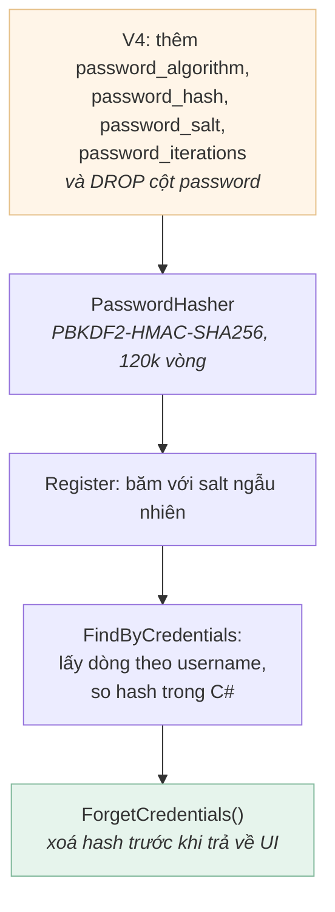

[← Bài 08](08-kiem-thu-winforms.md) · Bài 09/09 · [Mục lục](README.md)

# 09 · Bài tập

Bài tập xếp theo độ khó tăng dần. Mỗi bài ghi rõ **kiến thức dùng đến**, **gợi ý**, và
**cách tự kiểm chứng**.

Quy tắc chung: **làm xong bài nào cũng phải chạy được bộ test.**

```powershell
msbuild EmployeeManagementSystem.sln -p:Configuration=Debug -warnaserror
vstest.console.exe EmployeeManagementSystem.Tests\bin\Debug\net472\EmployeeManagementSystem.Tests.dll
```

---

## Mức 1 — Làm quen

### Bài 1 · Giới hạn độ dài ô nhập

**Dùng:** [bài 02](02-giai-phau-du-an.md) (Designer), [bài 05](05-ket-noi-database.md) (giới hạn cột)

Hiện không ô nhập nào đặt `MaxLength`. Gõ 60 ký tự vào ô mã nhân viên (cột
`VARCHAR2(50)`) sẽ ném `ORA-12899`.

Đặt `MaxLength` cho mọi `TextBox` khớp với schema:

| Ô nhập | Cột | Giới hạn |
|--------|-----|----------|
| `addEmployee_id` | `employee_id` | 50 |
| `addEmployee_fullName` | `full_name` | 200 |
| `addEmployee_phoneNumber` | `contact_number` | 50 |
| `signup_username` / `login_username` | `username` | 100 |
| `signup_password` / `login_password` | *(không có cột)* | Mật khẩu được băm nên độ dài lưu là cố định. Vẫn nên đặt trần hợp lý, ví dụ 128. |

**Gợi ý:** làm trong designer, hoặc sửa thẳng `.Designer.cs`.

**Kiểm chứng:** thử dán một chuỗi 100 ký tự vào ô mã nhân viên — nó phải bị cắt ở 50.

---

### Bài 2 · Hiện số phiên bản trên màn hình đăng nhập

**Dùng:** [bài 02](02-giai-phau-du-an.md)

Thêm một `Label` nhỏ ở góc `LoginForm` hiện phiên bản assembly.

**Gợi ý:**

```csharp
Assembly.GetExecutingAssembly().GetName().Version
```

Đặt ở đâu — constructor hay `OnLoad`? Đọc lại [bài 03](03-vong-doi-form-usercontrol.md)
rồi tự lý giải lựa chọn của mình.

**Kiểm chứng:** chạy app, thấy `v1.0.0.0`. Sau đó mở `Properties/AssemblyInfo.cs`, đổi
thành `1.1.0.0`, build lại và xác nhận label đổi theo.

---

## Mức 2 — Hiểu cơ chế

### Bài 3 · Đo lượng form bị rò rỉ (đã sửa sẵn)

**Dùng:** [bài 01](01-winforms-hoat-dong-the-nao.md)

Điều hướng đã được sửa sang vòng lặp phiên trong `Program.RunSessions`. Bài này là **đo
đạc**, để bạn tự thấy vấn đề cũ có thật chứ không phải lý thuyết.

Viết một chương trình nhỏ tham chiếu `EmployeeManagementSystem.exe`, chạy trên luồng STA:

```csharp
var login = new LoginForm();
login.Show();

Form current = login;
for (int i = 1; i <= 5; i++)
{
    Form next = current is LoginForm ? (Form)new RegisterForm() : new LoginForm();
    next.Show();
    current.Hide();          // mau CU
    Application.DoEvents();
    current = next;
    Console.WriteLine("vong " + i + ": OpenForms = " + Application.OpenForms.Count);
}
```

**Câu hỏi:**

1. Sau 5 vòng, `Application.OpenForms.Count` bằng bao nhiêu? Vì sao?
2. Đổi `current.Hide()` thành `current.Close()`. Con số đổi thế nào?
3. Vì sao vòng lặp phiên dùng `using` chứ không chỉ `Close()`?

<details>
<summary>Đáp án</summary>

1. **6.** Mỗi vòng thêm một form mới, còn form cũ chỉ bị ẩn nên vẫn nằm trong
   `Application.OpenForms`.
2. Về 1 — nhưng nếu form bị đóng là form đã truyền cho `Application.Run` thì ứng dụng
   thoát luôn. Đó chính là lý do bản cũ dùng `Hide()`, và cũng là lý do nó rò rỉ.
3. `Close()` giải phóng handle cửa sổ, nhưng với form **modal** (`ShowDialog`) .NET
   không tự `Dispose` — bạn phải làm. `using` bảo đảm điều đó.

</details>

---

### Bài 4 · Đừng tin `row.Cells[i]`

**Dùng:** [bài 04](04-datagridview-databinding.md)

Đây là bài tập **quan sát**, không phải sửa code.

1. Thêm `public string Email { get; set; }` vào **giữa** class `Employee`, ngay sau
   `Gender`.
2. Build và chạy. Bấm vào một dòng trong lưới nhân viên.
3. Ghi lại hiện tượng.
4. Bây giờ đọc `Views/EmployeeView.cs` — vì sao nó **không** bị lỗi này?
5. Hoàn tác thay đổi.

**Kết luận cần rút ra:** vì sao chỉ số cột nguy hiểm hơn tên cột, và vì sao trình biên
dịch không cứu được bạn.

---

### Bài 5 · Nạp lười cho các view

**Dùng:** [bài 03](03-vong-doi-form-usercontrol.md)

Mở `MainForm` hiện chạy **ba** truy vấn cùng lúc, vì `OnLoad` của cả ba `UserControl` đều
nổ dù hai cái đang ẩn.

Sửa để mỗi view chỉ nạp dữ liệu lần đầu nó được hiện.

**Gợi ý:** thêm một cờ `_loaded` trong `DataView`. Cẩn thận: `MainForm.ShowView()` vẫn phải
làm mới được dữ liệu khi người dùng quay lại một tab.

**Kiểm chứng:** đặt breakpoint trong `LoadData()` của `SalaryView`. Mở `MainForm` — nó
không được dừng lại. Bấm tab "Salary" — lúc này phải dừng.

---

## Mức 3 — Làm cho tử tế

### Bài 6 · Không cho app đơ

**Dùng:** [bài 07](07-luong-ui-va-xu-ly-loi.md)

Chuyển `SalaryView.salary_updateBtn_Click` sang `async`.

**Yêu cầu:**

- Vô hiệu hoá nút trong lúc chạy (chống bấm hai lần)
- Đổi con trỏ thành `Cursors.WaitCursor`
- Khôi phục cả hai trong `finally`
- Không dùng `Application.DoEvents()`

**Gợi ý:** repository hiện đồng bộ, nên bọc bằng `await Task.Run(() => ...)`. Nhớ: sau
`await`, bạn lại đang ở UI thread nên chạm control thoải mái.

**Kiểm chứng:** tạm thêm `Thread.Sleep(3000)` vào `EmployeeRepository.UpdateSalary`. Cửa
sổ phải vẫn kéo được trong lúc chờ. Xoá `Sleep` sau khi thử xong.

---

### Bài 7 · Thêm một migration

**Dùng:** [README gốc](../README.md), [bài 05](05-ket-noi-database.md)

Thêm cột `email VARCHAR2(200)` vào bảng `employees`.

**Bắt buộc:**

1. Tạo `db/migrations/V5__add_employee_email.sql` — **không sửa V1…V4**
2. Thêm `Email` vào model `Employee`
3. Cập nhật `Sql/EmployeeStatements.xml` (`SelectAll`, `SelectByStatus`, `Insert`, `Update`)
4. Thêm ô nhập vào `EmployeeView`
5. Thêm tiêu đề cột vào từ điển `Headers` trong `EmployeeGrid.cs`

**Kiểm chứng:**

```powershell
powershell -ExecutionPolicy Bypass -File db\setup-db.ps1     # áp dụng V5
powershell -ExecutionPolicy Bypass -File db\setup-db.ps1     # phải là "up to date"
```

Chạy lại lần hai **không được** áp dụng lại V5. Nếu có, bạn đã hiểu sai cách Flyway hoạt
động.

---

### Bài 8 · Viết test trước, sửa sau

**Dùng:** [bài 08](08-kiem-thu-winforms.md)

`EmployeeRepository.SoftDelete` hiện **không** được bọc trong `try/catch` dịch lỗi Oracle
như `Add`, `Update`, `UpdateSalary`.

1. Viết một test khẳng định hành vi mong muốn (test này phải **đỏ** trước).
2. Sửa `SoftDelete` cho nhất quán với các hàm ghi khác.
3. Xác nhận test chuyển xanh.

**Suy nghĩ thêm:** `SoftDelete` chỉ đặt `delete_date`, nên thực tế nó khó vi phạm ràng
buộc nào. Vậy thay đổi này có đáng không? Không có đáp án đúng tuyệt đối — hãy tự lập luận.

---

## Mức 4 — Thử thách

### Bài 9 · Đọc hiểu phần băm mật khẩu (đã làm sẵn)

**Dùng:** tất cả các bài. Đây là hạng mục **F1**, và nó **đã được hoàn thành** — nên bài
này là đọc hiểu, không phải viết mới.

Trước đây mật khẩu được lưu thô và so sánh ngay trong SQL. Migration **V4** đã đổi điều đó.
Hãy đọc `Data/PasswordHasher.cs` rồi trả lời:



**Câu hỏi:**

1. Vì sao `Rfc2898DeriveBytes` trong dự án phải truyền `HashAlgorithmName.SHA256`? Nếu bỏ
   tham số đó thì chuyện gì xảy ra, và bạn có nhận ra không?
2. Vì sao `FixedTimeEquals` không dừng sớm khi tìm thấy byte khác nhau?
3. `PasswordHasher.BurnTime()` làm gì, và tấn công nào nó ngăn?
4. Vì sao mỗi dòng lưu cả `password_iterations` thay vì dùng chung một hằng số?
5. Vì sao `password_algorithm` được lưu, dù hiện chỉ có đúng một thuật toán?

<details>
<summary>Đáp án</summary>

1. `Rfc2898DeriveBytes` trên .NET Framework **mặc định dùng SHA-1**. Bỏ tham số đó thì code
   vẫn chạy, vẫn băm, vẫn verify được — chỉ là yếu hơn nhiều. Không có cảnh báo nào.
2. Thời gian dừng sớm sẽ tiết lộ kẻ tấn công đã đoán đúng bao nhiêu byte đầu, cho phép
   dò từng byte một thay vì dò cả hash.
3. Nó tiêu tốn thời gian tương đương một lần verify thật, khi username không tồn tại. Không
   có nó, đăng nhập sai username trả về sau ~5ms còn sai mật khẩu mất ~340ms — chênh lệch
   đó cho biết username nào có thật (user enumeration).
4. Để nâng số vòng lặp về sau mà **không làm hỏng tài khoản cũ**. Mỗi hash tự mang theo
   chi phí nó được tạo ra.
5. Cùng lý do: để đổi thuật toán sau này mà vẫn verify được hash cũ. Hàm `Verify` từ chối
   thuật toán lạ thay vì đoán bừa.

</details>

**Bài tập thật:** `PasswordHasher` hiện dùng 120 000 vòng, mất khoảng 400 ms. OWASP khuyến
nghị cao hơn. Hãy nâng lên và đo — rồi giải thích vì sao **không nên** nâng trước khi làm
xong bài 6 (async).

**Còn một việc chưa làm:** V4 khiến mọi tài khoản có sẵn không đăng nhập được nữa, và vì
`username` là UNIQUE nên họ cũng không đăng ký lại được. Dự án chưa có màn hình quản trị
để đặt lại mật khẩu. Hãy thiết kế cách giải quyết.

---

### Bài 10 · Kiểm soát tương tranh

**Dùng:** [bài 05](05-ket-noi-database.md), [bài 06](06-kien-truc-phan-tang.md). Hạng mục **F7**.

Hai người cùng mở một nhân viên, cùng sửa. Người lưu sau ghi đè người lưu trước, **không
ai được cảnh báo**.

Thêm optimistic locking:

1. `V6`: thêm cột `row_version NUMBER DEFAULT 1 NOT NULL`
2. `SelectAll` trả về cột đó, model `Employee` có `RowVersion`
3. `Update` thêm `AND row_version = :expectedVersion` và tăng giá trị
4. Nếu trả về 0 dòng → báo "Có người khác vừa sửa bản ghi này, hãy tải lại"

**Kiểm chứng:** viết một test mô phỏng hai người sửa cùng lúc:

```csharp
Employee userA = _employees.GetAll().Single(e => e.EmployeeId == id);
Employee userB = _employees.GetAll().Single(e => e.EmployeeId == id);

userA.FullName = "Người A sửa";
Assert.Equal(1, _employees.Update(userA));      // thành công

userB.FullName = "Người B sửa";
Assert.Equal(0, _employees.Update(userB));      // phải bị từ chối
```

Hạ tầng đã sẵn sàng: repository vốn đã trả về số dòng bị ảnh hưởng.

---

## Đi tiếp

Toàn bộ danh sách hạng mục còn lại nằm trong kế hoạch cải tiến (F1–F21). Vài mục lớn:

| Mã | Nội dung | Vì sao đáng làm |
|----|----------|-----------------|
| F6 | Transaction | Copy ảnh và `INSERT` hiện không nguyên tử |
| F7 | Kiểm soát tương tranh | Người lưu sau ghi đè người lưu trước, không ai biết |
| F8 | Log thật (Serilog) | `Debug.WriteLine` biến mất trong bản Release |
| F11 | `async` cho truy vấn | Chống đơ giao diện — xem bài tập 6 |
| F17 | Ảnh lưu trong DB | Đường dẫn cục bộ vô nghĩa với máy thứ hai |

Tất cả những mục trên đều làm được **trên .NET Framework 4.7.2**, không cần nâng cấp
runtime. `async`/`await` có từ .NET Framework 4.5, và Serilog cũng hỗ trợ.

> Dự án chủ động **giữ nguyên WinForms trên .NET Framework 4.7.2**. Việc nâng lên .NET 8/9
> và việc tách một tầng Web API đã được đưa ra khỏi kế hoạch — không phải vì chúng sai, mà
> vì mục tiêu ở đây là học và làm WinForms.

---

[← Bài 08](08-kiem-thu-winforms.md) · [Mục lục](README.md)
