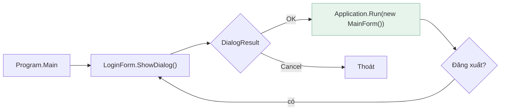
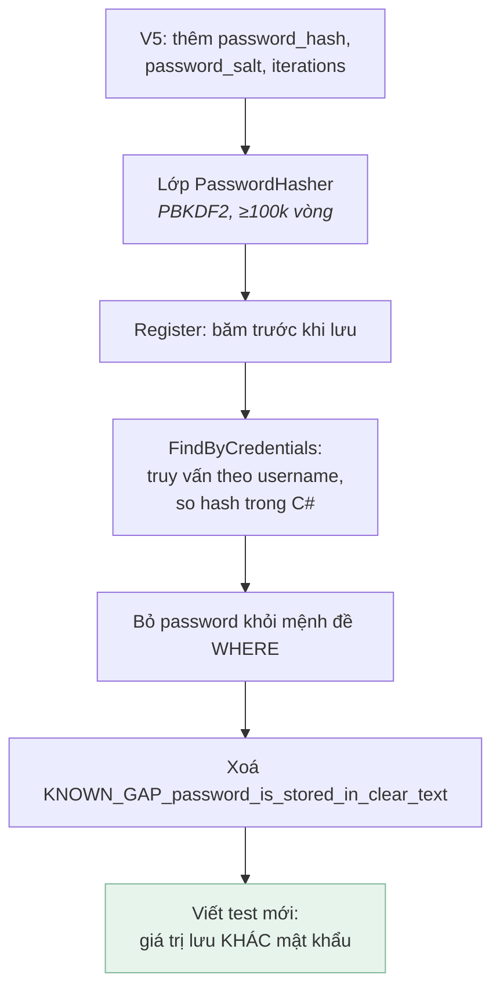

[← Bài 08](08-kiem-thu-winforms.md) · Bài 09/09 · [Mục lục](README.md)

# 09 · Bài tập

Bài tập xếp theo độ khó tăng dần. Mỗi bài ghi rõ **kiến thức dùng đến**, **gợi ý**, và
**cách tự kiểm chứng**.

Quy tắc chung: **làm xong bài nào cũng phải chạy được bộ test.**

```powershell
msbuild EmployeeManagementSystem.sln -p:Configuration=Debug -warnaserror
vstest.console.exe EmployeeManagementSystem.Tests\bin\Debug\net472\EmployeeManagementSystem.Tests.dll
```

---

## Mức 1 — Làm quen

### Bài 1 · Giới hạn độ dài ô nhập

**Dùng:** [bài 02](02-giai-phau-du-an.md) (Designer), [bài 05](05-ket-noi-database.md) (giới hạn cột)

Hiện không ô nhập nào đặt `MaxLength`. Gõ 60 ký tự vào ô mã nhân viên (cột
`VARCHAR2(50)`) sẽ ném `ORA-12899`.

Đặt `MaxLength` cho mọi `TextBox` khớp với schema:

| Ô nhập | Cột | Giới hạn |
|--------|-----|----------|
| `addEmployee_id` | `employee_id` | 50 |
| `addEmployee_fullName` | `full_name` | 200 |
| `addEmployee_phoneNumber` | `contact_number` | 50 |
| `signup_username` / `login_username` | `username` | 100 |
| `signup_password` / `login_password` | `password` | 200 |

**Gợi ý:** làm trong designer, hoặc sửa thẳng `.Designer.cs`.

**Kiểm chứng:** thử dán một chuỗi 100 ký tự vào ô mã nhân viên — nó phải bị cắt ở 50.

---

### Bài 2 · Hiện số phiên bản trên màn hình đăng nhập

**Dùng:** [bài 02](02-giai-phau-du-an.md)

Thêm một `Label` nhỏ ở góc `LoginForm` hiện phiên bản assembly.

**Gợi ý:**

```csharp
Assembly.GetExecutingAssembly().GetName().Version
```

Đặt ở đâu — constructor hay `OnLoad`? Đọc lại [bài 03](03-vong-doi-form-usercontrol.md)
rồi tự lý giải lựa chọn của mình.

**Kiểm chứng:** chạy app, thấy `v1.0.0.0`. Sau đó mở `Properties/AssemblyInfo.cs`, đổi
thành `1.1.0.0`, build lại và xác nhận label đổi theo.

---

## Mức 2 — Hiểu cơ chế

### Bài 3 · Sửa luồng đăng nhập / đăng xuất

**Dùng:** [bài 01](01-winforms-hoat-dong-the-nao.md)

Hiện tại `MainForm` gọi `Hide()` chứ không `Close()` khi đăng xuất, và mỗi lần lại tạo mới
một `LoginForm`. Form cũ chỉ bị ẩn và vẫn nằm trong bộ nhớ — cứ đăng nhập/đăng xuất nhiều
lần là chồng chất.

Sửa lại theo mẫu chuẩn:



**Gợi ý:** `LoginForm` đặt `this.DialogResult = DialogResult.OK` khi đăng nhập thành công.
`Program.Main` dùng vòng lặp `while` để quay lại màn đăng nhập sau khi đăng xuất.

**Kiểm chứng:** đăng nhập → đăng xuất → đăng nhập 5 lần. Mở Task Manager, số handle không
được tăng dần.

---

### Bài 4 · Đừng tin `row.Cells[i]`

**Dùng:** [bài 04](04-datagridview-databinding.md)

Đây là bài tập **quan sát**, không phải sửa code.

1. Thêm `public string Email { get; set; }` vào **giữa** class `Employee`, ngay sau
   `Gender`.
2. Build và chạy. Bấm vào một dòng trong lưới nhân viên.
3. Ghi lại hiện tượng.
4. Bây giờ đọc `Views/EmployeeView.cs` — vì sao nó **không** bị lỗi này?
5. Hoàn tác thay đổi.

**Kết luận cần rút ra:** vì sao chỉ số cột nguy hiểm hơn tên cột, và vì sao trình biên
dịch không cứu được bạn.

---

### Bài 5 · Nạp lười cho các view

**Dùng:** [bài 03](03-vong-doi-form-usercontrol.md)

Mở `MainForm` hiện chạy **ba** truy vấn cùng lúc, vì `OnLoad` của cả ba `UserControl` đều
nổ dù hai cái đang ẩn.

Sửa để mỗi view chỉ nạp dữ liệu lần đầu nó được hiện.

**Gợi ý:** thêm một cờ `_loaded` trong `DataView`. Cẩn thận: `MainForm.ShowView()` vẫn phải
làm mới được dữ liệu khi người dùng quay lại một tab.

**Kiểm chứng:** đặt breakpoint trong `LoadData()` của `SalaryView`. Mở `MainForm` — nó
không được dừng lại. Bấm tab "Salary" — lúc này phải dừng.

---

## Mức 3 — Làm cho tử tế

### Bài 6 · Không cho app đơ

**Dùng:** [bài 07](07-luong-ui-va-xu-ly-loi.md)

Chuyển `SalaryView.salary_updateBtn_Click` sang `async`.

**Yêu cầu:**

- Vô hiệu hoá nút trong lúc chạy (chống bấm hai lần)
- Đổi con trỏ thành `Cursors.WaitCursor`
- Khôi phục cả hai trong `finally`
- Không dùng `Application.DoEvents()`

**Gợi ý:** repository hiện đồng bộ, nên bọc bằng `await Task.Run(() => ...)`. Nhớ: sau
`await`, bạn lại đang ở UI thread nên chạm control thoải mái.

**Kiểm chứng:** tạm thêm `Thread.Sleep(3000)` vào `EmployeeRepository.UpdateSalary`. Cửa
sổ phải vẫn kéo được trong lúc chờ. Xoá `Sleep` sau khi thử xong.

---

### Bài 7 · Thêm một migration

**Dùng:** [README gốc](../README.md), [bài 05](05-ket-noi-database.md)

Thêm cột `email VARCHAR2(200)` vào bảng `employees`.

**Bắt buộc:**

1. Tạo `db/migrations/V4__add_employee_email.sql` — **không sửa V1, V2, V3**
2. Thêm `Email` vào model `Employee`
3. Cập nhật `Sql/EmployeeStatements.xml` (`SelectAll`, `SelectByStatus`, `Insert`, `Update`)
4. Thêm ô nhập vào `EmployeeView`
5. Thêm tiêu đề cột vào từ điển `Headers` trong `EmployeeGrid.cs`

**Kiểm chứng:**

```powershell
powershell -ExecutionPolicy Bypass -File db\setup-db.ps1     # áp dụng V4
powershell -ExecutionPolicy Bypass -File db\setup-db.ps1     # phải là "up to date"
```

Chạy lại lần hai **không được** áp dụng lại V4. Nếu có, bạn đã hiểu sai cách Flyway hoạt
động.

---

### Bài 8 · Viết test trước, sửa sau

**Dùng:** [bài 08](08-kiem-thu-winforms.md)

`EmployeeRepository.SoftDelete` hiện **không** được bọc trong `try/catch` dịch lỗi Oracle
như `Add`, `Update`, `UpdateSalary`.

1. Viết một test khẳng định hành vi mong muốn (test này phải **đỏ** trước).
2. Sửa `SoftDelete` cho nhất quán với các hàm ghi khác.
3. Xác nhận test chuyển xanh.

**Suy nghĩ thêm:** `SoftDelete` chỉ đặt `delete_date`, nên thực tế nó khó vi phạm ràng
buộc nào. Vậy thay đổi này có đáng không? Không có đáp án đúng tuyệt đối — hãy tự lập luận.

---

## Mức 4 — Thử thách

### Bài 9 · Băm mật khẩu

**Dùng:** tất cả các bài. Đây là hạng mục **F1** trong kế hoạch cải tiến.

Mật khẩu hiện lưu và so sánh dạng thô. Sửa lại cho đúng.

**Các bước:**



**Bắt buộc:**

- `Rfc2898DeriveBytes` với ít nhất 100 000 vòng lặp
- Mỗi người dùng một salt ngẫu nhiên riêng
- So sánh bằng hàm thời gian hằng định (chống timing attack)
- **Mật khẩu không bao giờ xuất hiện trong `WHERE`**

**Gợi ý về dữ liệu cũ:** không thể băm ngược mật khẩu đã có. Bạn sẽ làm gì với tài khoản
`admin` hiện tại? (Không có đáp án duy nhất — hãy chọn và ghi lý do vào comment của
migration.)

**Kiểm chứng:** đăng ký tài khoản mới, đăng nhập lại được. Truy vấn thẳng database và xác
nhận cột không chứa mật khẩu gốc:

```sql
SELECT username, password_hash FROM users;
```

---

### Bài 10 · Kiểm soát tương tranh

**Dùng:** [bài 05](05-ket-noi-database.md), [bài 06](06-kien-truc-phan-tang.md). Hạng mục **F7**.

Hai người cùng mở một nhân viên, cùng sửa. Người lưu sau ghi đè người lưu trước, **không
ai được cảnh báo**.

Thêm optimistic locking:

1. `V6`: thêm cột `row_version NUMBER DEFAULT 1 NOT NULL`
2. `SelectAll` trả về cột đó, model `Employee` có `RowVersion`
3. `Update` thêm `AND row_version = :expectedVersion` và tăng giá trị
4. Nếu trả về 0 dòng → báo "Có người khác vừa sửa bản ghi này, hãy tải lại"

**Kiểm chứng:** viết một test mô phỏng hai người sửa cùng lúc:

```csharp
Employee userA = _employees.GetAll().Single(e => e.EmployeeId == id);
Employee userB = _employees.GetAll().Single(e => e.EmployeeId == id);

userA.FullName = "Người A sửa";
Assert.Equal(1, _employees.Update(userA));      // thành công

userB.FullName = "Người B sửa";
Assert.Equal(0, _employees.Update(userB));      // phải bị từ chối
```

Hạ tầng đã sẵn sàng: repository vốn đã trả về số dòng bị ảnh hưởng.

---

## Đi tiếp

Toàn bộ danh sách hạng mục còn lại nằm trong kế hoạch cải tiến (F1–F21). Vài mục lớn:

| Mã | Nội dung | Vì sao đáng làm |
|----|----------|-----------------|
| F6 | Transaction | Copy ảnh và `INSERT` hiện không nguyên tử |
| F8 | Log thật (Serilog) | `Debug.WriteLine` biến mất trong bản Release |
| F17 | Ảnh lưu trong DB | Đường dẫn cục bộ vô nghĩa với máy thứ hai |
| F18 | Nâng lên .NET 8/9 | Cú pháp gần như y hệt, DI thật, async tốt hơn |

Nếu bạn học WinForms để **bắt đầu dự án mới**, hãy làm F18 sớm. WinForms trên .NET 8/9
dùng gần như cùng API nhưng có `IConfiguration`, `Microsoft.Extensions.DependencyInjection`,
và toàn bộ hệ sinh thái .NET hiện đại.

---

[← Bài 08](08-kiem-thu-winforms.md) · [Mục lục](README.md)
