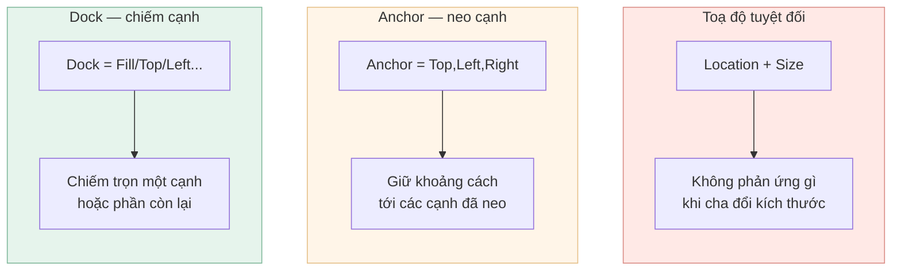
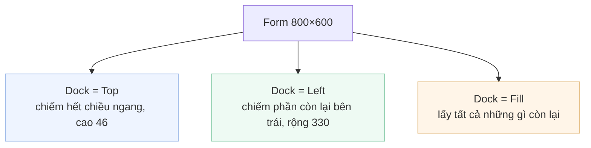
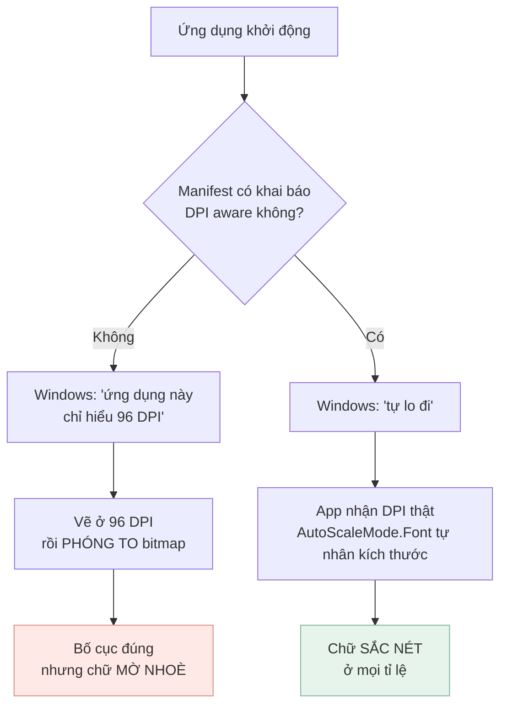

[← Bài 08](08-kiem-thu-winforms.md) · Bài 09/12 · [Tiếp: Bàn phím và focus →](10-ban-phim-va-focus.md)

# 09 · Bố cục và DPI

## Vấn đề

Bạn kéo thả control vào form, chạy thử trên máy mình — đẹp. Gửi cho người khác, họ mở lên
thì chữ mờ nhoè, nút chồng lên nhau, hoặc phóng to cửa sổ thì mọi thứ dồn về góc trên bên
trái.

Hai nguyên nhân, hai cơ chế khác nhau: **bố cục** và **DPI**.

## Phần 1 — Bố cục

Designer sinh ra toạ độ tuyệt đối:

```csharp
this.dashboardView.Location = new System.Drawing.Point(-3, 0);
this.dashboardView.Size = new System.Drawing.Size(923, 648);
```

Đây là **cách kém nhất**, và dự án này đã dính đúng hậu quả của nó.

### Lỗi thật của dự án

Ba view được đặt trong `panel3` với toạ độ tuyệt đối:

| View | Location cũ |
|------|-------------|
| `dashboardView` | `(-3, 0)` |
| `employeeView` | `(0, 0)` |
| `salaryView` | `(-3, 0)` |

Hai cái lệch **3 pixel** so với cái còn lại. Mỗi lần đổi tab, nội dung **nhảy sang ngang
3px**. Không ai cố ý làm vậy — nó đến từ việc kéo thả bằng chuột và lỡ tay.

Sửa bằng một dòng cho mỗi view:

```csharp
this.dashboardView.Dock = System.Windows.Forms.DockStyle.Fill;
```

Đo sau khi sửa: cả ba có `bounds = {X=0, Y=0, Width=692, Height=527}` — giống hệt nhau, và
**tự bám theo `panel3`** nếu kích thước đổi.

### Ba cơ chế bố cục



**`Anchor`** giữ khoảng cách tới các cạnh được neo. Mặc định là `Top, Left` — nghĩa là
control giữ nguyên vị trí góc trên trái và **không co giãn**. Neo `Top, Left, Right` thì
control giãn ngang theo cha.

**`Dock`** mạnh hơn: control chiếm trọn một cạnh. Thứ tự quan trọng — control nào được thêm
vào `Controls` **sau** thì nằm **trong cùng**:



Đây đúng là cấu trúc `MainForm` nên có: `panel1` (thanh trên) `Dock = Top`, `panel2` (menu
trái) `Dock = Left`, `panel3` (nội dung) `Dock = Fill`. Hiện chúng vẫn dùng toạ độ tuyệt
đối — [bài tập 5](12-bai-tap.md) yêu cầu bạn chuyển.

### Panel bố cục

Khi Anchor/Dock không đủ, WinForms có hai container tự sắp:

| Container | Dùng khi |
|-----------|----------|
| `TableLayoutPanel` | Lưới hàng/cột, tỉ lệ phần trăm — như form nhập liệu nhãn/ô |
| `FlowLayoutPanel` | Xếp liên tiếp và tự xuống dòng — như một dãy nút |

Chúng chậm hơn toạ độ tuyệt đối một chút, nhưng đổi lại **tự đúng khi font hoặc DPI đổi**.

## Phần 2 — DPI

Đây là phần hay bị bỏ qua nhất, và cũng là lý do phổ biến nhất khiến app WinForms trông
"cũ".

### Chuyện gì thực sự xảy ra

Windows cổ điển giả định 96 DPI. Màn hình laptop hiện đại thường đặt tỉ lệ 125% hoặc 150%,
tức 120 hoặc 144 DPI.



Điểm quan trọng: **không khai báo gì thì app vẫn "chạy đúng"** — nó chỉ mờ. Vì thế lỗi này
sống rất dai: không ai thấy exception, không ai thấy sai bố cục, chỉ thấy "trông hơi xấu".

### Khai báo bằng manifest

Dự án thêm `app.manifest` và trỏ tới nó trong `.csproj`:

```xml
<ApplicationManifest>app.manifest</ApplicationManifest>
```

```xml
<windowsSettings>
  <dpiAwareness xmlns="http://schemas.microsoft.com/SMI/2016/WindowsSettings">PerMonitorV2</dpiAwareness>
  <dpiAware xmlns="http://schemas.microsoft.com/SMI/2005/WindowsSettings">true/pm</dpiAware>
</windowsSettings>
```

Hai thẻ vì hai thế hệ Windows: `dpiAwareness` cho Windows 10 1703 trở lên, `dpiAware` cho
các bản cũ hơn không hiểu thẻ mới.

**Kiểm chứng** — manifest được nhúng thẳng vào `.exe`, và hệ điều hành xác nhận:

```powershell
GetProcessDpiAwareness -> 2 (PER_MONITOR_DPI_AWARE)
```

Trước khi thêm manifest, giá trị là `0` (`UNAWARE`).

### `AutoScaleMode` — nửa còn lại

Manifest nói với Windows "tôi tự lo". `AutoScaleMode` là **cách** WinForms tự lo:

| Giá trị | Nghĩa |
|---------|-------|
| `None` | Không co giãn gì cả |
| `Font` | Co giãn theo kích thước font hệ thống — **mặc định của designer, và là lựa chọn đúng** |
| `Dpi` | Co giãn theo DPI |
| `Inherit` | Theo control cha |

Mọi form trong dự án đều đặt `AutoScaleMode.Font` kèm `AutoScaleDimensions = (8F, 16F)` —
"form này được thiết kế khi font hệ thống cao 16px". Lúc chạy, WinForms so với font thật và
nhân toàn bộ toạ độ theo tỉ lệ.

> **Đừng bao giờ sửa tay `AutoScaleDimensions`.** Nó là *số đo lúc thiết kế*, không phải
> cấu hình. Designer tự ghi lại. Sửa nó là nói dối với bộ co giãn.

## Cạm bẫy

**Trộn `Dock` với `Location`.** Đặt `Dock` xong thì `Location` bị bỏ qua hoàn toàn. Đọc
`Location` sau khi Dock sẽ ra giá trị mà bạn không đặt.

**Thứ tự Dock ngược.** Control thêm sau nằm trong cùng. Nếu `Fill` được thêm *trước* `Top`,
nó sẽ chiếm cả vùng mà thanh trên đáng lẽ chiếm.

**Đặt kích thước cứng cho control chứa chữ.** Ở 150% DPI, chữ to hơn nhưng nút thì không —
chữ bị cắt. Dùng `AutoSize` hoặc để bố cục tự tính.

**Test trên đúng một máy.** Đổi tỉ lệ hiển thị Windows sang 150%, đăng xuất rồi đăng nhập
lại, mở app lên xem. Đây là bài kiểm tra 30 giây mà hầu như không ai làm.

## Tự kiểm tra

1. Ba view từng lệch nhau 3px. Vì sao `Dock = Fill` sửa được, mà sửa `Location` thành `(0,0)`
   thì chưa đủ tốt?
2. Không có `app.manifest`, ứng dụng chạy trên màn hình 150% sẽ ra sao? Có exception không?
3. `AutoScaleDimensions = (8F, 16F)` nghĩa là gì?
4. Bạn muốn một thanh công cụ luôn nằm sát trên và một lưới chiếm phần còn lại. Thêm control
   vào `Controls` theo thứ tự nào?

<details>
<summary>Đáp án</summary>

1. `Location = (0,0)` chỉ sửa **triệu chứng hiện tại**. `Dock = Fill` sửa **nguyên nhân**:
   view không còn tự giữ toạ độ mà bám theo container, nên đổi kích thước `panel3` hay đổi
   DPI đều đúng, và không ai lỡ tay kéo lệch được nữa.
2. **Không có exception.** Windows vẽ app ở 96 DPI rồi phóng to bitmap lên 150% — bố cục
   vẫn đúng, chỉ là chữ mờ. Đó chính là lý do lỗi này tồn tại lâu: nó không hỏng, nó chỉ xấu.
3. "Form này được thiết kế trên máy có font hệ thống rộng 8px, cao 16px." Lúc chạy, WinForms
   so số đó với font thật và nhân toàn bộ kích thước theo tỉ lệ.
4. Thêm control `Fill` **trước**, rồi `Top` sau — vì control thêm sau nằm trong cùng và
   được ưu tiên chiếm cạnh. Trong designer, dùng "Bring to Front" / "Send to Back" để đổi
   thứ tự này.

</details>

---

[← Bài 08](08-kiem-thu-winforms.md) · [Tiếp: Bàn phím và focus →](10-ban-phim-va-focus.md)
