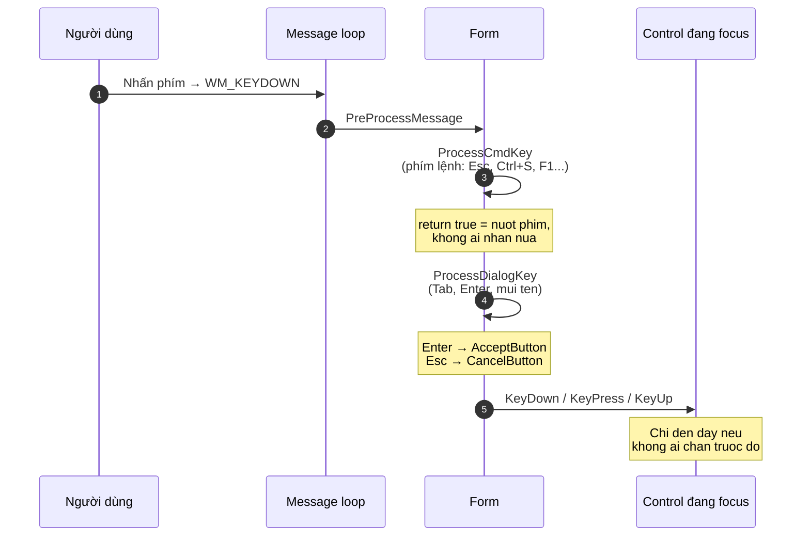
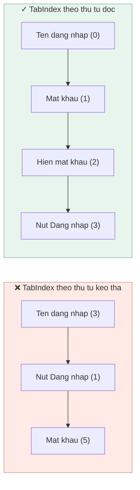

[← Bài 09](09-bo-cuc-va-dpi.md) · Bài 10/12 · [Tiếp: WndProc và Win32 →](11-wndproc-va-win32.md)

# 10 · Bàn phím và focus

## Vấn đề

Mở màn hình đăng nhập. Gõ tên, gõ mật khẩu, nhấn **Enter**.

Không có gì xảy ra.

Trước lần nâng cấp này, dự án đúng như vậy: người dùng buộc phải rời tay khỏi bàn phím,
cầm chuột, bấm nút. Với một form đăng nhập, đó là lỗi trải nghiệm nghiêm trọng — và nó
xuất phát từ việc không biết WinForms xử lý phím thế nào.

## Đường đi của một phím

Phím không đến thẳng control. Nó đi qua nhiều chặng, và **mỗi chặng đều chặn được**:



Ba mức, dùng cho ba mục đích khác nhau:

| Mức | Dùng cho | Ví dụ trong dự án |
|-----|----------|-------------------|
| `ProcessCmdKey` | Phím lệnh toàn form, chạy **trước mọi thứ** | `Esc` đóng màn đăng nhập |
| `AcceptButton` / `CancelButton` | Enter và Esc theo chuẩn hộp thoại | `Enter` = Đăng nhập |
| `KeyDown` / `KeyPress` | Xử lý gõ trong một control cụ thể | (chưa dùng) |

## `AcceptButton` — nút mặc định

Một dòng trong designer, và Enter hoạt động ở **mọi ô nhập** trên form:

```csharp
this.AcceptButton = this.login_btn;
```

WinForms tự lo phần còn lại: nhấn Enter ở bất kỳ đâu (trừ control tự nuốt Enter như
`TextBox` nhiều dòng) sẽ kích hoạt nút đó, kể cả hiệu ứng nhấn.

`CancelButton` là cặp đôi cho phím `Esc`:

```csharp
// RegisterForm
this.AcceptButton = this.sigunp_btn;        // Enter = Đăng ký
this.CancelButton = this.signup_loginBtn;   // Esc  = quay lại đăng nhập
```

### Chỗ dự án không dùng được `CancelButton`

`LoginForm` **không** đặt được `CancelButton`. Lý do rất đáng nhớ:

```csharp
private System.Windows.Forms.Label exit;    // dau X mau tim la mot LABEL
```

`CancelButton` đòi kiểu `IButtonControl`, mà `Label` không hiện thực interface đó. Gán vào
là **lỗi biên dịch**:

```
error CS0266: không thể chuyển đổi ngầm 'Label' sang 'IButtonControl'
```

Đây là trình biên dịch chỉ ra một vấn đề sâu hơn: **`Label` không nhận được focus**, nên
dấu X đóng cửa sổ ấy hoàn toàn **không thể đến bằng bàn phím**. Người dùng chỉ dùng bàn
phím sẽ không có cách nào đóng cửa sổ.

Giải pháp tạm ở tầng `AppForm`:

```csharp
protected override bool ProcessCmdKey(ref Message msg, Keys keyData)
{
    if (EscapeClosesForm && keyData == Keys.Escape)
    {
        Close();
        return true;
    }

    return base.ProcessCmdKey(ref msg, keyData);
}
```

`ProcessCmdKey` chạy **trước** khi phím đến control nào, nên nó bắt được `Esc` bất kể con
trỏ đang ở đâu. `return true` nghĩa là "đã xử lý, dừng lại".

> **Cách sửa triệt để** là đổi `Label` thành `Button` có `FlatStyle` phù hợp, để nó vào
> được vòng Tab và đọc được bởi trình đọc màn hình. Đó là [bài tập 4](12-bai-tap.md).

## Thứ tự Tab

`TabIndex` quyết định thứ tự nhảy focus khi nhấn Tab. Dự án **có** đặt `TabIndex` (13 lần
riêng trong `LoginForm`), nhưng designer gán số theo **thứ tự bạn kéo control vào**, không
theo thứ tự đọc.



Hai thuộc tính liên quan:

| Thuộc tính | Nghĩa |
|------------|-------|
| `TabIndex` | Vị trí trong vòng Tab, tính **trong phạm vi control cha** |
| `TabStop` | `false` = bỏ qua control này khi Tab, nhưng vẫn click được |

Lưu ý `TabIndex` là **cục bộ theo container**. Control trong `panel2` có `TabIndex` riêng,
không so với control trong `panel3` — thứ tự tổng thể được quyết định bởi `TabIndex` của
chính các panel.

> Visual Studio có công cụ **View → Tab Order**: bấm lần lượt lên các control theo thứ tự
> bạn muốn, nó tự đánh số. Nhanh hơn sửa tay rất nhiều.

## Focus: `Focus()` hay `Select()`?

Sau khi đăng ký thành công, dự án điền sẵn tên và đưa con trỏ vào ô mật khẩu:

```csharp
if (!string.IsNullOrEmpty(register.RegisteredUsername))
{
    login_username.Text = register.RegisteredUsername;
    login_password.Focus();
}
```

| Hàm | Khác nhau |
|-----|-----------|
| `Focus()` | Cấp thấp. **Thất bại im lặng** nếu control chưa `Visible` hoặc chưa có handle |
| `Select()` | Cấp cao, đi qua logic container. An toàn hơn cho control lồng nhau |
| `ActiveControl = x` | Đặt trên form, dùng được cả trước khi form hiện |

Cạm bẫy kinh điển: gọi `Focus()` trong **constructor**. Lúc đó control chưa có handle nên
lệnh không có tác dụng, và không có lỗi nào báo cho bạn biết — cùng họ với vấn đề ở
[bài 03](03-vong-doi-form-usercontrol.md). Đặt trong `OnLoad` hoặc `OnShown`.

## Cạm bẫy

**Quên `AcceptButton`.** Người dùng nhấn Enter trên form đăng nhập là phản xạ. Không có nó,
app trông hỏng.

**Đặt `CancelButton` là nút phá huỷ.** `Esc` phải là "thoát ra an toàn", không phải "xoá".
Nhấn nhầm Esc là chuyện thường.

**Dùng `Label` làm nút bấm.** Không vào được vòng Tab, không đọc được bởi trình đọc màn
hình, không gán được `AcceptButton`/`CancelButton`.

**`Focus()` trong constructor.** Không có tác dụng, không có cảnh báo.

**`KeyPreview = true` rồi xử lý mọi phím ở form.** Dễ nuốt nhầm phím mà control đang cần.
`ProcessCmdKey` chính xác hơn cho phím lệnh.

## Tự kiểm tra

1. Vì sao `LoginForm` đặt được `AcceptButton` nhưng không đặt được `CancelButton`?
2. `ProcessCmdKey` khác `KeyDown` ở điểm nào?
3. `return true` trong `ProcessCmdKey` nghĩa là gì?
4. Bạn gọi `txtName.Focus()` trong constructor của form. Có tác dụng không?
5. `TabIndex = 0` trên một control trong `panel3` có làm nó được Tab tới đầu tiên trên toàn
   form không?

<details>
<summary>Đáp án</summary>

1. `AcceptButton` được gán `login_btn` — một `Button`. `CancelButton` cần gán dấu X, nhưng
   dấu X đó là một `Label`, mà `Label` không hiện thực `IButtonControl`. Trình biên dịch
   chặn ngay (`CS0266`).
2. `ProcessCmdKey` chạy **trước**, ở mức form, cho **mọi** phím dù control nào đang focus.
   `KeyDown` chỉ chạy trên control đang focus và chỉ khi không ai chặn trước đó.
3. "Tôi đã xử lý phím này, đừng chuyển tiếp nữa." Trả `false` (hoặc gọi `base`) thì phím
   tiếp tục đi xuống các chặng sau.
4. **Không.** Trong constructor control chưa có handle cửa sổ nên `Focus()` thất bại im
   lặng. Đặt trong `OnLoad`/`OnShown`, hoặc dùng `ActiveControl`.
5. **Không.** `TabIndex` chỉ so sánh trong phạm vi container. Vị trí tổng thể phụ thuộc
   `TabIndex` của chính `panel3` so với các panel khác.

</details>

---

[← Bài 09](09-bo-cuc-va-dpi.md) · [Tiếp: WndProc và Win32 →](11-wndproc-va-win32.md)
