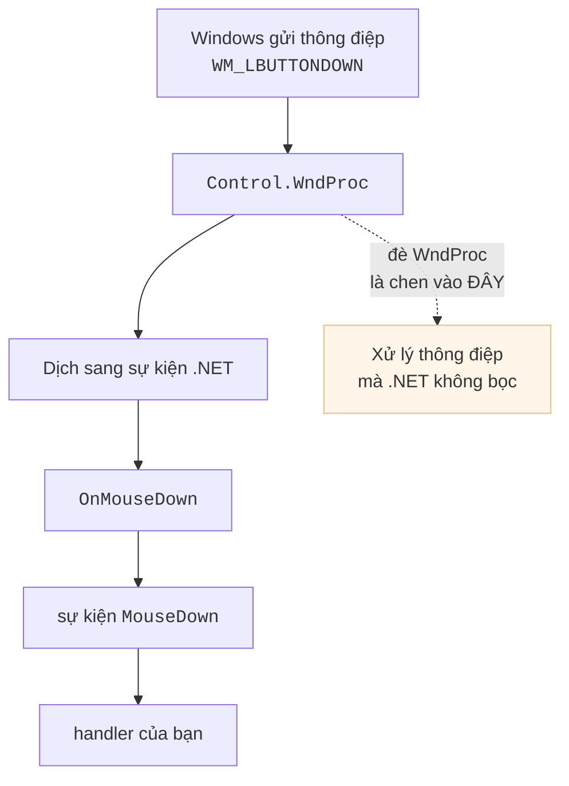
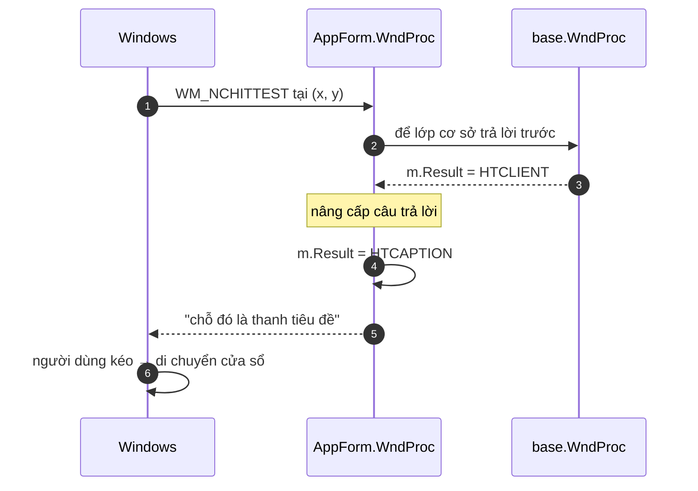
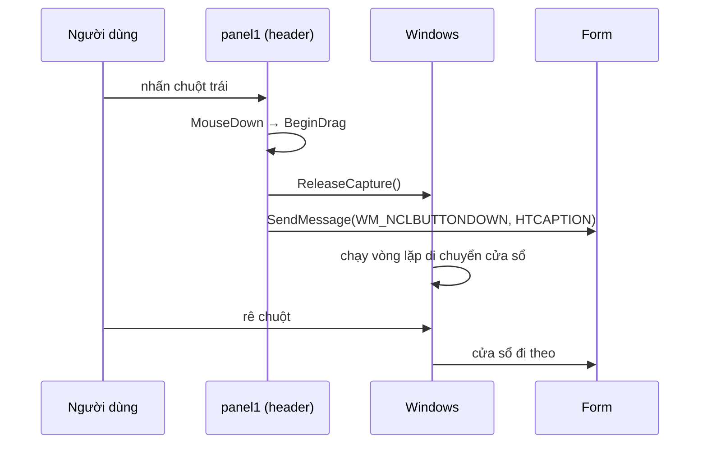
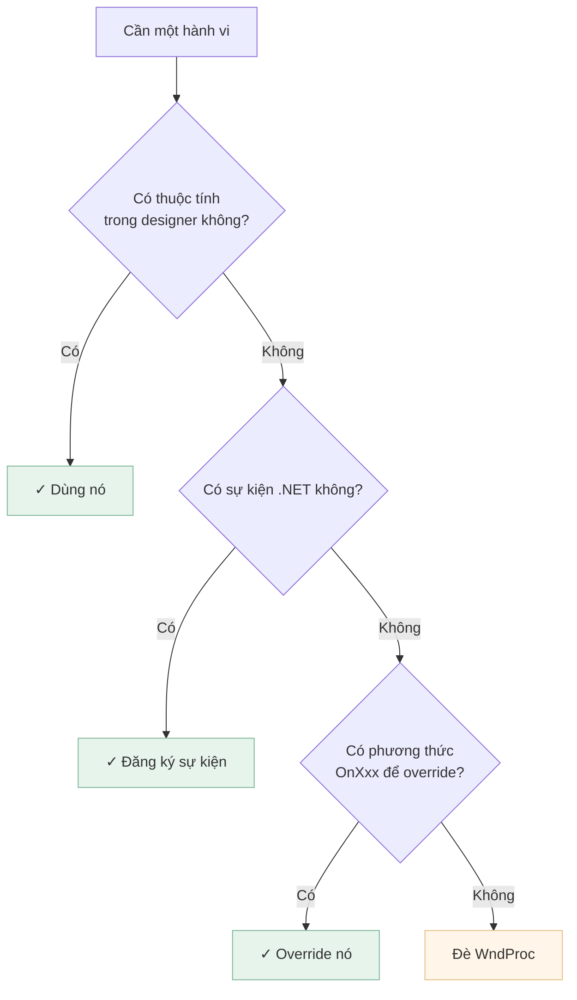
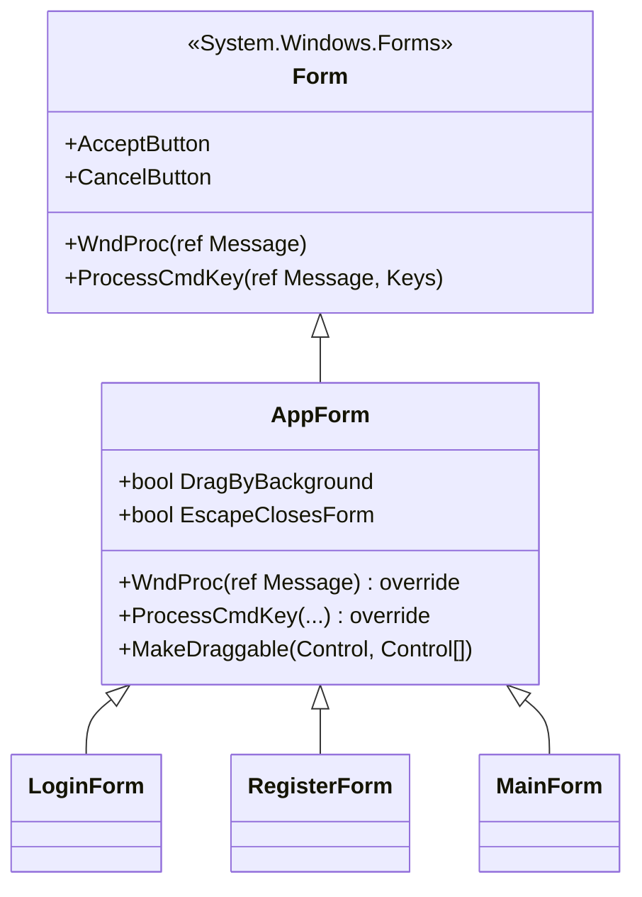

[← Bài 10](10-ban-phim-va-focus.md) · Bài 11/12 · [Tiếp: Bài tập →](12-bai-tap.md)

# 11 · WndProc và Win32 bên dưới

## Vấn đề

Ba form của dự án đặt `FormBorderStyle.None` để có thanh tiêu đề tím tự vẽ. Đẹp — nhưng
**không cửa sổ nào di chuyển được**. Chúng mở ra giữa màn hình và nằm im ở đó, kể cả khi
che mất thứ người dùng cần nhìn.

Không có thuộc tính nào trong designer sửa được điều này. Muốn sửa phải đi xuống một tầng.

## WinForms thực ra là gì

Mọi `Control` trong WinForms là một **cửa sổ Win32** thật, và cửa sổ Win32 giao tiếp bằng
**thông điệp** (xem lại [bài 01](01-winforms-hoat-dong-the-nao.md)). Những sự kiện C# quen
thuộc chỉ là lớp bọc:



`WndProc` là **cửa vào**. Đè nó lên là bạn nhìn thấy đúng những gì Windows gửi, kể cả các
thông điệp .NET không hề bọc thành sự kiện — và `WM_NCHITTEST` là một trong số đó.

## `WM_NCHITTEST` — "chỗ này là chỗ nào?"

Trước mỗi thao tác chuột, Windows hỏi cửa sổ: *"điểm này thuộc phần nào của mày?"*. Câu trả
lời quyết định con trỏ đổi hình gì và kéo ở đó thì xảy ra chuyện gì.

| Trả lời | Nghĩa | Kéo ở đó thì |
|---------|-------|--------------|
| `HTCLIENT` (1) | Vùng nội dung | Không có gì đặc biệt |
| `HTCAPTION` (2) | Thanh tiêu đề | **Di chuyển cửa sổ** |
| `HTLEFT`, `HTBOTTOMRIGHT`… | Cạnh, góc | Đổi kích thước |

Cửa sổ không viền không có thanh tiêu đề, nên không bao giờ trả `HTCAPTION` — vì thế không
kéo đi được. Toàn bộ cách sửa gói trong một ý: **nói dối một cách có kiểm soát.**

```csharp
// Forms/AppForm.cs
private const int WM_NCHITTEST = 0x0084;
private const int HTCLIENT = 1;
private const int HTCAPTION = 2;

protected override void WndProc(ref Message m)
{
    base.WndProc(ref m);

    if (DragByBackground
        && m.Msg == WM_NCHITTEST
        && m.Result == (IntPtr)HTCLIENT)
    {
        m.Result = (IntPtr)HTCAPTION;
    }
}
```



Ba chi tiết đáng học trong 6 dòng đó:

**Gọi `base.WndProc` TRƯỚC.** Để lớp cơ sở làm việc bình thường rồi mới sửa kết quả. Nếu
tự trả lời mà không gọi `base`, bạn phá mọi hành vi mặc định khác của thông điệp.

**Chỉ đổi khi kết quả là `HTCLIENT`.** Nếu base đã trả lời "đây là cạnh để resize" thì đừng
đè lên. Chỉ nâng cấp vùng nội dung trống.

**Control con KHÔNG bị ảnh hưởng — và đó vừa là ưu điểm vừa là giới hạn.** Mỗi control là
một cửa sổ Win32 riêng và nhận `WM_NCHITTEST` của **chính nó**. Nút, ô nhập, lưới vì thế
vẫn hoạt động bình thường: đoạn code trên không hề chạm tới chúng.

Nhưng lật ngược lại: `WM_NCHITTEST` ở form chỉ trả lời cho **nền trống của form**. Chỗ nào
bị control che, thông điệp không bao giờ đến `WndProc` của form.

### Bẫy thật gặp trong dự án này

`MainForm` có ba panel:

| Panel | Vị trí | Kích thước |
|-------|--------|-----------|
| `panel1` (header) | 0, 0 | 940 × 37 |
| `panel2` (menu trái) | 0, 37 | 248 × 526 |
| `panel3` (nội dung) | 248, 37 | 692 × 526 |

`ClientSize` là 940 × 564. Ba panel phủ hết, chỉ chừa lại **một dải cao đúng 1 pixel** ở
đáy (`{X=0, Y=563, W=940, H=1}`) — không ai bấm trúng được dải đó. Nghĩa là `WndProc` ở
trên tuy viết đúng nhưng thực tế không bao giờ được gọi tới: `MainForm` hoàn toàn không
kéo được. Bài học: một cơ chế "đúng lý thuyết" vẫn có thể vô dụng vì bố cục thực tế, và
chỉ kiểm tra `DragByBackground == true` thì không phát hiện ra — phải đo.

### Kỹ thuật thứ hai: trả cú kéo lại cho Windows

Với những control che kín form, ta bắt `MouseDown` trên chính chúng rồi **nói dối** với
Windows rằng cú nhấn xảy ra ở thanh tiêu đề của form:

```csharp
[DllImport("user32.dll")] static extern bool ReleaseCapture();
[DllImport("user32.dll", CharSet = CharSet.Auto)]
static extern IntPtr SendMessage(IntPtr hWnd, int msg, IntPtr wParam, IntPtr lParam);

private void BeginDrag(object sender, MouseEventArgs e)
{
    if (e.Button != MouseButtons.Left) return;

    ReleaseCapture();                                    // control nha chuot ra
    SendMessage(Handle, WM_NCLBUTTONDOWN, (IntPtr)HTCAPTION, IntPtr.Zero);
}
```

Hai lời gọi, mỗi lời một việc:

- `ReleaseCapture()` — khi bạn nhấn chuột lên một control, control đó **giữ chuột**
  (mouse capture): mọi chuyển động sau đó thuộc về nó. Không nhả ra thì Windows không thể
  chạy vòng lặp di chuyển cửa sổ.
- `SendMessage(..., WM_NCLBUTTONDOWN, HTCAPTION, ...)` — báo cho **form** rằng có cú nhấn
  trái ở vùng tiêu đề. Windows tự chạy vòng lặp kéo của nó, nên cảm giác giống hệt kéo
  cửa sổ thật: snap vào cạnh màn hình, Aero shake, đa màn hình đều còn nguyên.



`AppForm.MakeDraggable(root, except)` gắn handler này đệ quy, nhưng **chỉ cho control thụ
động** — `Panel`, `Label`, `PictureBox`:

```csharp
if (control is Panel || control is Label || control is PictureBox)
{
    control.MouseDown -= BeginDrag;     // goi hai lan van an toan
    control.MouseDown += BeginDrag;
}
```

`Button`, `TextBox`, `DataGridView` bị bỏ qua vì cú nhấn của chúng có ý nghĩa riêng. Tham
số `except` xử lý ngoại lệ ngược lại: dấu **X** màu tím ở góc là một `Label` — trông thụ
động nhưng thực chất là nút đóng, nên phải loại trừ thủ công.

### Vậy dùng cách nào?

**Cả hai.** Chúng bù cho nhau, không thay thế nhau:

| | `WM_NCHITTEST` | `ReleaseCapture` + `WM_NCLBUTTONDOWN` |
|---|---|---|
| Phủ được | Nền trống của form | Từng control được chỉ định |
| Cần P/Invoke | Không | Có (2 hàm) |
| Công sức | Viết một lần ở lớp cơ sở | Phải liệt kê control |
| Khi form bị control che kín | **Vô tác dụng** | Vẫn chạy |

`AppForm` cài cả hai: `WndProc` lo phần nền còn trống (`LoginForm`, `RegisterForm` có),
`MakeDraggable` lo phần bị panel che (`MainForm`).
cho toàn bộ form một lần.

## `Message` là gì

```csharp
public struct Message
{
    public IntPtr HWnd;     // cửa sổ nhận
    public int Msg;         // mã thông điệp, ví dụ 0x0084
    public IntPtr WParam;   // tham số, ý nghĩa tuỳ thông điệp
    public IntPtr LParam;   // tham số thứ hai
    public IntPtr Result;   // giá trị TRẢ VỀ cho Windows
}
```

`ref Message m` là `ref` vì bạn thường phải **ghi vào `m.Result`** — đó là cách trả lời
Windows.

> **Vì sao `(IntPtr)HTCAPTION` chứ không phải `HTCAPTION`?** `Result` là `IntPtr` để cùng
> một API chạy được ở cả 32-bit và 64-bit, nơi con trỏ có kích thước khác nhau. So sánh
> `m.Result == (IntPtr)HTCLIENT` cũng vì lý do đó.

## Những thông điệp khác hay dùng

| Thông điệp | Dùng để |
|------------|---------|
| `WM_NCHITTEST` (0x0084) | Quyết định vùng nào là tiêu đề / cạnh |
| `WM_NCLBUTTONDOWN` (0x00A1) | Giả lập cú nhấn lên tiêu đề để Windows tự kéo cửa sổ |
| `WM_ERASEBKGND` (0x0014) | Nuốt nó đi để chống nhấp nháy khi tự vẽ |
| `WM_SETREDRAW` (0x000B) | Tạm ngừng vẽ khi cập nhật hàng loạt |
| `WM_PAINT` (0x000F) | Vẽ — nhưng nên dùng `OnPaint` thay vì bắt tay |
| `WM_DPICHANGED` (0x02E0) | Cửa sổ chuyển sang màn hình có DPI khác ([bài 09](09-bo-cuc-va-dpi.md)) |

## Khi nào KHÔNG nên đè `WndProc`

Đây là công cụ cuối cùng, không phải công cụ đầu tiên.



Lý do: code trong `WndProc` chạy cho **mọi** thông điệp gửi tới cửa sổ — hàng nghìn cái mỗi
giây khi di chuột. Viết chậm hoặc ném ngoại lệ ở đó là làm hỏng cả ứng dụng theo cách rất
khó lần ra.

Trong dự án này, kéo cửa sổ là trường hợp hợp lệ: `FormBorderStyle.None` không có thuộc
tính hay sự kiện nào thay thế được.

## `AppForm` — đặt ở lớp cơ sở

Giống `DataView` cho các UserControl ([bài 03](03-vong-doi-form-usercontrol.md)), phần
Win32 nằm ở **một** lớp cơ sở chứ không lặp lại ở ba form:



Hai cờ `DragByBackground` và `EscapeClosesForm` để mỗi form tự chọn, thay vì ép hành vi
lên tất cả. `DragByBackground` được bật trong `OnLoad` chứ không phải constructor — để
Visual Studio designer, vốn cũng dựng form này, không bao giờ bị ảnh hưởng.

## Cạm bẫy

**Quên gọi `base.WndProc`.** Cửa sổ mất hành vi mặc định theo những cách rất khó chẩn đoán.

**Ném ngoại lệ trong `WndProc`.** Nó chạy sâu trong vòng lặp thông điệp; ngoại lệ ở đó
thường làm sập ứng dụng chứ không nổi lên chỗ bạn nhìn thấy.

**Làm việc nặng trong `WndProc`.** Nó chạy hàng nghìn lần mỗi giây. Kiểm tra `m.Msg` trước
tiên rồi thoát sớm.

**Hard-code hằng số thay vì đặt tên.** `0x0084` không nói gì; `WM_NCHITTEST` thì có.

**Dùng `int` thay `IntPtr` cho `Result`.** Chạy ở 32-bit, hỏng ở 64-bit.

**Tưởng đè `WM_NCHITTEST` là xong.** Nếu control phủ kín client area thì thông điệp không
bao giờ tới form. Phải kiểm tra bằng cách **kéo thật**, không phải bằng cách đọc thuộc tính.

## Tự kiểm tra

1. Vì sao cửa sổ `FormBorderStyle.None` không kéo đi được?
2. Vì sao `base.WndProc(ref m)` được gọi **trước** khi sửa `m.Result`?
3. Đè `WM_NCHITTEST` ở form có làm hỏng việc bấm nút bên trong không? Vì sao?
4. Vì sao `DragByBackground` bật ở `OnLoad` chứ không phải constructor?
5. Khi nào **không** nên đè `WndProc`?
6. `MainForm` có ba panel phủ kín client area. Chỉ đè `WM_NCHITTEST` thì kéo được không?

<details>
<summary>Đáp án</summary>

1. Vì Windows chỉ di chuyển cửa sổ khi việc kéo bắt đầu ở vùng được báo là `HTCAPTION`
   (thanh tiêu đề). Cửa sổ không viền không có thanh tiêu đề nên không bao giờ trả lời như
   vậy.
2. Để lớp cơ sở làm mọi việc bình thường của nó rồi ta mới **nâng cấp** câu trả lời. Nhờ
   gọi base trước, ta biết kết quả gốc là `HTCLIENT` và chỉ đổi đúng trường hợp đó — không
   đè lên các câu trả lời khác như cạnh resize.
3. **Không.** Mỗi control là một cửa sổ Win32 riêng và nhận `WM_NCHITTEST` của chính nó.
   `WndProc` của form chỉ được hỏi về phần nền trống của form.
4. Vì Visual Studio designer cũng dựng form này. Bật ở constructor nghĩa là bật cả trong
   designer, nơi hành vi kéo cửa sổ vừa vô nghĩa vừa gây rối. Cùng nguyên tắc với
   [bài 03](03-vong-doi-form-usercontrol.md).
5. Khi còn thuộc tính, sự kiện, hoặc phương thức `OnXxx` làm được việc đó. `WndProc` chạy
   cho mọi thông điệp nên chi phí và rủi ro cao hơn hẳn.
6. **Không.** Không còn pixel nền trống nào nên `WndProc` của form không bao giờ được hỏi.
   Phải gắn `MouseDown` lên chính các panel đó (`MakeDraggable`) và dùng `ReleaseCapture` +
   `WM_NCLBUTTONDOWN` để trả cú kéo lại cho Windows.

</details>

---

[← Bài 10](10-ban-phim-va-focus.md) · [Tiếp: Bài tập →](12-bai-tap.md)
