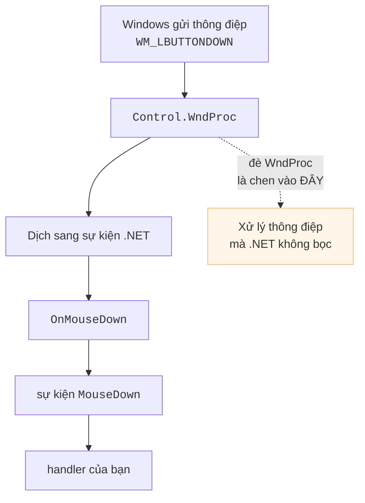
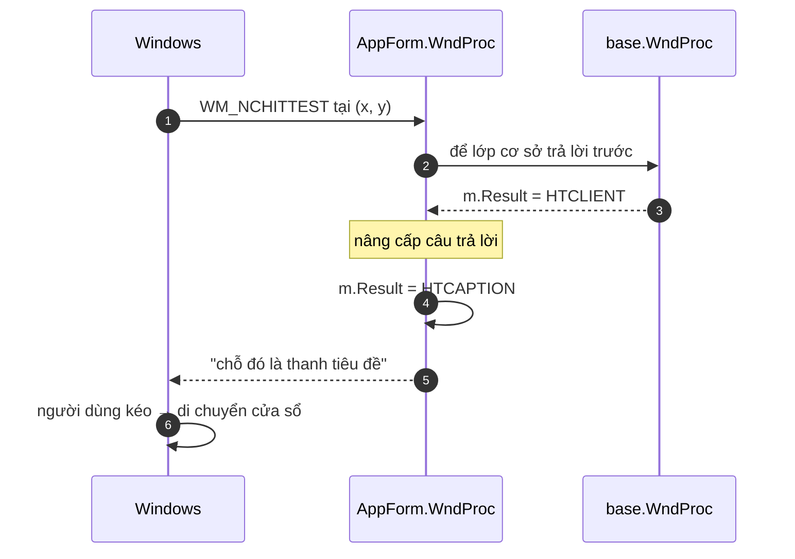
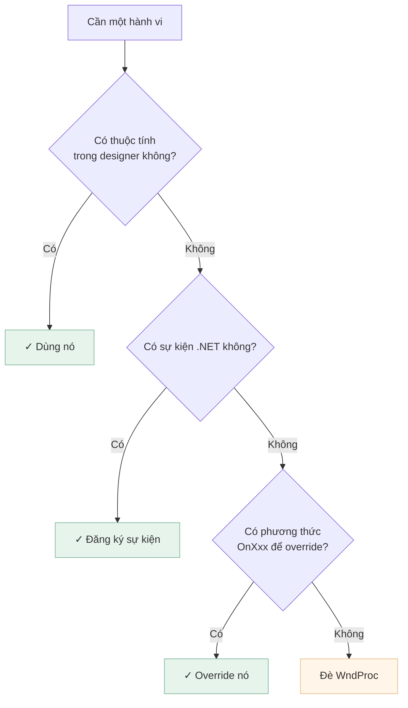
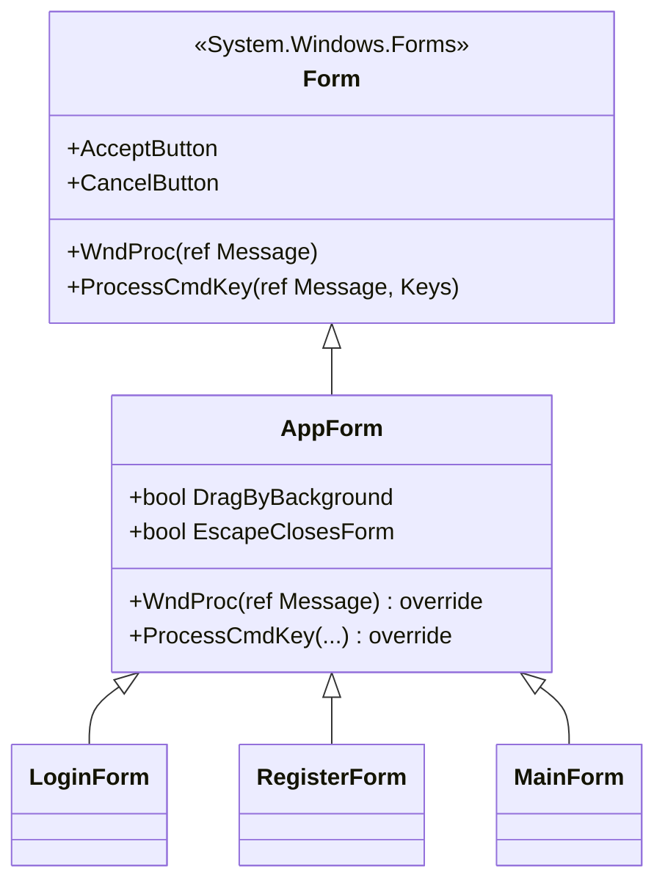

[← Bài 10](10-ban-phim-va-focus.md) · Bài 11/12 · [Tiếp: Bài tập →](12-bai-tap.md)

# 11 · WndProc và Win32 bên dưới

## Vấn đề

Ba form của dự án đặt `FormBorderStyle.None` để có thanh tiêu đề tím tự vẽ. Đẹp — nhưng
**không cửa sổ nào di chuyển được**. Chúng mở ra giữa màn hình và nằm im ở đó, kể cả khi
che mất thứ người dùng cần nhìn.

Không có thuộc tính nào trong designer sửa được điều này. Muốn sửa phải đi xuống một tầng.

## WinForms thực ra là gì

Mọi `Control` trong WinForms là một **cửa sổ Win32** thật, và cửa sổ Win32 giao tiếp bằng
**thông điệp** (xem lại [bài 01](01-winforms-hoat-dong-the-nao.md)). Những sự kiện C# quen
thuộc chỉ là lớp bọc:



`WndProc` là **cửa vào**. Đè nó lên là bạn nhìn thấy đúng những gì Windows gửi, kể cả các
thông điệp .NET không hề bọc thành sự kiện — và `WM_NCHITTEST` là một trong số đó.

## `WM_NCHITTEST` — "chỗ này là chỗ nào?"

Trước mỗi thao tác chuột, Windows hỏi cửa sổ: *"điểm này thuộc phần nào của mày?"*. Câu trả
lời quyết định con trỏ đổi hình gì và kéo ở đó thì xảy ra chuyện gì.

| Trả lời | Nghĩa | Kéo ở đó thì |
|---------|-------|--------------|
| `HTCLIENT` (1) | Vùng nội dung | Không có gì đặc biệt |
| `HTCAPTION` (2) | Thanh tiêu đề | **Di chuyển cửa sổ** |
| `HTLEFT`, `HTBOTTOMRIGHT`… | Cạnh, góc | Đổi kích thước |

Cửa sổ không viền không có thanh tiêu đề, nên không bao giờ trả `HTCAPTION` — vì thế không
kéo đi được. Toàn bộ cách sửa gói trong một ý: **nói dối một cách có kiểm soát.**

```csharp
// Forms/AppForm.cs
private const int WM_NCHITTEST = 0x0084;
private const int HTCLIENT = 1;
private const int HTCAPTION = 2;

protected override void WndProc(ref Message m)
{
    base.WndProc(ref m);

    if (DragByBackground
        && m.Msg == WM_NCHITTEST
        && m.Result == (IntPtr)HTCLIENT)
    {
        m.Result = (IntPtr)HTCAPTION;
    }
}
```



Ba chi tiết đáng học trong 6 dòng đó:

**Gọi `base.WndProc` TRƯỚC.** Để lớp cơ sở làm việc bình thường rồi mới sửa kết quả. Nếu
tự trả lời mà không gọi `base`, bạn phá mọi hành vi mặc định khác của thông điệp.

**Chỉ đổi khi kết quả là `HTCLIENT`.** Nếu base đã trả lời "đây là cạnh để resize" thì đừng
đè lên. Chỉ nâng cấp vùng nội dung trống.

**Control con không bị ảnh hưởng.** Mỗi control là một cửa sổ riêng và nhận `WM_NCHITTEST`
của chính nó. Nút, ô nhập, lưới vẫn hoạt động bình thường — chỉ nền trống của form mới kéo
được. Đây là điều khiến cách này an toàn, khác hẳn cách bắt `MouseDown` rồi tự tính toạ độ.

### So với cách phổ biến trên mạng

Nhiều hướng dẫn dùng P/Invoke:

```csharp
// Cach pho bien — nhieu thu hon de sai
[DllImport("user32.dll")] static extern bool ReleaseCapture();
[DllImport("user32.dll")] static extern int SendMessage(IntPtr h, int msg, int p, int l);

private void panel1_MouseDown(object sender, MouseEventArgs e)
{
    ReleaseCapture();
    SendMessage(Handle, 0xA1, 0x2, 0);   // WM_NCLBUTTONDOWN, HTCAPTION
}
```

Cách này chạy được nhưng phải gắn handler cho **từng** panel muốn kéo, cần hai lời gọi
P/Invoke, và dễ quên mất một vùng. Cách `WM_NCHITTEST` không cần P/Invoke nào và áp dụng
cho toàn bộ form một lần.

## `Message` là gì

```csharp
public struct Message
{
    public IntPtr HWnd;     // cửa sổ nhận
    public int Msg;         // mã thông điệp, ví dụ 0x0084
    public IntPtr WParam;   // tham số, ý nghĩa tuỳ thông điệp
    public IntPtr LParam;   // tham số thứ hai
    public IntPtr Result;   // giá trị TRẢ VỀ cho Windows
}
```

`ref Message m` là `ref` vì bạn thường phải **ghi vào `m.Result`** — đó là cách trả lời
Windows.

> **Vì sao `(IntPtr)HTCAPTION` chứ không phải `HTCAPTION`?** `Result` là `IntPtr` để cùng
> một API chạy được ở cả 32-bit và 64-bit, nơi con trỏ có kích thước khác nhau. So sánh
> `m.Result == (IntPtr)HTCLIENT` cũng vì lý do đó.

## Những thông điệp khác hay dùng

| Thông điệp | Dùng để |
|------------|---------|
| `WM_NCHITTEST` (0x0084) | Quyết định vùng nào là tiêu đề / cạnh |
| `WM_ERASEBKGND` (0x0014) | Nuốt nó đi để chống nhấp nháy khi tự vẽ |
| `WM_SETREDRAW` (0x000B) | Tạm ngừng vẽ khi cập nhật hàng loạt |
| `WM_PAINT` (0x000F) | Vẽ — nhưng nên dùng `OnPaint` thay vì bắt tay |
| `WM_DPICHANGED` (0x02E0) | Cửa sổ chuyển sang màn hình có DPI khác ([bài 09](09-bo-cuc-va-dpi.md)) |

## Khi nào KHÔNG nên đè `WndProc`

Đây là công cụ cuối cùng, không phải công cụ đầu tiên.



Lý do: code trong `WndProc` chạy cho **mọi** thông điệp gửi tới cửa sổ — hàng nghìn cái mỗi
giây khi di chuột. Viết chậm hoặc ném ngoại lệ ở đó là làm hỏng cả ứng dụng theo cách rất
khó lần ra.

Trong dự án này, kéo cửa sổ là trường hợp hợp lệ: `FormBorderStyle.None` không có thuộc
tính hay sự kiện nào thay thế được.

## `AppForm` — đặt ở lớp cơ sở

Giống `DataView` cho các UserControl ([bài 03](03-vong-doi-form-usercontrol.md)), phần
Win32 nằm ở **một** lớp cơ sở chứ không lặp lại ở ba form:



Hai cờ `DragByBackground` và `EscapeClosesForm` để mỗi form tự chọn, thay vì ép hành vi
lên tất cả. `DragByBackground` được bật trong `OnLoad` chứ không phải constructor — để
Visual Studio designer, vốn cũng dựng form này, không bao giờ bị ảnh hưởng.

## Cạm bẫy

**Quên gọi `base.WndProc`.** Cửa sổ mất hành vi mặc định theo những cách rất khó chẩn đoán.

**Ném ngoại lệ trong `WndProc`.** Nó chạy sâu trong vòng lặp thông điệp; ngoại lệ ở đó
thường làm sập ứng dụng chứ không nổi lên chỗ bạn nhìn thấy.

**Làm việc nặng trong `WndProc`.** Nó chạy hàng nghìn lần mỗi giây. Kiểm tra `m.Msg` trước
tiên rồi thoát sớm.

**Hard-code hằng số thay vì đặt tên.** `0x0084` không nói gì; `WM_NCHITTEST` thì có.

**Dùng `int` thay `IntPtr` cho `Result`.** Chạy ở 32-bit, hỏng ở 64-bit.

## Tự kiểm tra

1. Vì sao cửa sổ `FormBorderStyle.None` không kéo đi được?
2. Vì sao `base.WndProc(ref m)` được gọi **trước** khi sửa `m.Result`?
3. Đè `WM_NCHITTEST` ở form có làm hỏng việc bấm nút bên trong không? Vì sao?
4. Vì sao `DragByBackground` bật ở `OnLoad` chứ không phải constructor?
5. Khi nào **không** nên đè `WndProc`?

<details>
<summary>Đáp án</summary>

1. Vì Windows chỉ di chuyển cửa sổ khi việc kéo bắt đầu ở vùng được báo là `HTCAPTION`
   (thanh tiêu đề). Cửa sổ không viền không có thanh tiêu đề nên không bao giờ trả lời như
   vậy.
2. Để lớp cơ sở làm mọi việc bình thường của nó rồi ta mới **nâng cấp** câu trả lời. Nhờ
   gọi base trước, ta biết kết quả gốc là `HTCLIENT` và chỉ đổi đúng trường hợp đó — không
   đè lên các câu trả lời khác như cạnh resize.
3. **Không.** Mỗi control là một cửa sổ Win32 riêng và nhận `WM_NCHITTEST` của chính nó.
   `WndProc` của form chỉ được hỏi về phần nền trống của form.
4. Vì Visual Studio designer cũng dựng form này. Bật ở constructor nghĩa là bật cả trong
   designer, nơi hành vi kéo cửa sổ vừa vô nghĩa vừa gây rối. Cùng nguyên tắc với
   [bài 03](03-vong-doi-form-usercontrol.md).
5. Khi còn thuộc tính, sự kiện, hoặc phương thức `OnXxx` làm được việc đó. `WndProc` chạy
   cho mọi thông điệp nên chi phí và rủi ro cao hơn hẳn.

</details>

---

[← Bài 10](10-ban-phim-va-focus.md) · [Tiếp: Bài tập →](12-bai-tap.md)
