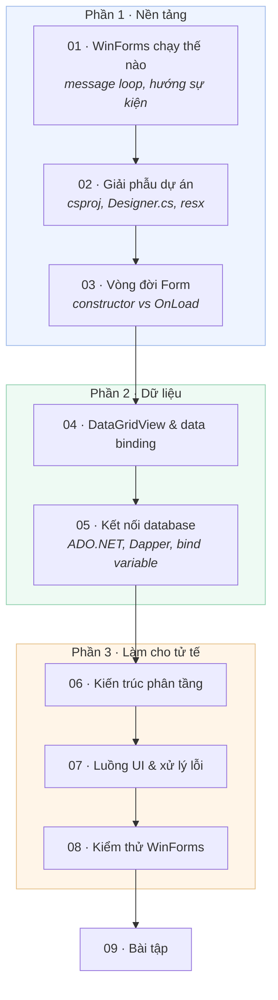

# Học WinForms .NET Framework qua một dự án thật

Bộ tài liệu này dạy WinForms bằng cách mổ xẻ **chính dự án Employee Management System**
trong repo này — không dùng ví dụ `Hello World` tự chế.

Mọi đoạn code trích dẫn đều là code đang chạy. Mọi lỗi được mô tả đều là lỗi đã thực sự
xảy ra trong dự án này và đã được sửa. Bạn mở file lên đọc song song là được.

## Dành cho ai

Người đã biết C# cơ bản (class, interface, property, `using`) nhưng chưa làm WinForms,
hoặc đã kéo thả được form nhưng không hiểu bên dưới có gì.

## Lộ trình



## Mục lục

| # | Bài | Trả lời câu hỏi |
|---|-----|-----------------|
| 01 | [WinForms chạy thế nào](01-winforms-hoat-dong-the-nao.md) | Bấm nút thì chuyện gì xảy ra? `Application.Run` làm gì? |
| 02 | [Giải phẫu dự án](02-giai-phau-du-an.md) | `.Designer.cs` ở đâu ra? `.resx` để làm gì? `partial` nghĩa là sao? |
| 03 | [Vòng đời Form và UserControl](03-vong-doi-form-usercontrol.md) | Đặt code khởi tạo ở constructor hay `OnLoad`? |
| 04 | [DataGridView và data binding](04-datagridview-databinding.md) | Sao lưới tự sinh cột? Lấy lại object từ dòng đang chọn thế nào? |
| 05 | [Kết nối database](05-ket-noi-database.md) | ADO.NET, Dapper, và vì sao `:name` chứ không phải `@name`? |
| 06 | [Kiến trúc phân tầng](06-kien-truc-phan-tang.md) | Vì sao không viết SQL thẳng trong nút bấm? |
| 07 | [Luồng UI và xử lý lỗi](07-luong-ui-va-xu-ly-loi.md) | Vì sao app đơ? `InvokeRequired` là gì? |
| 08 | [Kiểm thử WinForms](08-kiem-thu-winforms.md) | Test một cái form kiểu gì? |
| 09 | [Bài tập](09-bai-tap.md) | Tự làm để nhớ. |

## Cách dùng bộ tài liệu này

Mỗi bài có cấu trúc giống nhau:

- **Vấn đề** — câu hỏi bài này giải quyết
- **Cơ chế** — chuyện gì thực sự xảy ra, kèm sơ đồ
- **Trong dự án này** — code thật, đường dẫn thật
- **Cạm bẫy** — lỗi hay gặp, gồm cả lỗi dự án này từng dính
- **Tự kiểm tra** — vài câu hỏi ngắn

## Chuẩn bị môi trường

```powershell
# 1. Database (lần đầu mất vài phút để kéo image Oracle)
powershell -ExecutionPolicy Bypass -File db\setup-db.ps1 -Seed

# 2. Build
msbuild EmployeeManagementSystem.sln -t:restore
msbuild EmployeeManagementSystem.sln -p:Configuration=Debug

# 3. Chạy
.\EmployeeManagementSystem\bin\Debug\EmployeeManagementSystem.exe
```

Đăng nhập: `admin` / `admin`.

Chi tiết về database và kiến trúc nằm ở [README gốc](../README.md).

## Một lưu ý thành thật về công nghệ

Dự án này dùng **.NET Framework 4.7.2**, bản .NET cũ chỉ chạy trên Windows. Microsoft
vẫn hỗ trợ nhưng đã đóng băng: không thêm tính năng mới.

Đây là **lựa chọn có chủ đích**, không phải nợ kỹ thuật bị bỏ quên. Mục tiêu của dự án là
học và làm WinForms, nên việc nâng lên .NET 8/9 và việc tách một tầng Web API đã được đưa
ra khỏi kế hoạch cải tiến.

Học WinForms vẫn đáng vì:

- Rất nhiều phần mềm nội bộ doanh nghiệp đang chạy trên nó, và cần người bảo trì.
- Các khái niệm — vòng đời control, hướng sự kiện, luồng UI, data binding — chuyển thẳng
  sang WPF, MAUI, và cả WinForms trên .NET 8/9.

Và cũng cần nói rõ: **ở lại .NET Framework không có nghĩa là bỏ qua phần kỹ thuật tốt.**
Mọi hạng mục còn lại trong kế hoạch — transaction, kiểm soát tương tranh, log, `async` —
đều làm được trên 4.7.2. `async`/`await` có từ .NET Framework 4.5.

Nếu sau này bạn bắt đầu một dự án **mới**, WinForms trên .NET 8/9 dùng gần như cùng API
nhưng có thêm `IConfiguration` và DI thật.
